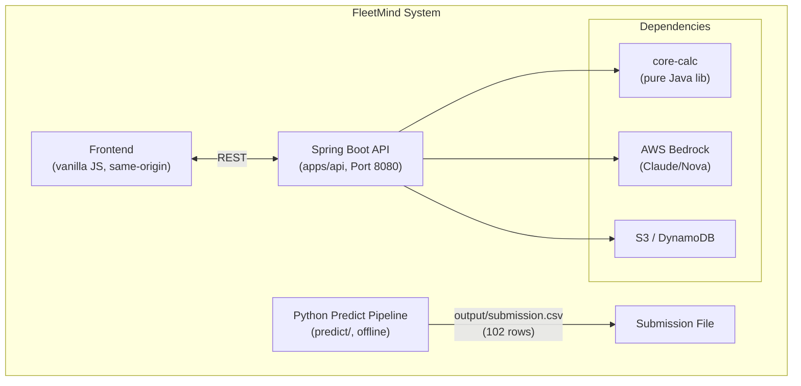
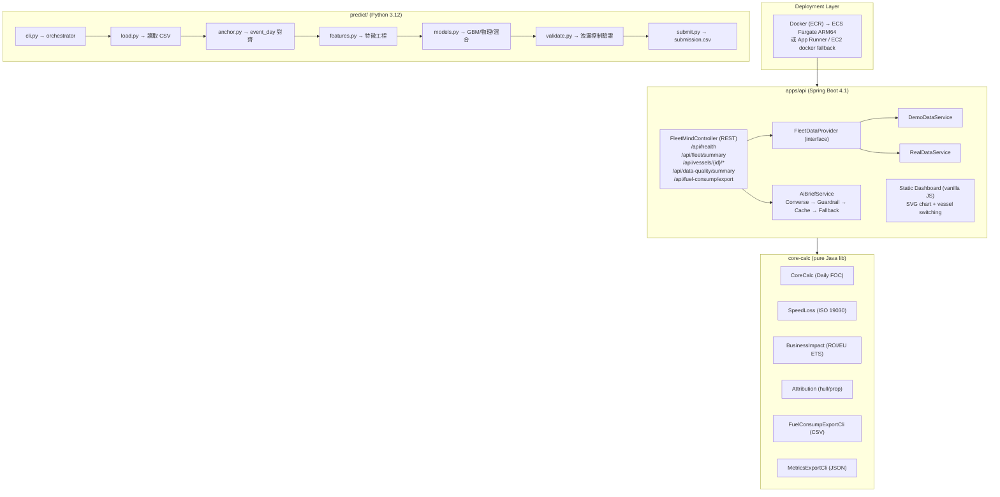
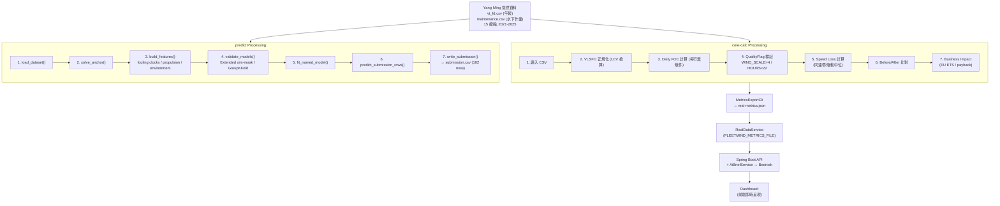
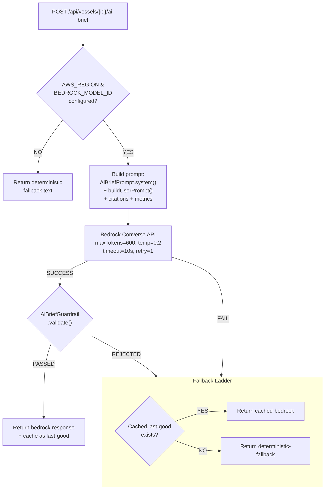
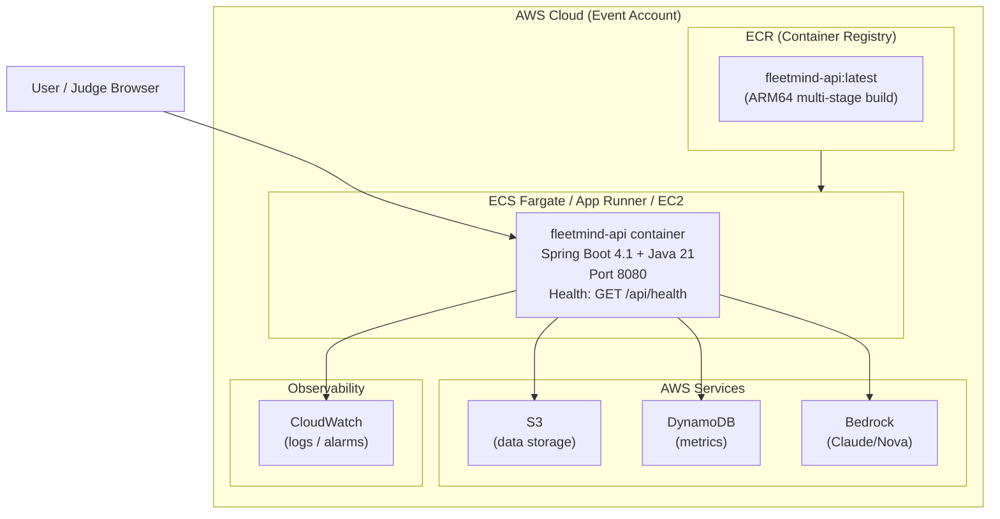
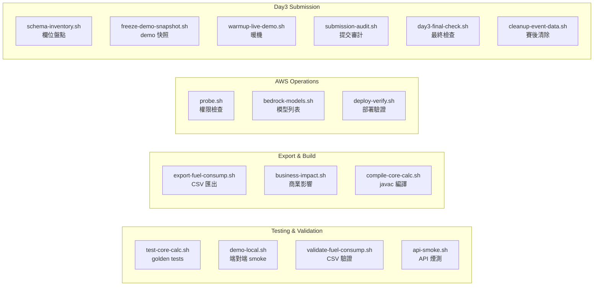
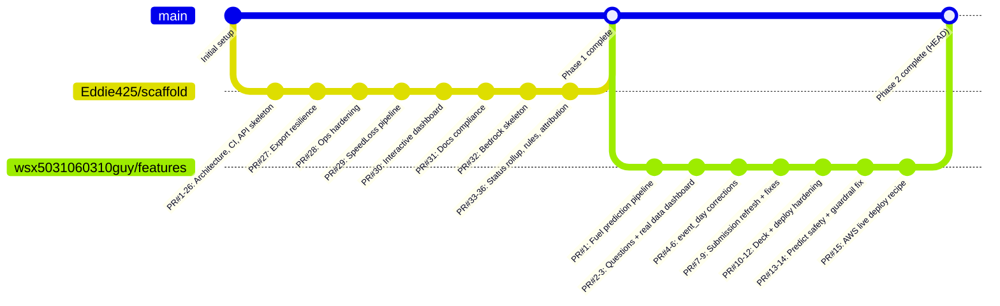
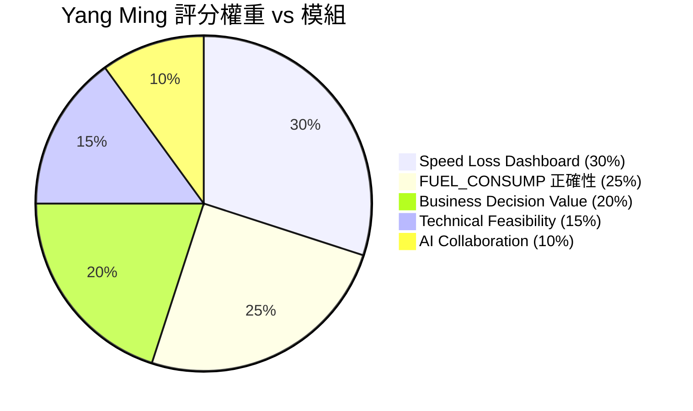
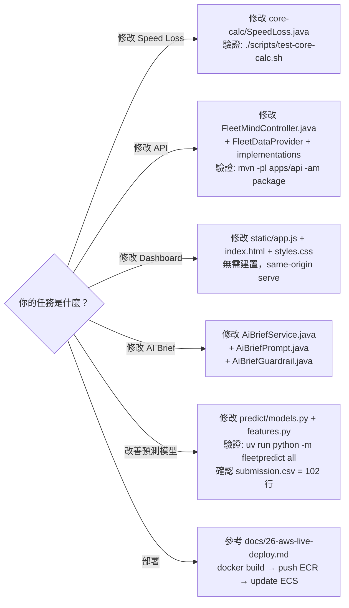
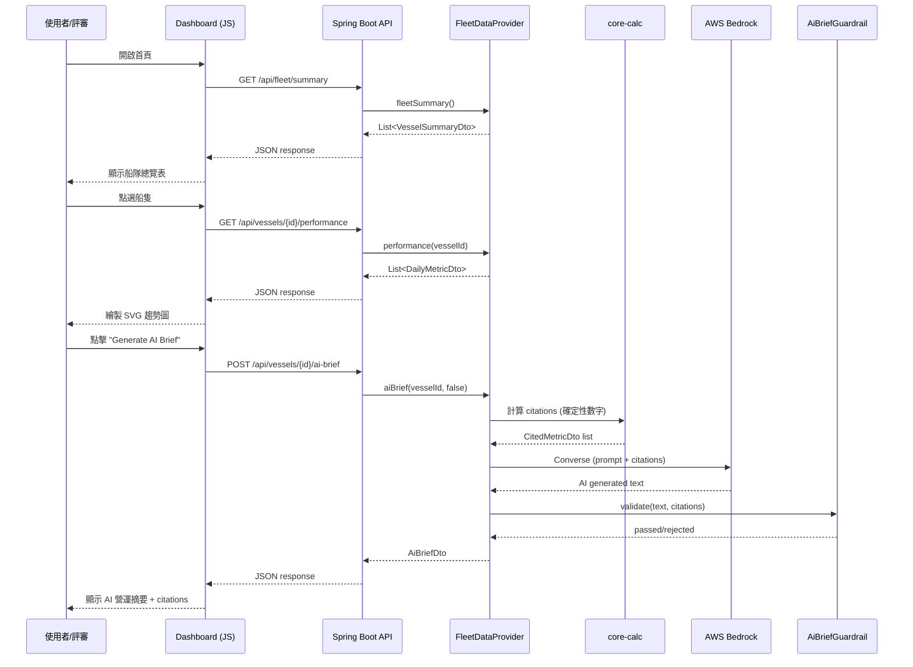

# FleetMind 系統流程架構圖

> 此文件供 AI Agents (Claude / Codex / Kiro) 參考，用於理解專案完整架構後執行各自分工任務。
> 最後更新：2026-07-14

---

## 1. 高層架構總覽



---

## 2. 模組分層架構



---

## 3. 資料流程圖 (Data Flow)



---

## 4. API 端點清單

| Method | Path | 功能 | 資料來源 |
|--------|------|------|----------|
| GET | `/api/health` | 健康檢查 | 即時 |
| GET | `/api/fleet/summary` | 船隊總覽 (15 vessels) | FleetDataProvider |
| GET | `/api/vessels/{id}/performance` | 單船每日效能指標 | FleetDataProvider |
| GET | `/api/vessels/{id}/underwater-events` | 水下作業事件列表 | FleetDataProvider |
| GET | `/api/vessels/{id}/before-after?eventId=` | 事件前後比較 + 商業影響 | FleetDataProvider |
| POST | `/api/vessels/{id}/ai-brief` | AI 營運摘要 (Bedrock/fallback) | AiBriefService |
| GET | `/api/vessels/{id}/ai-brief/prompt` | 查看 AI prompt 構造 | AiBriefService |
| GET | `/api/data-quality/summary` | 資料品質統計 | FleetDataProvider |
| GET | `/api/fuel-consump/export` | FUEL_CONSUMP CSV 匯出 | FleetDataProvider |

---

## 5. AI Bedrock 整合流程



---

## 6. 部署架構 (AWS)



---

## 7. 關鍵類別/模組對照表

### core-calc (com.fleetmind.corecalc)

| 類別 | 職責 |
|------|------|
| `CoreCalc` | Daily FOC = ME_FULLSPEED_CONSUMP / HOURS * 24 |
| `SpeedLoss` | ISO 19030 Speed Loss 聚合 (reference window, speed band, rolling median, Theil-Sen, before-after) |
| `BusinessImpact` | 年化燃料成本、CO₂、EU ETS、payback days |
| `Attribution` | Hull vs propeller 歸因 (ISO 19030 framing) |
| `FuelConsumpExportCli` | FUEL_CONSUMP CSV 匯出 (crash-proof, never drop rows) |
| `MetricsExportCli` | real-metrics.json 輸出給 API |
| `QualityFlag` | 品質旗標邏輯 (WIND_SCALE, HOURS_FULL_SPEED) |
| `FuelType` / `FuelMass` | 燃料 LCV 轉換 (HFO=40.2, VLSFO=40.2, ULSFO=41.2, MGO=42.7) |

### apps/api (com.fleetmind.api)

| 類別 | 職責 |
|------|------|
| `FleetMindController` | REST endpoints |
| `FleetDataProvider` | 資料提供介面 |
| `FleetDataConfiguration` | Bean wiring (FLEETMIND_METRICS_FILE 切換 demo/real) |
| `RealDataService` | 讀 real-metrics.json 提供真實資料 |
| `DemoDataService` | 硬編碼示範資料 (fallback) |
| `AiBriefService` | Bedrock Converse + guardrail + fallback ladder |
| `AiBriefGuardrail` | 數值守門 (AI 輸出 vs 確定性計算比對) |
| `AiBriefPrompt` | System/User prompt 構造 |

### predict/ (Python — fleetpredict)

| 模組 | 職責 |
|------|------|
| `load.py` | 讀取 vt_fd.csv + maintenance.csv |
| `anchor.py` | event_day 直接 join (maintenance → vt_fd.NOON_UTC) |
| `features.py` | 特徵工程 (fouling clocks, propulsion, loading, direction, ship/fuel) |
| `models.py` | GBM baseline / GBM+fouling / Physics / Blend 四組候選模型 |
| `validate.py` | Extended sim-mask + GroupKFold 驗證；自動選出 min RMSE 模型 |
| `submit.py` | 產出 submission.csv (102 rows, 正向有限值, 上限裁剪) |
| `external.py` | 外部 SST/洋流 join (OFF by default) |
| `cli.py` | 一鍵 `uv run python -m fleetpredict all` |

---

## 8. 環境變數

| 變數 | 用途 | 必要性 |
|------|------|--------|
| `AWS_REGION` | Bedrock 與 AWS 服務 region | Bedrock 必要 |
| `FLEETMIND_BEDROCK_MODEL_ID` | Bedrock model ID | Bedrock 必要 |
| `FLEETMIND_METRICS_FILE` | real-metrics.json 路徑 | Real data 必要 |
| `PORT` | HTTP port (default 8080) | 選用 |
| `FINAL_FUEL_CONSUMP` | Day3 final check 用 | Day3 |
| `OFFICIAL_ROW_COUNT` | Day3 final check 用 | Day3 |
| `BASE_URL` | Live demo URL | Day3 |

---

## 9. 腳本工具鏈



---

## 10. 建置與執行指令

```bash
# === Java (Maven multi-module) ===
mvn -pl apps/api -am clean package -DskipTests   # 建置 API jar
java -jar apps/api/target/fleetmind-api-0.1.0-SNAPSHOT.jar  # 啟動

# === Docker ===
docker build -f apps/api/Dockerfile -t fleetmind-api .
docker run -p 8080:8080 \
  -e FLEETMIND_METRICS_FILE=/app/real-metrics.json \
  -e AWS_REGION=ap-northeast-1 \
  -e FLEETMIND_BEDROCK_MODEL_ID=<model-id> \
  fleetmind-api

# === Python Prediction ===
cd predict
uv run python -m fleetpredict all       # 跑全部pipeline
uv run pytest tests -q                  # 跑測試

# === 驗證 ===
./scripts/test-core-calc.sh             # golden tests
./scripts/demo-local.sh                 # 端對端 demo
./scripts/api-smoke.sh                  # API 煙測
./scripts/day3-final-check.sh --dev     # Day3 檢查 (開發模式)
```

---

## 11. Commit 歷程摘要 (開發階段)



### Phase 1: 基礎建設 (Eddie — PR #1~#36)
- 架構文件、CI、API skeleton、golden tests
- core-calc: Daily FOC + Speed Loss + Business Impact + Attribution
- apps/api: Spring Boot + static dashboard + Bedrock skeleton
- 運維腳本全套、部署驗證、合規檢查

### Phase 2: 真實資料整合 (Feng — PR #1~#15)
- PR #1: fuel prediction pipeline (25% deliverable)
- PR #3: 真實資料 Speed Loss dashboard
- PR #6: predict pipeline 整合 event_day
- PR #10~#11: 簡報重建 + Day1 checklist
- PR #13: prediction safety guard
- PR #14: Bedrock prompt guardrail fix
- PR #15: AWS live deploy recipe (ECR + ECS Fargate + Bedrock)

---

## 12. 評分對應模組



| 評分項目 (權重) | 對應模組/功能 |
|----------------|---------------|
| Speed Loss Dashboard (30%) | core-calc/SpeedLoss + apps/api dashboard (SVG chart + vessel switching) |
| FUEL_CONSUMP 正確性 (25%) | predict/ pipeline → submission.csv (102 rows, RMSE ~3.5 MT) |
| Business Decision Value (20%) | core-calc/BusinessImpact + BeforeAfter + AI Brief |
| Technical Feasibility (15%) | Docker + ECS + Bedrock + CI/CD + golden tests |
| AI Collaboration Creativity (10%) | AiBriefService (Bedrock + guardrail + fallback) + AI agent 工作流程 |

---

## 13. 給其他 AI Agent 的執行指引



### 詳細指引

- **Speed Loss 計算邏輯** → `core-calc/src/main/java/com/fleetmind/corecalc/SpeedLoss.java`
- **API endpoints** → `apps/api/src/main/java/com/fleetmind/api/FleetMindController.java`
- **前端 Dashboard** → `apps/api/src/main/resources/static/app.js` + `index.html` + `styles.css`
- **AI Brief / Bedrock** → `AiBriefService.java` + `AiBriefPrompt.java` + `AiBriefGuardrail.java`
- **預測模型** → `predict/src/fleetpredict/models.py` + `features.py`
- **部署** → `docs/26-aws-live-deploy.md` + `apps/api/Dockerfile`

---

## 14. 鐵律 (Iron Rules)

1. **Daily FOC 每行無條件計算** — filter 只設 quality flag，不刪行
2. **Bedrock 只解釋不計算** — 數字永遠來自 core-calc 確定性計算
3. **submission.csv 永遠 102 行** — 正向有限值，六位小數
4. **不使用 RDS / CloudFront / QuickSight / Bedrock Agents** — 已在 docs/11 評估淘汰
5. **Dashboard 是 vanilla JS** — 不引入 React/Vue/Angular

---

## 15. 目錄結構速查

```
fleetmind-yang-ming-hackathon/
├── pom.xml                          # 根 POM (multi-module)
├── AGENTS.md                        # AI agent 指令
├── README.md                        # 專案總覽
├── .env.example                     # 環境變數模板
├── ai-context/
│   ├── PROJECT_CONTEXT.md           # 完整 AI context
│   ├── ASK_AI_PROMPT.md             # 初始 AI prompt
│   └── ARCHITECTURE_DIAGRAM.md      # ← 本文件
├── apps/api/
│   ├── Dockerfile                   # 多段建置
│   ├── pom.xml                      # API module POM
│   └── src/main/
│       ├── java/com/fleetmind/api/  # Java 源碼
│       └── resources/static/        # 前端 (HTML/JS/CSS)
├── core-calc/
│   ├── pom.xml                      # 計算庫 POM
│   └── src/main/java/com/fleetmind/corecalc/  # 純函數計算
├── predict/
│   ├── pyproject.toml               # Python 專案設定
│   ├── data/                        # 輸入資料
│   ├── output/                      # submission.csv 輸出
│   └── src/fleetpredict/            # pipeline 源碼
├── docs/                            # 26 份文件 + INDEX
├── scripts/                         # 運維腳本
├── presentation/                    # 簡報 (PPTX)
└── .github/workflows/checks.yml     # CI
```

---

## 16. 完整系統序列圖 (使用者操作流程)


