# FleetMind AWS 架構方案圖集

> 六種 AWS 架構方案的 Mermaid 圖 + 評分比較，供簡報/提交物/AI agent 參考。
> 現行部署 = 方案 B（單服務容器 on ECS Fargate **+ ALB**）。
> 最後更新：2026-07-15
>
> ⚠️ **讀本檔前先看這段**：下方各方案的淘汰理由是 **2026-07-14 當下的決策紀錄**，不是現況。
> 其中一條已被推翻：方案 D 的淘汰理由之一寫「VPC/ALB 14h 稅」，但之後為了取得
> **固定網址**（task 重啟換 IP 會讓 live demo 連結失效），已實際加上 ALB 並上線 ——
> ALB **不是**被否決的技術，它就在 production 上跑：
> `http://fleetmind-alb-330672315.us-east-1.elb.amazonaws.com`（帳號 516665228894 · us-east-1）。
> 各方案「已淘汰」= 當時不選它作為主線，不代表其中的元件不可用。

---

## 方案總覽比較

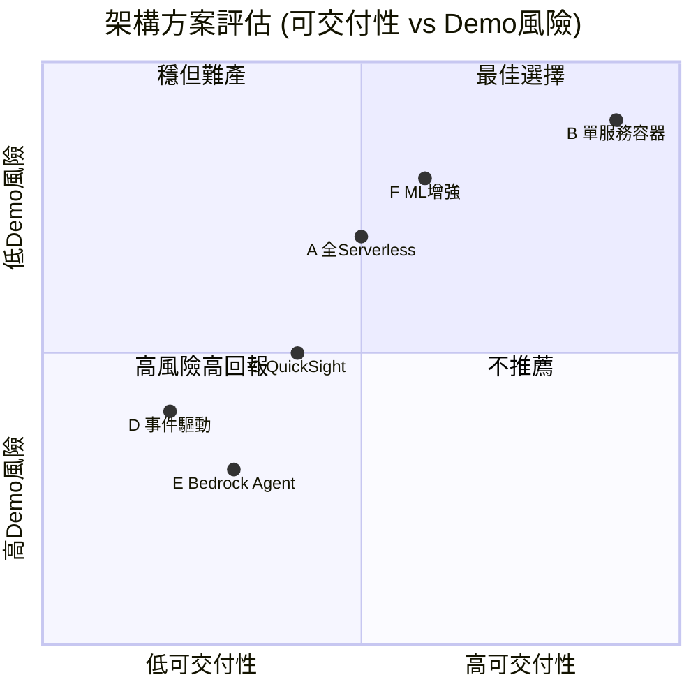

| 路線 | 可交付性 | 評分最大化 | Demo 風險 | **總分** | Infra 人時 |
|------|:--------:|:----------:|:---------:|:--------:|:----------:|
| **B. 單服務容器 (現行)** | 9 | 9 | 9 | **27** | 8h |
| F. ML 增強 (SageMaker) | 6 | 6 | 8 | 20 | 18h |
| A. 全 Serverless | 5 | 7 | 7 | 19 | 18h |
| C. QuickSight 託管分析 | 4 | 3 | 5 | 12 | 20h |
| E. Bedrock Agent 中心 | 3 | 5 | 3 | 11 | 22h |
| D. 事件驅動管線 | 2 | 4 | 4 | 10 | 14h |

---

## 方案 B：單服務容器 (現行部署方案)

> 評分 27/30 | Infra 8h | **已在 Day1 實測部署成功**

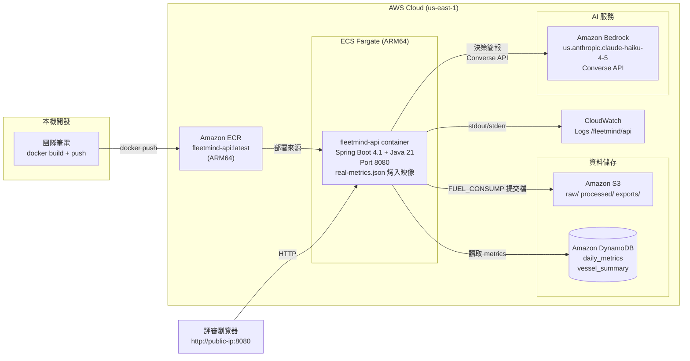

### 現行部署細節

```mermaid
flowchart TD
    subgraph Build["建置流程"]
        A1["compile-core-calc.sh"] --> A2["MetricsExportCli<br/>→ real-metrics.json"]
        A2 --> A3["docker build<br/>(ARM64, multi-stage)"]
        A3 --> A4["docker push<br/>→ ECR"]
    end

    subgraph Deploy["ECS 部署"]
        A4 --> B1["Task Definition<br/>cpu:512 mem:1024<br/>ARM64/LINUX"]
        B1 --> B2["run-task<br/>public subnet<br/>assignPublicIp=ENABLED"]
        B2 --> B3["取得 Public IP"]
    end

    subgraph IAM["IAM 角色"]
        R1["fleetmind-ecs-exec<br/>ECR pull + logs"]
        R2["fleetmind-ecs-task<br/>bedrock:InvokeModel"]
    end

    subgraph Env["環境變數"]
        E1["PORT=8080"]
        E2["AWS_REGION=us-east-1"]
        E3["FLEETMIND_BEDROCK_MODEL_ID=<br/>us.anthropic.claude-haiku-4-5-20251001-v1:0"]
    end

    R1 --> B1
    R2 --> B1
    Env --> B1
```

### Fallback 階梯

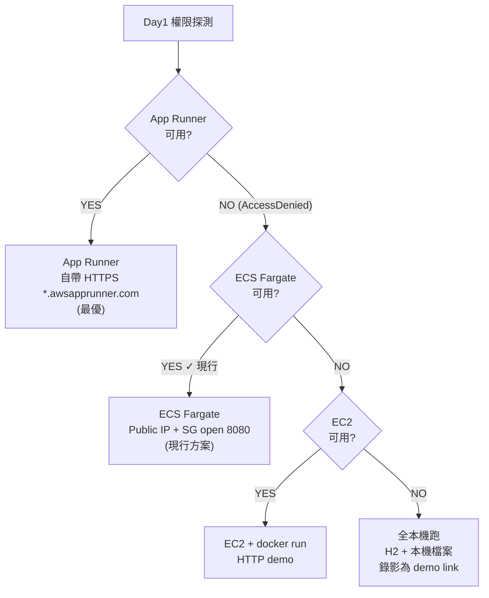

---

## 方案 A：全 Serverless

> 評分 19/30 | Infra 18h | 未採用

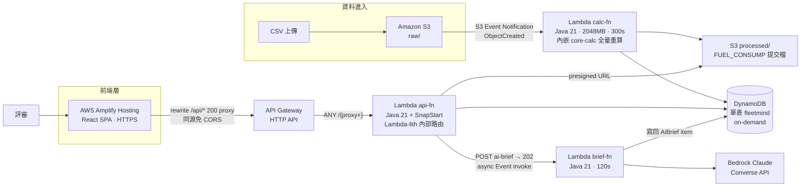

---

## 方案 C：QuickSight 託管分析

> 評分 12/30 | Infra 20h | 已淘汰 (客製天花板鎖死 30% dashboard)

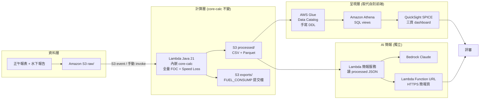

---

## 方案 D：事件驅動管線

> 評分 10/30 | Infra 14h | 已淘汰 (VPC/ALB/CORS 炸彈回歸)

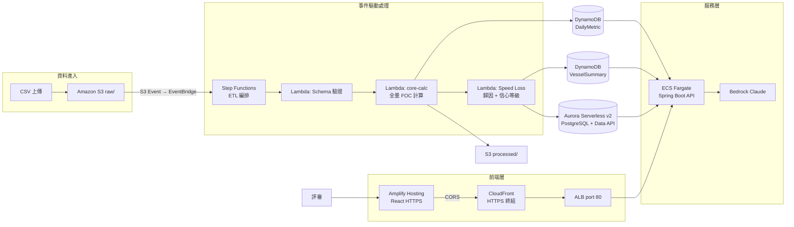

---

## 方案 E：Bedrock Agent 中心

> 評分 11/30 | Infra 22h | 已淘汰 (用最高風險追最低 10% 權重)

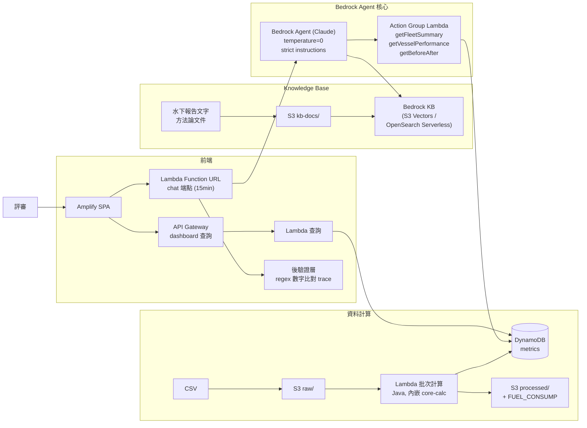

---

## 方案 F：ML 增強 (SageMaker)

> 評分 20/30 | Infra 18h | 作為 stretch 選項 (閘門管制)

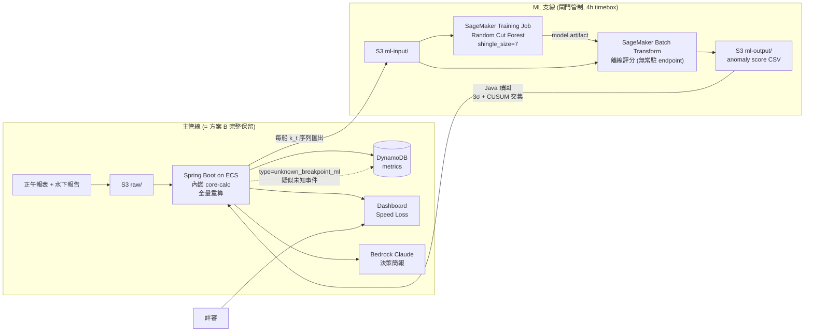

### ML 閘門決策

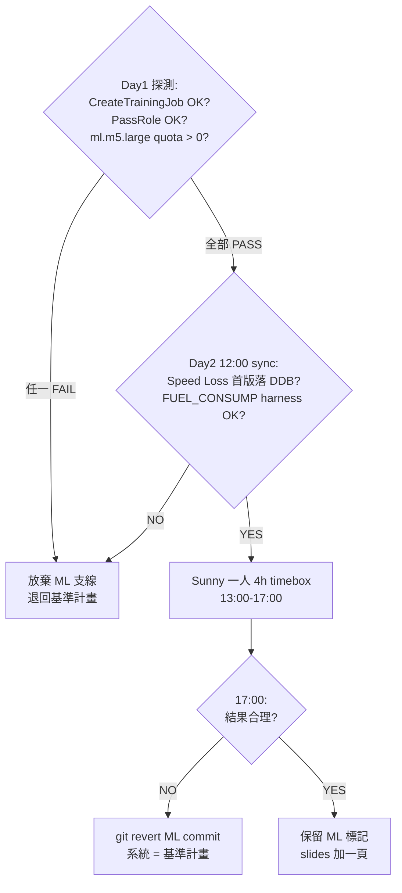

---

## 現行架構 vs 淘汰方案的關鍵差異

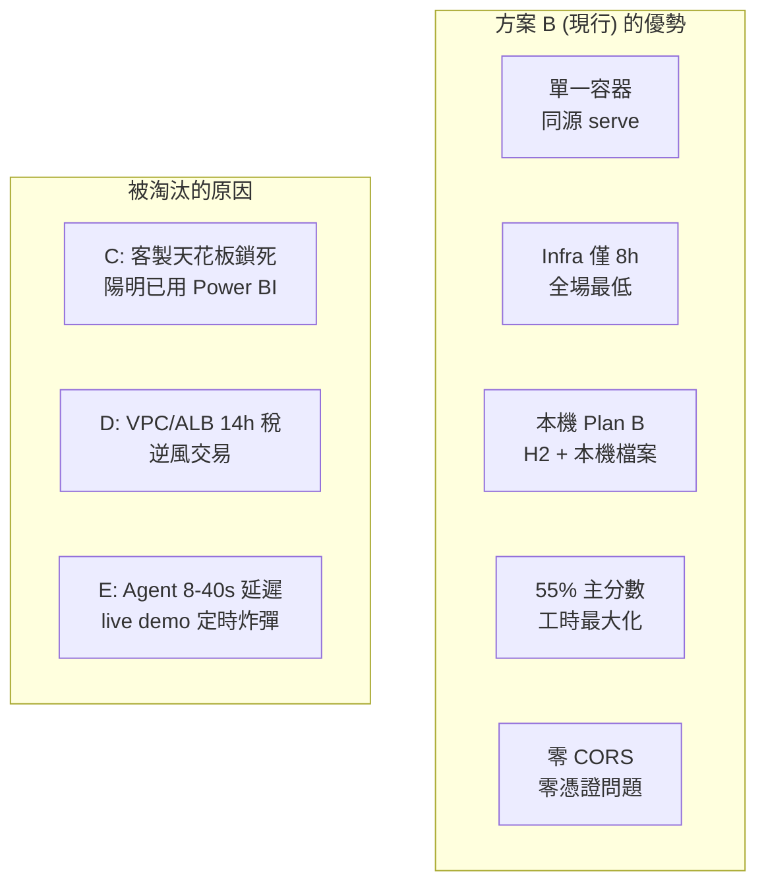

---

## 開賽日決策樹 (完整版)

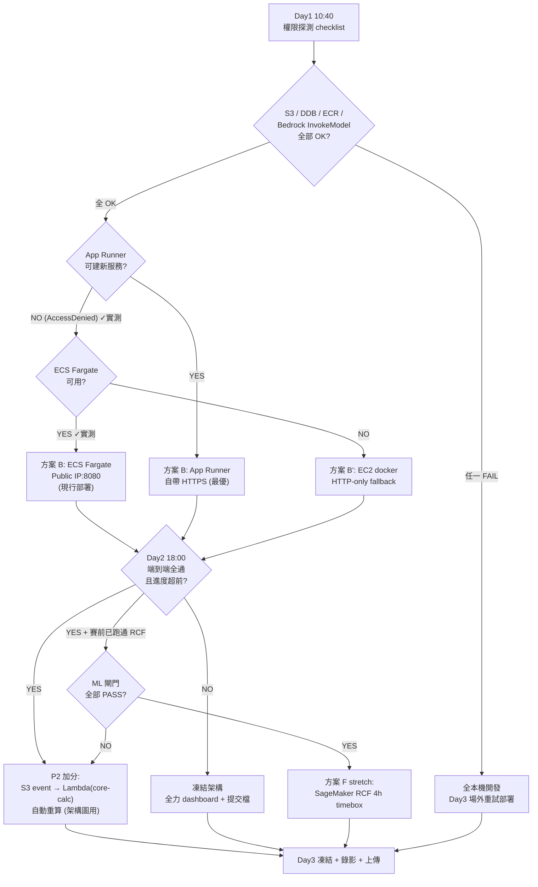

---

## 簡報用：定稿架構 (v1.0)

> 此圖可直接用於提交的技術架構文件

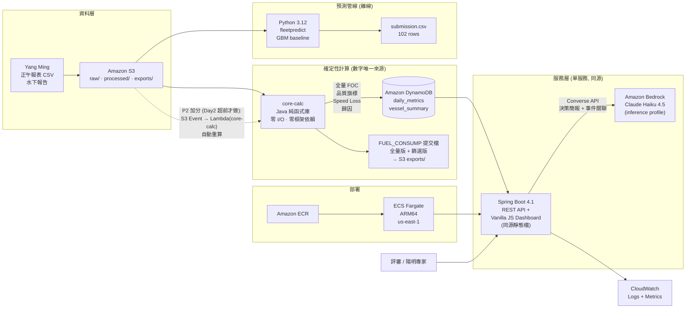

---

## 評分權重 vs 架構對應

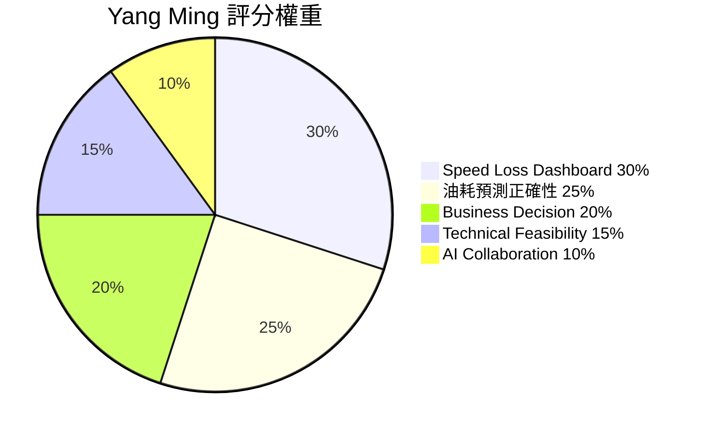

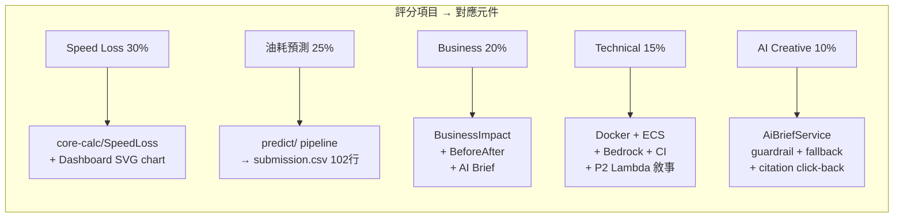

---

## 服務使用清單 (現行)

| AWS 服務 | 用途 | 狀態 |
|----------|------|------|
| Amazon ECR | Container image registry | ✅ 已部署 |
| Amazon ECS (Fargate) | ARM64 容器運行 | ✅ 已部署 |
| Amazon S3 | 資料儲存 (raw/processed/exports) | ✅ 已使用 |
| Amazon DynamoDB | Metrics 儲存 (透過 real-metrics.json) | 設計中 |
| Amazon Bedrock | Claude Haiku 4.5 AI 簡報 | ✅ 已驗證 |
| Amazon CloudWatch | 日誌與監控 | ✅ 自動掛載 |
| AWS IAM | 執行角色 + 任務角色 | ✅ 已建立 |

### 明確不使用的服務 (已在 docs/11 評估淘汰)

| 服務 | 淘汰原因 |
|------|----------|
| Amazon RDS / Aurora | 2.7 萬列不需要關聯式 DB |
| Amazon CloudFront | 增加 CORS + 傳播延遲 |
| Amazon QuickSight | 客製天花板 + 陽明已用 Power BI |
| Bedrock Agents | 8-40s 延遲 + 不可控 live demo |
| Amazon SageMaker | 期望值僅 +1-2%，工時不划算 |
| AWS App Runner | 帳號 AccessDenied (實測) |
