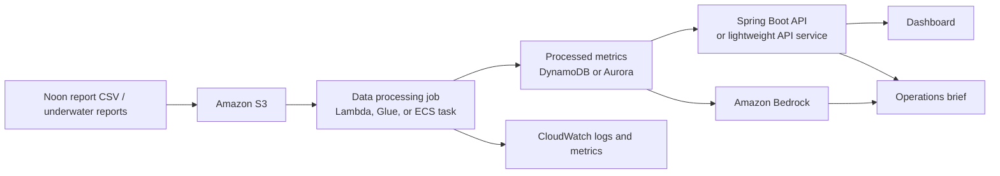

# Architecture Notes

## Preferred AWS Architecture



## Data Pipeline

1. Load noon reports.
2. Validate required fields.
3. Filter comparable sailing conditions:
   - `WIND_SCALE <= 4`
   - `HOURS_FULL_SPEED >= 22`
4. Normalize fuel to VLSFO equivalent.
5. Calculate Daily FOC.
6. Join underwater events.
7. Calculate vessel-level efficiency signals.
8. Persist processed metrics for dashboard and AI explanation.

## AI Usage

Use Bedrock for:

- Explanation of vessel anomaly.
- Evidence-based action brief.
- Q&A over processed metrics and business rules.
- Report generation.

Do not ask the LLM to be the source of numeric truth.

Numeric truth should come from deterministic calculations and validated data transformations.

## Suggested Services

- S3: input files and generated reports.
- Lambda / ECS / Glue: processing jobs.
- API Gateway: API entrypoint if needed.
- Spring Boot or lightweight backend: dashboard API and orchestration.
- DynamoDB / Aurora: processed metric storage.
- Bedrock: explanation and report generation.
- CloudWatch: logs, metrics, debugging.

## Reliability Considerations

- Make ingestion idempotent by file checksum or upload id.
- Keep raw input separate from processed metrics.
- Store transformation version with output records.
- Log rejected rows with reason.
- Surface data quality score in dashboard.
- Use timeouts and fallback summaries for Bedrock calls.
- If Bedrock fails, dashboard should still show deterministic metrics.

## Possible API Shape

```http
GET /api/fleet/summary
GET /api/vessels/{vesselId}/performance
GET /api/vessels/{vesselId}/underwater-events
POST /api/vessels/{vesselId}/ai-brief
POST /api/scenarios/fuel-impact
```

