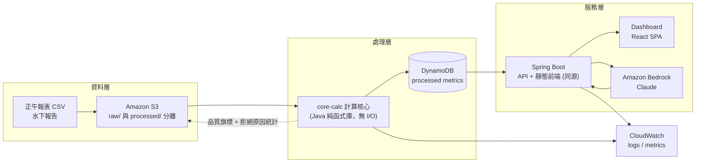
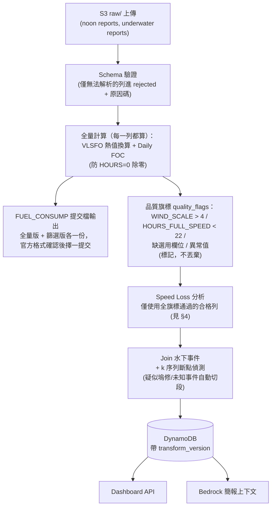
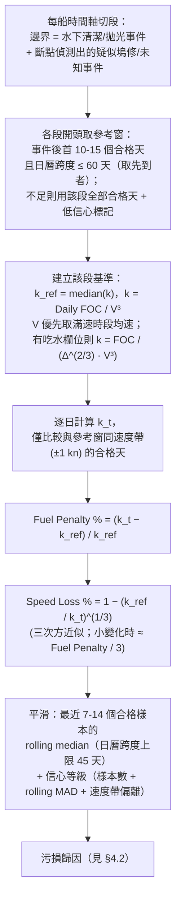
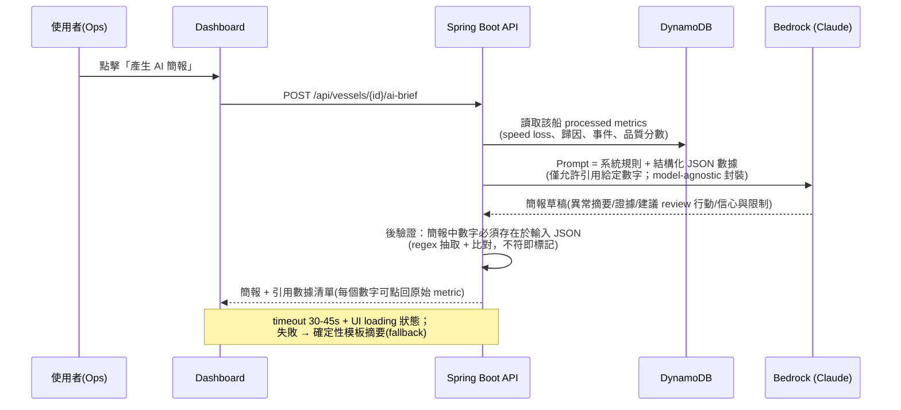

# 系統架構與執行計畫（Architecture & Execution Plan）

> 目的：把 `04-solution-strategy.md` 與 `05-architecture-notes.md` 收斂成一份可直接執行的完整計畫，供團隊 review。
> 範圍：只有計畫與設計，不含實作。實作於 07-14 開賽後依本計畫進行。
> 狀態：Draft v2（已經過 4 視角對抗式審查：海事領域／評審視角／AWS 架構／數學一致性），待團隊 review。

## 1. 定位與成功標準

FleetMind = 船隊能效決策支援 Copilot。AI 不開船、不下指令；AI 把雜訊資料變成可解釋的維護決策證據。

可驗證的成功標準（對齊評分權重）：

| # | 成功標準 | 對應評分 | 驗證方式 |
| --- | --- | --- | --- |
| S1 | Speed Loss dashboard：每船 Speed Loss 數值、趨勢、污損歸因 %（含可計算的歸因定義，見 §4.2） | Speed Loss dashboard 30% | Live demo 走完 demo script |
| S2 | Daily FOC 對**全量資料列**計算正確，且能依官方評分格式一鍵匯出 | FUEL_CONSUMP 正確性 25%（程式自動評分） | 單元測試 + golden case + 提交 harness 自我驗證 |
| S3 | 每船可產出前後對比（清潔/拋光前 vs 後，同分母口徑） | 商務決策價值 20% | Demo 中展示至少 1 艘船的 before-after |
| S4 | 架構 3 天內可部署、全 AWS 服務 | 技術可行性 15% | 架構圖 + 實際部署 |
| S5 | Bedrock 產出引用實際數據的決策簡報，數字零幻覺，citation 可點回原始 metric | AI 協作創意 10% | 簡報內數字可回溯至 API 回傳值 |

## 2. 系統架構

### 2.1 架構總覽



角色分工原則：

- **數字真相只來自確定性計算**（core-calc），Bedrock 只做解釋與敘事，不產生數字。
- raw 與 processed 嚴格分離；每筆 processed 記錄帶 `transform_version`，可重現。
- Bedrock 失敗時 dashboard 仍完整可用（fallback 摘要）。

### 2.2 關鍵架構決策：計算核心用 Java、單服務優先

**core-calc 是一個無 I/O 的 Java 純函式庫**（篩選旗標、VLSFO 換算、Daily FOC、Speed Loss、before-after），配 golden-case 單元測試。理由：

- 團隊最強技能是 Java/Spring Boot；27k 列的表格運算 pandas 沒有不可替代性。
- 同一份程式碼可以跑在 Lambda（Java runtime）**或**直接內嵌 Spring Boot——部署形式退化時**計算零重工**，golden case 測試也只寫一套。

**部署走「最低摩擦優先、逐步加分」兩階段**：

| 階段 | 內容 | 條件 |
| --- | --- | --- |
| P1（default，Day1 必須跑通） | 單一 Spring Boot 服務：serve React build（同源，無 CORS/混合內容問題）+ API + 內嵌 core-calc（管理端點觸發全量重算）。外部依賴只有 S3、DynamoDB、Bedrock。跑在 App Runner（可用時）或一台 EC2 + docker | 任何權限環境都能活 |
| P2（加分，時間有餘才做） | core-calc 包成 Lambda 由 S3 上傳事件觸發；前端拆到 Amplify Hosting | Day2 進度超前 + 權限允許 |

明確**不做**：CloudFront（invalidation 延遲 + HTTPS 混合內容是 demo 前夜炸彈）、RDS（VPC 佈建成本高）、ECS Fargate 為 default（ECR/task role/ALB 全套半天起跳，降為 P2 之後的 stretch）。

DynamoDB 不可用時的儲存 fallback：內嵌 H2 / 純記憶體 + S3 快照。

**開賽日環境探測**：預先寫好 10 分鐘權限探測 checklist（建 S3 bucket / 建 DynamoDB table / 建 IAM role / 部署 Lambda / App Runner 可用性 / **Bedrock 可用模型清單 + 實際 InvokeModel 一次**），環境到手立刻跑，每項 pass/fail 直接對映 P1/P2 分叉。Bedrock smoke test 是 Day1 必做——模型存取可能要逐一啟用，拖到 Day2 發現沒開通就來不及。

### 2.3 技術選型摘要

| 元件 | 選擇 | 理由 |
| --- | --- | --- |
| 儲存 | S3 | 原始檔 + 產出報告；比賽資料賽後可整包刪除 |
| 計算 | core-calc（Java 純函式庫） | 見 §2.2；資料量小，全量重算 < 1 分鐘 |
| 指標庫 | DynamoDB（fallback H2/記憶體） | 查詢模式固定，免 schema migration |
| API + 前端 | Spring Boot 同源 serve React build | 團隊最強技能；消滅 CORS/HTTPS 整類問題 |
| 圖表 | Recharts（用現成 dashboard template 起手） | 工程四人皆後端，不從零刻版面；P5 供版面/文案設計意見 |
| AI | Bedrock（Claude 系列，model-agnostic 封裝） | 賽制指定 AWS models only；換 model id 即可跑 |
| 觀測 | CloudWatch logs + 基本 metrics（不設 alarm） | demo 用不到 alarm |

## 3. 資料模型與管線

### 3.1 資料管線流程

**設計鐵律：Daily FOC 對全量列無條件計算；篩選只產生品質旗標，不丟資料。** FUEL_CONSUMP 自動評分（25%）可能要求對所有列（或官方指定列）輸出 Daily FOC——若先篩選再計算，提交檔會缺列，直接在程式評分丟分。



管線工程要求：

- **冪等**：全量重算 + 覆寫，重跑同一輸入結果完全一致（不做 checksum 去重，重算即冪等）。
- **品質可觀測**：每個旗標原因碼計數上 dashboard 的 data quality 面板。

### 3.2 燃料 VLSFO 當量換算與 Daily FOC（自動評分 25%，必須精確）

```text
VLSFO_equiv(t) = Σ_i  mass_i × LCV_i / LCV_VLSFO
LCV: MGO=42.7, ULSFO=41.2, HFO=40.2, VLSFO=40.2
Daily FOC = ME_FULLSPEED_CONSUMP_VLSFO / HOURS_FULL_SPEED × 24
```

- 換算與 Daily FOC 是 core-calc 內的純函式，配 golden-case 單元測試（≥10 案例：多燃料日、單燃料日、HOURS=0、邊界 22 小時、風力 4 級恰好通過等）。
- 若官方欄位已是換算後的 `ME_FULLSPEED_CONSUMP_VLSFO`，換算函式仍保留並交叉驗證（誤差 > 0.1% 告警）。
- **提交 harness 是管線的正式輸出**（非附帶品）：依官方格式（欄位名、精度、四捨五入）輸出 + 自我驗證腳本。格式未確認前，全量版與篩選版同時預產。

### 3.3 核心資料實體

| 實體 | 主要欄位 | 來源 |
| --- | --- | --- |
| NoonReportDaily | vessel_id, date, wind_scale, hours_full_speed, me_fullspeed_consump_vlsfo, speed/distance(待確認), draft(待確認), 其餘原欄位 | 正午報表 CSV |
| UnderwaterEvent | vessel_id, date, type(inspection/cleaning/propeller_polishing/**unknown_breakpoint**), notes | 水下報告 + 斷點偵測 |
| DailyMetric | vessel_id, date, daily_foc, quality_flags, k_value, speed_loss_pct, fuel_penalty_pct, confidence, transform_version | 管線產出 |
| VesselSummary | vessel_id, latest_speed_loss, fouling_attribution_pct, trend, days_since_last_cleaning, ref_window_span_days, data_quality_score, review_priority | 管線產出 |
| AiBrief | vessel_id, generated_at, brief_text, cited_metrics[], model_id | Bedrock |

## 4. Speed Loss 方法論（dashboard 評分 30% 的核心）

### 4.1 計算邏輯

參考 ISO 19030（船體與螺槳性能量測標準）的精神，簡化為正午報表可支撐的版本，**並明列與標準的偏離**（見 §4.4）。



方法選擇理由：

- 推進功率 ≈ 阻力 × 速度 ∝ V³，同船同條件下 `FOC/V³` 是船體阻力係數的 proxy；污損 → k 上升。
- 有吃水欄位時用 Admiralty 修正 `k = FOC/(Δ^(2/3)·V³)`（Δ 由吃水近似排水量）：滿載/輕載腿的 k 差可達 10–20%，與污損訊號同量級，不修正等於把載況差當污損。無吃水欄位時以「同船同航線方向」分組比較緩解，且信心等級把吃水未知列為扣分項。
- 三次方是近似：貨櫃船服務速度區間阻力指數常達 3.5–4.5。緩解：k 比較限制在與參考窗同速度帶（±1 kn）內；時間允許則以參考窗資料回歸擬合每船實際指數 n 取代硬編 3。速度偏離參考窗列為降信心條件（2021–2025 橫跨 slow steaming 結構性降速，不控速度帶會把降速誤判成污損變化）。
- 用 **median 不用 mean**：正午報表天生噪音大（人工填報、海流、湧浪）。
- 參考窗刻意短（10–15 個合格天）：合格天（風力≤4 且滿速≥22h）可能稀疏，窗拉太長（30+ 合格天可能橫跨數月）會讓再生污損墊高 k_ref、系統性低估 Speed Loss。`ref_window_span_days` 進 VesselSummary，Day1 拿真實資料統計每船合格天分佈後定案 N。

**Before-After 對比（同分母口徑，避免基準混用）**：

```text
清潔回收效率 = (median k_事件前30個合格天 − median k_事件後參考窗) / median k_事件前30個合格天
```

不跨段相減 fuel penalty（兩段分母不同，相減無意義且會被評審打穿）。

**長期累積劣化（輔助指標）**：另以全船史最低 k_ref 段為「最佳基準」畫累積劣化曲線——回答評審「這艘船到底髒到什麼程度」時，段內相對值答不上絕對劣化（多次清潔僅部分回復時，跨段殘留劣化會被段內基準歸零）。

### 4.2 污損歸因（可計算的定義）

陽明明確要求「因船體髒污導致 Speed Loss 百分比%」。**不宣稱「天候已完全排除、殘差全是污損」**——WIND_SCALE≤4 濾不掉湧浪、洋流（固定航線上的海流是系統性偏差，median 救不回）、海水溫度季節效應、吃水差異。

可執行的歸因定義：

```text
段內 k_t 對時間做穩健迴歸（Theil-Sen）：
  趨勢成分（斜率 × 經過天數）→ 歸因為污損累積（生物污損隨時間單調生長）
  殘差 → 未歸因（海況/海流/填報噪音）
污損歸因 % = 趨勢貢獻 / 總 fuel penalty
```

Dashboard 歸因卡顯示三個數字：總 Speed Loss %、其中污損歸因 %、未解釋殘差 %。負值（優於基準）顯示「優於基準」徽章不顯示負百分比。同時明列未控制變因（湧浪、洋流、SST、吃水若無欄位）——誠實的限制聲明是對陽明專家評審的加分項，不是扣分項。若資料含海水溫度欄位，Day2 至少做 SST vs k 散點檢查以回應專家提問。

### 4.3 已知假設與 fallback（開賽日必須驗證）

| 假設 | 若不成立的 fallback |
| --- | --- |
| 正午報表含船速或距離（滿速時段均速最佳） | 退化為 Daily FOC 趨勢漂移訊號；**dashboard 頭牌仍叫 Speed Loss dashboard**，主 KPI 顯示 Speed Loss %（÷3 近似 +「估計」徽章），Fuel Penalty 並列為輔助指標（評分項名就是 Speed Loss dashboard，不改名） |
| 船速為對地速 SOG（幾乎必然，非 ISO 19030 要求的對水速 STW） | 待確認是否有 log speed / engine distance / slip 欄位；無則明列限制，以同航線去回程配對 + 長窗 median 緩解洋流系統性偏差 |
| 每船至少有 1 次水下清潔事件 | 無事件的船以資料期最早合格天為參考窗 |
| 水下報告涵蓋所有效率重置事件 | 五年資料內幾乎必有進塢（換防污漆，阻力重置遠大於水下清潔）；斷點偵測（k 驟降 >X% 持續 N 天）自動切段並標記「疑似塢修/未知事件」 |
| 吃水/排水量欄位可用 | 見 §4.1：同航線方向分組 + 信心降級 |
| 合格天樣本足夠 | 樣本 < 門檻顯示低信心徽章，AI 簡報自動降低建議強度 |

### 4.4 ISO 19030 偏離表（Q&A 防守用）

| ISO 19030 要求 | 本方案（正午報表限制下） | 影響與緩解 |
| --- | --- | --- |
| 對水速 STW（都卜勒計程儀） | 對地速 SOG | 洋流系統性偏差；同航線配對 + 長窗 median |
| 高頻自動感測（分鐘級） | 每日人工正午報表 | 噪音大；median + 信心等級 |
| 軸功率計 | 主機油耗 proxy | SFOC 隨負載變動；同速度帶比較 |
| 吃水/trim 修正 | 有欄位才修正 | 無欄位時信心降級 |

主動承認限制並說明緩解 = 把弱點轉成誠實加分。

### 4.5 Dashboard 規格（砍到評分必要的最小集合）

1. **Fleet Overview**：15 船排名表（Speed Loss % / 污損歸因 % / 距上次清潔天數 / 資料品質分數 / 建議 review 優先序）。
2. **Vessel Detail**：Daily FOC 趨勢、Speed Loss 趨勢 + 事件標記線、歸因卡（§4.2 三數字）。
3. **Before-After**：事件前後對比卡（k 值口徑、換算年化燃油成本差）。
4. **AI Ops Brief**：一鍵產生決策簡報（demo 船預先快取，見 §5）；「待人工審核」靜態標籤呈現 human-in-the-loop 定位。

Stretch（時間有餘才做）：信心帶視覺化、合格天散點圖、累積劣化曲線。

## 5. Bedrock AI 協作設計

### 5.1 決策簡報生成流程



防幻覺三道防線：

1. Prompt 內明確規則：只能引用提供的 JSON 數字，不得推算新數字。
2. 後驗證：抽取簡報中所有數字比對輸入，不符者整段標記警示。
3. UI 上每個數字可點回原始 metric（citation）——**這也是 AI 協作創意 10% 的展示重點**：demo 時現場點簡報中的數字跳到 dashboard 對應點，零額外工程、評審可見的差異化。

**Demo 風險解耦**：demo 用船的簡報在 Day3 資料凍結後預先產生並快取，現場點擊直接秀快取結果（UI 顯示 `generated_at` 證明真實產出），live 重新生成留作評審要求時的加碼演示。不讓 8 分鐘簡報現場賭 LLM 延遲。

### 5.2 Could-have（Day2 進度超前才做）

- 自然語言查詢 fleet metrics：只做**單一 happy-path demo**（tool-use 呼叫既有 API），不做泛用版。
- 匯出周報（Markdown → PDF）。

## 6. API 規格（v1）

```http
GET  /api/fleet/summary                      # 15 船排名 + 品質分數
GET  /api/vessels/{id}/performance?from&to   # daily metrics 時序
GET  /api/vessels/{id}/underwater-events
GET  /api/vessels/{id}/before-after?eventId
POST /api/vessels/{id}/ai-brief              # 產生簡報(30-45s timeout, demo 走快取)
GET  /api/data-quality/summary               # 品質旗標統計
GET  /api/fuel-consump/export?variant=full|filtered   # 自動評分提交檔
POST /admin/reprocess                        # 全量重算(冪等)
```

- 回應內附 `transform_version` 與 `data_quality`，供簡報引用與 Q&A 防守。
- 簡報 review 狀態流程（PUT status）降為 could-have：3 分鐘 demo 展示不到，工時讓給綁分數的缺口。

## 7. 三天執行計畫與分工

團隊：Eddie（Backend/Java）、Sunny（AWS 架構）、Feng（Software Eng）、Chen（Software Eng）、**P5（PM/簡報/設計）**。

**5 人分工原則**：工程四人鎖死 55% 硬盤（dashboard + FUEL_CONSUMP）與系統本體；P5 專職「簡報官＋提交官」——slides 主筆、demo script 導演、彩排計時、官方七項提交物 end-to-end owner、待確認清單記錄、Q&A 模擬主持。簡報線從 Day1 起與工程線**平行**推進（不再等 Day2 晚由工程師兼職），工程師只供截圖與數字。

**官方議程對齊**（`01-event-rules.md`）：Day1 現場 build 時段是 13:00–17:00；Day3 現場 sprint 只有 11:30–14:30。計畫不假設不存在的開發時段；17:00 後與 Day3 清晨的場外工作明寫在表內。

### Day1 07-14（AWS office）

| 時段 | 內容 |
| --- | --- |
| 09:00–10:00 | 報到/開場（無開發時段） |
| 09:40–10:00 | 上傳平台公布：**P5 主責記錄**欄位/格式限制、challenge link 定義（`12` §5） |
| 10:00–10:40 | 企業命題與資料說明：工程四人專注 schema 技術細節；**P5 記錄全部 §10 待確認答案**（問不到就當場向主辦方書面提問） |
| 10:40–11:00 | 環境說明：Sunny 跑 10 分鐘權限探測 checklist + **Bedrock smoke test**（§2.2） |
| 11:00–12:00 | 提案討論時段內定 P1/P2 拍板 + API contract 草稿 + **凍結 Speed Loss 輸出 JSON schema（含假數值）**；P5 開 slides 骨架（冷開場留數字位） |
| 13:00–14:00 | API contract 定稿（哪怕全假資料），前後端自此平行 |
| 13:00–17:00 | 平行實作（下表） |
| 晚間（場外，自願） | 各自收尾當日目標；Chen 產出第一版 FUEL_CONSUMP 提交檔 |

| Day1 13:00–17:00 | Eddie | Sunny | Feng | Chen | P5 |
| --- | --- | --- | --- | --- | --- |
| 任務 | Spring Boot 骨架 + API contract 假資料實作 + 接 DynamoDB | P1 部署跑通（App Runner/EC2）+ S3/DynamoDB/IAM + 前端 build 部署走通一次 | 真實資料 schema 驗證 + golden case 準備 + **FUEL_CONSUMP 提交 harness（owner）** | core-calc：品質旗標 + VLSFO 換算 + Daily FOC + 單元測試 | slides 骨架（評分表骨架頁+冷開場留位）+ 上傳平台規則文件化 + 16:00 抽籤結果入彩排排程 |

### Day2 07-15（remote）

| 時段 | Eddie | Sunny | Feng | Chen | P5 |
| --- | --- | --- | --- | --- | --- |
| 全天 | before-after API + ai-brief API + 後驗證 | Bedrock 整合 + fallback + CloudWatch + **端到端整合 owner** | Dashboard 三頁面（template 起手，最小圖表集合） | Speed Loss + 歸因 + 信心等級（core-calc） | slides 主體主筆（工程師只供截圖/數字）+ 企業資料應用說明初稿（Feng 供技術素材）+ demo script 三擊版初稿 |
| 12:00 sync | — | — | — | Speed Loss 首版數字落 DynamoDB | — |
| 18:00 sync | 全員：端到端串真資料，走一次 demo 動線（P5 掐錶） | | | | |
| 晚間 | Q&A 附錄 10 題技術素材；第二版 FUEL_CONSUMP 提交檔驗證 | | | | slides 定稿（Day3 只換真截圖）+ 冷開場數字填入（來自 18:00 before-after 真資料） |

Day2 環境風險：比賽用臨時帳號可能場外不可用/憑證過期（§10 待確認）。Plan B：全系統本機可跑（H2 + 本機檔案取代 S3/DynamoDB），Day2 本機開發、Day3 到場部署回 AWS——§2.2 的單服務設計天然支援這條路。

### Day3 07-16（TICC，現場 11:30–14:30）

| 時段 | 內容 |
| --- | --- |
| 07:30–11:00（場外） | 工程：bug 修 + **demo 資料凍結成快照** + demo 船 AI 簡報預產快取；P5：**slides 換真截圖** + 企業資料應用說明定稿 + demo 錄影導演 + 彩排第 1 次（P5 計時給修正意見） |
| 11:30–12:00（現場） | 最後檢查 + feature freeze + 部署凍結 |
| 12:00–14:00 | **上傳全部交付物（不等 14:30 死線）**：官方七項——deck / challenge link / 企業資料應用說明 / 架構文件 / repo / demo 連結 / 錄影。**P5 owner：七項提交物逐項核對＋實際上傳**（詳見 `12` §3 G5）；Sunny：repo README（架構圖、跑法、公式與測試說明）+ 部署凍結 + warm-up 驗證 |
| 13:30–14:00 | 彩排第 2 次（P5 計時 + 模擬 Q&A 快問） |
| 15:00–17:00 | 上台 |

關鍵原則：

- 每天結束前有一個「可 demo 的整體」，不留隔夜整合（Day2 靠兩個 sync 點把整合風險切成半天粒度）。
- 錄影與 live demo 用同一份凍結快照；slides 截圖同快照（Day2 晚的截圖只是佔位草稿）。
- FUEL_CONSUMP 提交檔三次迭代：Day1 晚首版 → Day2 晚驗證版 → Day3 上午最終版。

## 8. 驗證與測試計畫

| 對象 | 方法 | 通過標準 |
| --- | --- | --- |
| VLSFO 換算 + Daily FOC | core-calc 純函式單元測試 + golden cases（≥10 案例，含多燃料、HOURS=0、邊界值） | 全過；與官方欄位交叉驗證誤差 < 0.1% |
| FUEL_CONSUMP 提交檔 | harness 依官方格式自我驗證（欄位名/精度/列數） | 全量列無缺；格式與官方樣例一致 |
| 品質旗標 | 單元測試（風力 4/5、時數 21.9/22 邊界） | 全過；**旗標不影響 FOC 計算與提交檔列數** |
| Speed Loss | 對 1-2 艘有清潔事件的船人工驗證：事件後 k 應下降 | 方向正確 + before-after 同分母口徑數字合理 |
| 管線冪等 | 同一 CSV 跑兩次 diff processed 輸出 | 完全一致 |
| API | contract test（回應 schema）+ 手動冒煙 | demo 所需端點全通 |
| 簡報防幻覺 | 抽 5 份簡報人工核對所有數字 | 100% 可回溯 |
| Live demo | demo script 計時 | **≤ 3 分鐘**（配合 `10-presentation-plan.md` 時段） |
| 整場簡報 | 含 demo 全程彩排計時 | **≤ 7 分 15 秒**（留 45 秒 buffer） |

## 9. 風險與備援

| 風險 | 機率 | 備援 |
| --- | --- | --- |
| FUEL_CONSUMP 提交格式與假設不符 | 高 | 全量計算鐵律（§3.1）+ 雙版本預產 + Day1 當場釐清格式；Feng 專責 harness |
| 真實資料欄位與簡報不符 | 高 | Day1 13:00 第一件事驗 schema；欄位映射獨立成 config |
| 無船速/吃水欄位 | 中 | §4.3 fallback 表；頭牌仍叫 Speed Loss dashboard |
| 工程四人皆後端、無前端專長，dashboard 佔 30% 評分 | 高 | template 起手 + 最小圖表集合 + Day1 前端 build/部署先走通一次（工具鏈風險提前引爆）+ P5 以設計視角當 dashboard 第一使用者，持續點測回饋 |
| AWS 環境權限受限 | 中 | P1 單服務路徑 + 權限探測 checklist 即時分叉；儲存 fallback H2 |
| Bedrock 模型未開通/配額低 | 中 | Day1 上午 smoke test；model-agnostic 封裝換模型即跑；再不行確定性模板簡報 |
| Day2 遠端環境不可用 | 中 | 全系統本機可跑 plan B（§7 Day2） |
| Live demo 現場 Bedrock 延遲/失敗 | 中 | demo 船簡報預產快取 + `generated_at` 佐證；live 重生成留作加碼 |
| Live demo 網路故障 | 低 | demo 錄影必備 + 本機 fallback 環境 |
| 資料太髒、合格天太少 | 中 | 品質面板如實呈現 + 把「資料品質可視化」講成 feature（誠實 = 商務可信度） |

## 10. 待確認問題（07-14 開賽日，按優先序）

1. **FUEL_CONSUMP 自動評分的提交格式**（CSV？API？欄位名？精度？四捨五入？範圍是全量列還是篩選後？）——直接影響 25%，最高優先。
2. 正午報表實際欄位清單：船速（**對水速或對地速？對應全日還是滿速時段？**）、航行距離（engine distance？log speed？slip？）、吃水、海水溫度、錨泊/等待時數。
3. `ME_FULLSPEED_CONSUMP_VLSFO` 是原始值還是已換算值？多燃料日的原始欄位長怎樣？
4. 水下報告是結構化資料還是 PDF？**是否含進塢（dry-docking）/塢修日期**（15 艘 × 5 年幾乎必有；若無，靠斷點偵測）？若 PDF，人工建事件表可行。
5. AWS 環境：帳號權限範圍、可用區域、**Bedrock 可用模型清單**、**Day2 場外是否可存取、憑證有效期**。
6. Live demo 是投影自己電腦還是提供環境？

## 11. 本計畫與既有文件的關係

- `04-solution-strategy.md`：產品範圍（MoSCoW）不變，本文件落實其 How；簡報 review 狀態流程從 should-have 降為 could-have（§6）。
- `05-architecture-notes.md`：架構方向不變；本文件把處理層從 Lambda-first 改為 core-calc（Java）+ 單服務優先（§2.2），並補齊 Speed Loss 方法論、歸因定義、資料模型、分工、測試計畫。
- `06-demo-storyline.md`：敘事不變；live demo script 需剪裁到 ≤ 3 分鐘（§8）。
- `07-judge-qna.md`：本文件 §4.4 ISO 偏離表、§4.2 歸因限制聲明為 Q&A 新增防守材料。
