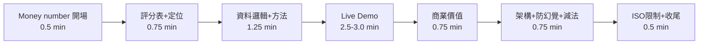

# 簡報計畫（8 分鐘上台 + 4 分鐘 Q&A）

> 對應 `06-demo-storyline.md` 的敘事，落成 slide-by-slide 計畫。
> 簡報檔以此為藍本產出；live demo 佔中段 2.5–3 分鐘，slides 前後包夾。
> 總長目標 **7 分 15 秒**，留 45 秒 buffer——超時 30 秒就會腰斬收尾。

## 時間分配

**冷開場直接用 demo 船 money number**，第二頁用陽明五維評分表宣告時間分配。商業價值（評分 20%）排在 demo 後第一頁，不放最後，避免被超時吃掉。

## Slide 清單（9 頁正片 + 附錄）

| # | Slide | 重點 | 開始時間 |
| --- | --- | --- | --- |
| 1 | Money number 開場 | 「這艘船過去 90 天因船體污損每天多燒 Y 噸油，年化 Z 萬美元；FleetMind 在第 N 天抓到。」數字留位，Day2 18:00 後填真資料 | 0:00 |
| 2 | 評分表 + 產品定位 | 陽明五維權重：Speed Loss 30 / FUEL_CONSUMP 25 / 商務 20 / 技術 15 / AI 10。一句話：數字來自計算，語言來自 AI，決策留給人 | 0:30 |
| 3 | 營運痛點 | 燃油成本佔比高；船體/螺槳污損可致 >20% 效率損失；岸端人力有限、Power BI+人工監控不可擴展 | 1:15 |
| 4 | 資料邏輯 | 15 船 × 2021-2025 正午報表 + 水下報告；品質旗標三道；Daily FOC 原式；**全量計算、旗標不丟資料** | 1:45 |
| 5 | Speed Loss 方法 | FOC/V³ 阻力 proxy + 清潔事件分段基準 + 同速度帶比較 + 歸因卡三數字（總損失/污損歸因/未解釋） | 2:30 |
| — | **Live Demo** | 三擊：①排名表點最差船 ②事件標記線 + k 陡降 ③AI 簡報 citation 點回 dashboard；收 before-after + ROI。script ≤ 3 分鐘 | 3:00 |
| 6 | 商業價值 | 清潔 ROI 回本天數、每延遲一天燃油代價、CO₂/CII/EU ETS 影響卡；全部標明假設值與公式 | 5:45 |
| 7 | 架構 + 防幻覺 + 減法 | 左：S3/core-calc/DynamoDB/Spring Boot/Bedrock/CloudWatch。右：prompt 限制/後驗證/citation。下方：刻意不用 SageMaker/QuickSight/CloudFront/RDS | 6:30 |
| 8 | ISO 19030 偏離表 | 30 秒主動講 SOG 非 STW、正午報表非高頻、無軸功率計、吃水欄位條件式；限制先講，Q&A 攻擊失效 | 7:00 |
| 9 | 收尾 | AI 不取代海事專家；證據更快、可解釋、可行動。15→97 艘架構不變 | 7:15 |

## Q&A 附錄 slides（不進正片）

可直接套版的 backup slide 清單與彩排流程見 `15-presentation-readiness-pack.md`。

1. 為什麼不做航線優化（`07-judge-qna.md` 第一題）。
2. 污損歸因方法與未控制變因（湧浪/洋流/SST/吃水）。
3. 資料品質處理（品質旗標原因碼統計、全量計算鐵律）。
4. 無船速欄位的 fallback 說明。
5. 為什麼不用 SageMaker/QuickSight/Bedrock Agents。
6. 3.2% Speed Loss 到底該不該花 USD 40k 清潔。
7. SOG 與洋流偏差。
8. V³ 近似與每船 n 擬合。
9. 成本估算（AWS 服務用量）。
10. 賽後資料刪除與 repo 無原始資料檢查。

## Demo 防炸設計

- Demo 船 AI 簡報 **Day3 資料凍結後預產快取**，現場點擊秀快取（UI 顯示 generated_at）；live 重生成留作評審加碼要求。
- 錄影、live demo、slides 截圖全部用同一份 Day3 凍結快照——評審對照 live 與 slides 數字不會露餡。
- 網路故障 → 播錄影；本機 fallback 環境待命。

## 分工建議

- 主講候選：**P5（口條）或 Eddie（技術敘事）**——Day3 彩排第 1 次後定案；demo 操作 1 人（建議 Feng，最熟 dashboard）；Q&A 工程四人按專長（架構=Sunny、API/後端=Eddie、資料管線/歸因=Feng/Chen），P5 主持接題分配。
- 彩排 2 次：Day3 07:30–11:00 場外 1 次、13:30 現場 1 次，**P5 導演＋計時**，目標 ≤ 7:15。
- slides 製作線由 P5 主筆（Day1 骨架 → Day2 主體 → Day2 晚定稿 → Day3 換真截圖），工程師只供截圖與數字。

## 簡報製作原則

- 每頁一個重點，數字大字呈現。
- 架構圖與流程圖直接取自 `09-architecture-and-execution-plan.md` mermaid 圖轉出。
- Demo 截圖：Day2 晚只放佔位草稿，Day3 凍結快照後換真圖。
- 中文為主，技術名詞保留英文。
- slides 主體 Day2 晚間定稿，Day3 只換截圖（時間軸見 `09` §7）。
