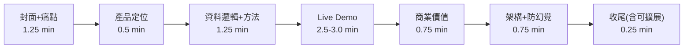

# 簡報計畫（8 分鐘上台 + 4 分鐘 Q&A）

> 對應 `06-demo-storyline.md` 的敘事，落成 slide-by-slide 計畫。
> 簡報檔以此為藍本產出；live demo 佔中段 2.5–3 分鐘，slides 前後包夾。
> 總長目標 **7 分 15 秒**，留 45 秒 buffer——超時 30 秒就會腰斬收尾。

## 時間分配

**商業價值（評分 20%）排在 demo 之後第一頁**——不放最後，避免被超時吃掉。

## Slide 清單（10 頁正片 + 附錄）

| # | Slide | 重點 | 開始時間 |
| --- | --- | --- | --- |
| 1 | 封面 | FleetMind：船隊能效決策支援 Copilot / 團隊名 | 0:00 |
| 2 | 營運痛點 | 燃油成本佔比高；船體/螺槳污損可致 >20% 效率損失（主機僅 3-5%）；岸端人力有限、Power BI+人工監控不可擴展 | 0:30 |
| 3 | 產品定位 | 一句話：AI 找出污損衰退的船，給人類專家可解釋的維護決策證據。AI 不開船 | 1:15 |
| 4 | 資料邏輯 | 15 船 × 2021-2025 正午報表 + 水下報告；品質旗標三道（風力≤4、滿速≥22h、VLSFO 熱值換算）；Daily FOC 公式原式呈現；**全量計算、旗標不丟資料** | 1:45 |
| 5 | Speed Loss 方法 | FOC/V³ 阻力 proxy + 清潔事件分段基準 + 三次方換 Speed Loss %；歸因卡三數字（總損失/污損歸因/未解釋）；一張圖講完 | 2:30 |
| — | **Live Demo** | 排名 → 單船趨勢+事件標記 → AI 簡報（快取，點數字跳回 metric）→ before-after。script ≤ 3 分鐘 | 3:00 |
| 6 | 商業價值 | 提早發現 → 提早清潔 → 用 demo 船 before-after 實數換算年化燃油成本差 + ESG 報告證據 | 5:45 |
| 7 | 架構 + 防幻覺 | 一頁雙欄：左 = S3/core-calc/DynamoDB/Spring Boot/Bedrock/CloudWatch 架構圖；右 = 三道防線（prompt 限制/後驗證/citation）。核心句：「數字全確定性、AI 只解釋」 | 6:30 |
| 8 | 收尾 | AI 不取代海事專家；證據更快、可解釋、可行動。可擴展一句話帶過（15→97 艘架構不變） | 7:00 |
| 9 | Q&A 封面 | 團隊分工 + 附錄索引 | 7:15 |
| 10 | 備用空白 | 防臨時需要 | — |

## Q&A 附錄 slides（不進正片）

1. 為什麼不做航線優化（`07-judge-qna.md` 第一題）。
2. **ISO 19030 偏離表**（`09` §4.4）：不端「對照」，端「偏離 + 緩解」——主動承認 SOG 非 STW、正午報表非高頻感測，弱點轉誠實加分。
3. 污損歸因方法與未控制變因（湧浪/洋流/SST/吃水）——海事專家必問。
4. 資料品質處理（品質旗標原因碼統計、全量計算鐵律）。
5. 無船速欄位的 fallback 說明。
6. 成本估算（AWS 服務用量）。

## Demo 防炸設計

- Demo 船 AI 簡報 **Day3 資料凍結後預產快取**，現場點擊秀快取（UI 顯示 generated_at）；live 重生成留作評審加碼要求。
- 錄影、live demo、slides 截圖全部用同一份 Day3 凍結快照——評審對照 live 與 slides 數字不會露餡。
- 網路故障 → 播錄影；本機 fallback 環境待命。

## 分工建議

- 主講 1 人（痛點到方法 + 商業價值 + 收尾）、demo 操作 1 人、Q&A 全員（架構=Sunny、API/後端=Eddie、資料管線/歸因=Feng/Chen）。
- 彩排 2 次：Day3 07:30–11:00 場外 1 次、13:30 現場 1 次，皆計時，目標 ≤ 7:15。

## 簡報製作原則

- 每頁一個重點，數字大字呈現。
- 架構圖與流程圖直接取自 `09-architecture-and-execution-plan.md` mermaid 圖轉出。
- Demo 截圖：Day2 晚只放佔位草稿，Day3 凍結快照後換真圖。
- 中文為主，技術名詞保留英文。
- slides 主體 Day2 晚間定稿，Day3 只換截圖（時間軸見 `09` §7）。
