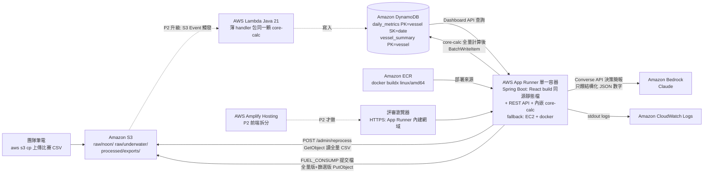
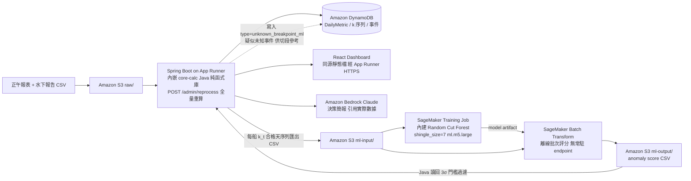
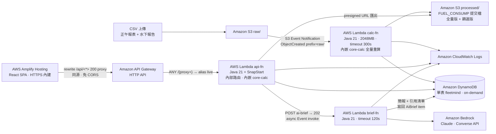
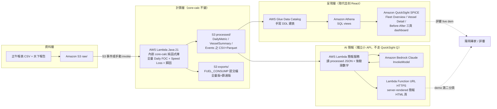
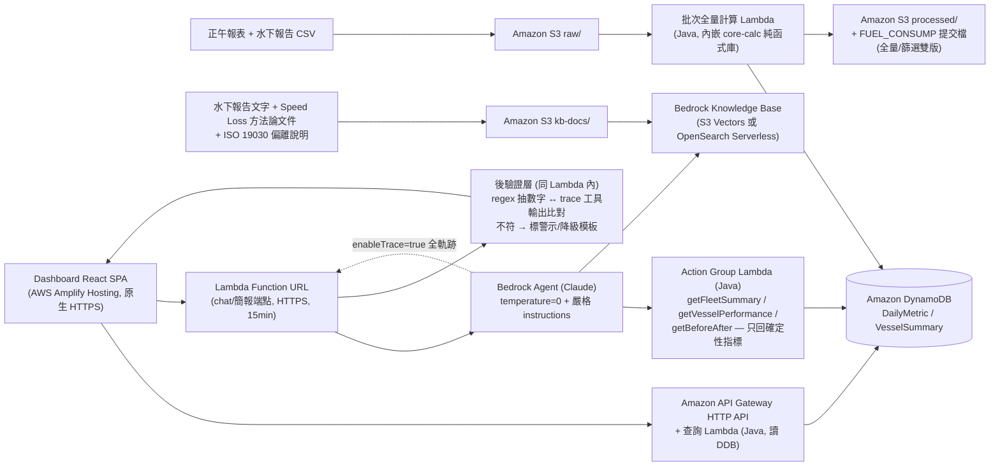
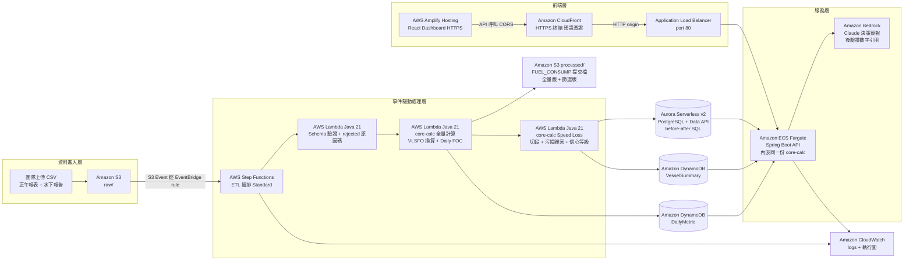
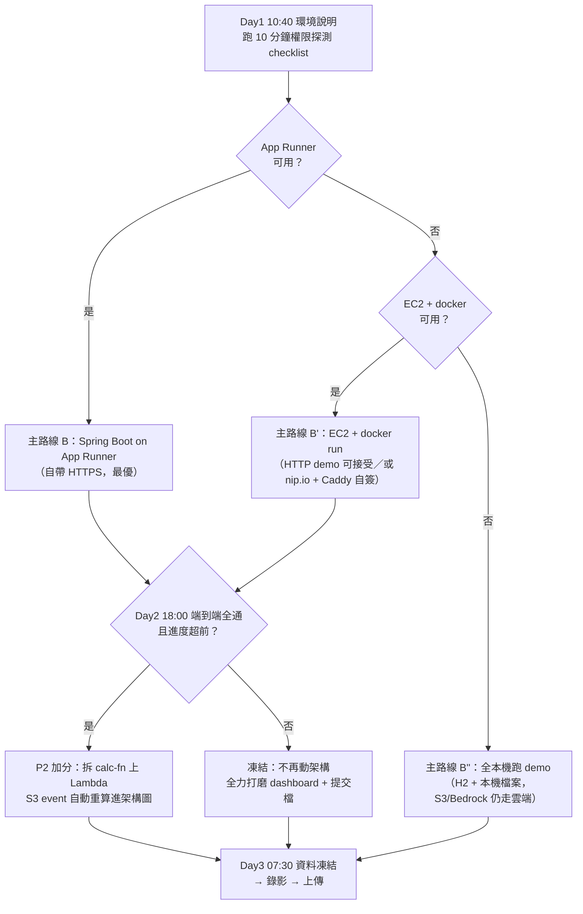

# AWS 系統架構方案比較與研究（Architecture Options Analysis）

> 目的：回應「系統架構全用 AWS 雲端服務完成」的賽制要求，產出多種可行架構與開發流程，並逐案分析優缺點，供團隊拍板。
> 方法：6 條路線各由獨立視角完整設計（含 3 天開發流程與風險表），再經 3 個評審視角（可交付性／評分最大化／Demo 風險）獨立打分。
> 前提：沿用 `09-architecture-and-execution-plan.md` 的既定決策 —— core-calc 為 Java 純函式庫、Daily FOC 全量計算鐵律、demo 簡報預產快取。各方案說明如何承載或為何推翻。
> 狀態：Draft，待團隊 review。

## 1. 快速結論：評審計分板

| 路線 | 可交付性 | 評分最大化 | Demo 風險 | 總分 | Infra 人時 |
| --- | ---: | ---: | ---: | ---: | ---: |
| B. 單服務容器（P1） | 9 | 9 | 9 | **27** | 8h |
| F. ML 增強（SageMaker） | 6 | 6 | 8 | **20** | 18h |
| A. 全 Serverless | 5 | 7 | 7 | **19** | 18h |
| C. 託管分析 QuickSight | 4 | 3 | 5 | **12** | 20h |
| E. Bedrock Agent 中心 | 3 | 5 | 3 | **11** | 22h |
| D. 事件驅動管線 | 2 | 4 | 4 | **10** | 14h |

三個評審視角一致裁決：**單服務容器（= `09` 計畫的 P1 default）全項第一**。詳細裁決與決策樹見 §4、§5。

## 2. 六條路線詳析

### 2.1 B. 單服務容器（P1） — P1 單服務容器路線（Spring Boot 同源 monolith on App Runner，漸進升級 P2 Lambda）

**一句話**：一個 docker image 打天下：Spring Boot 同源 serve React build + 內嵌 core-calc，跑 App Runner（自帶 HTTPS），外部只碰 S3/DynamoDB/Bedrock，任何權限受限環境都能活，且計算核心零重工即可升級成 S3→Lambda 事件驅動加分架構。

**資料流**：Day1 拿到比賽資料後，團隊用 aws s3 cp 把正午報表 CSV 與水下報告丟進 S3 raw/（不做上傳 UI，省半天工）。任何人打 POST /admin/reprocess（或容器啟動時偵測 DynamoDB 為空自動觸發），Spring Boot 用 SDK 讀回全部 CSV，交給同 JVM 內的 core-calc 純函式庫做全量計算：每一列無條件算 VLSFO 換算 + Daily FOC（篩選只產生 quality_flags 不丟列），再對合格列算 Speed Loss / 污損歸因 / before-after。結果 BatchWriteItem 進 DynamoDB 兩張表，同時把 FUEL_CONSUMP 提交檔（全量版 + 篩選版）寫回 S3 processed/exports/ 並經 GET /api/fuel-consump/export 可下載——自動評分 25% 的產出物是管線的正式輸出，不經前端。評審瀏覽器走 App Runner 內建 HTTPS 網域載入同源 React dashboard，圖表資料全部來自同一個 Spring Boot 查 DynamoDB；點「產生 AI 簡報」時 API 把該船 processed metrics 組成結構化 JSON 餵 Bedrock Claude，回來先做數字後驗證（regex 抽取比對輸入 JSON）再回前端，demo 船簡報 Day3 凍結後預產快取。

**服務組合**：AWS App Runner（主要運行環境，內建 *.awsapprunner.com TLS 網域）、Amazon ECR（container image 部署來源）、Amazon S3（raw/ 原始 CSV + processed/exports/ FUEL_CONSUMP 提交檔）、Amazon DynamoDB（daily_metrics + vessel_summary 兩張表）、Amazon Bedrock（Claude，Converse API，model-agnostic 封裝）、AWS IAM（單一 instance role：S3/DynamoDB/Bedrock 三條 policy）、Amazon CloudWatch Logs（App Runner 自動掛，不設 alarm）、Amazon EC2 + docker（App Runner 不可用時的 fallback）、AWS Lambda + S3 Event Notification（P2 升級才用）、AWS Amplify Hosting（P2 前端拆分才用）

**3 天開發流程**：

> 【IaC 選擇】不用 CDK/SAM——CDK bootstrap 要 CloudFormation + 寬 IAM，比賽帳號權限未知，bootstrap 失敗就燒掉半天；改用「一個 infra.sh（冪等 AWS CLI：create bucket / create table / create role+policy / ecr create-repo）+ Dockerfile + apprunner create-service CLI 或 console」，每條命令失敗可單獨換手動 console 操作，探測與佈建同一份腳本。賽前（7/14 前）先在自己帳號把 scaffold 全部走通一次：Spring Boot 骨架 + React/Vite/Recharts template + multi-stage Dockerfile + infra.sh 放 GitHub，Day1 只做接線不做初始化。
> 【Day1 13:00–17:00，四人平行】Sunny：跑 10 分鐘權限探測 checklist（S3/DDB/IAM/ECR push/App Runner/Bedrock InvokeModel 各真打一次），據結果拍板 App Runner 或 EC2 fallback，17:00 前用 hello-world image 把 HTTPS 網域跑通並貼給全隊。Eddie：Spring Boot API contract 假資料實作 + DynamoDB 讀寫 + /admin/reprocess 骨架。Chen：core-calc 品質旗標 + VLSFO 換算 + Daily FOC + golden case 單元測試（純 Java，完全不等雲端）。Feng：真實 schema 驗證 + FUEL_CONSUMP 提交 harness（owner），晚間場外產出首版提交檔。前後端解耦靠 11:00–12:00 凍結的 API JSON schema。
> 【Day2 remote 全天】Chen：Speed Loss + 歸因 + 信心等級進 core-calc，12:00 前首版數字落 DynamoDB。Feng：dashboard 三頁面（Fleet Overview / Vessel Detail / Before-After），改一版就 docker buildx push + apprunner update-service 驗一版（每輪 5–8 分鐘，排進節奏）。Eddie：before-after API + ai-brief API + 數字後驗證。Sunny：Bedrock 整合 + fallback 模板 + 端到端整合 owner，18:00 sync 全員串真資料走一次 demo 動線。若比賽帳號場外不可用 → 全系統本機跑（Spring profile local：H2 + 本機檔案取代 S3/DDB），Day3 到場重部署——單服務設計天然支援。行有餘力才啟動 P2：Lambda 薄 handler（~100 行）包同一顆 core-calc jar，S3 raw/ 事件觸發寫 DynamoDB，monolith 的 /admin/reprocess 保留當備援，architecture slide 同時畫 P1 實跑 + P2 事件驅動。
> 【Day3 07:30–11:00 場外】bug 修 + demo 資料凍結快照 + demo 船 AI 簡報預產快取 + 最終版 FUEL_CONSUMP 提交檔 + slides 換真截圖 + 錄影 + 彩排。【11:30–14:30 現場】11:30 feature/部署凍結，12:00 起上傳全部交付物（不等 14:30 死線），Sunny 核對五件套，13:30 二次計時彩排。

| 優點 | 缺點 |
| --- | --- |
| 消滅整類 demo 前夜炸彈：同源 serve 前端 = 沒有 CORS、沒有混合內容；App Runner 內建 TLS 網域 = HTTPS 零設定，live demo link 直接可交 | 架構表面上是 monolith，對技術可行性 15% 的評審不如事件驅動 serverless 亮眼——必須靠 P2 升級敘事與『3 天交付取捨』論述補，若 P2 沒做出來只剩嘴上談兵 |
| 外部依賴只有 S3/DynamoDB/Bedrock 三個高機率可用的服務，權限受限環境存活率全路線最高；每個依賴都有 fallback（H2/記憶體 + 本機檔案） | 前端迭代摩擦高：改一行 React 要 docker buildx + ECR push + App Runner 部署（每輪 5–8 分鐘），Day2 dashboard 密集調版面時累積成本顯著（緩解：本機 Vite dev server 對本機 Spring Boot 開發，雲端只做整合驗證） |
| 對齊團隊技能：4 個後端全在最熟的 Spring Boot 生態裡工作，唯一不熟的前端被壓縮到「改 template + 接 JSON」 | /admin/reprocess 是手動觸發、非事件驅動，資料管線的『自動化程度』在架構問答時是可被攻擊的點 |
| core-calc 內嵌 = 27k 列全量重算在同 JVM 內 <1 分鐘、可 curl 一鍵觸發、可本機 debug；FUEL_CONSUMP 25% 的迭代速度（改公式→重算→驗提交檔）是所有部署形式中最快的 | EC2 fallback 會失去 HTTPS：沒有網域就沒有乾淨的 TLS（自簽憑證瀏覽器警告更難看），demo link 退化成 http://IP:8080——App Runner 不可用時這是真實的降級 |
| 整合面最小：一個 image、一個服務、一個 IAM role，Day2 遠端只要 ECR push 權限活著就能持續部署 | 單一服務 = 單點：容器 OOM 或部署壞版本，dashboard、API、提交檔下載、Bedrock 簡報全部一起死（緩解：demo 凍結後不再部署 + 本機 fallback + 錄影） |
| 升級路徑不重工：core-calc 是無 I/O 純函式庫，P2 只是加一個 Lambda 薄 handler + S3 事件通知，golden case 測試一套通用；P1 失敗不拖累 P2，P2 失敗退回 P1 零損失 | App Runner 對 Spring Boot 冷啟不友善：health check 預設太急，JVM 起太慢會被判定不健康進入部署失敗循環，需明確設 health check path 與 interval |
| 本機 Plan B 是一等公民：Spring profile 切換即可全系統離線跑，對沖 Day2 帳號不可用與 Day3 現場網路風險 | 所有計算在請求執行緒內同步跑，雖然 27k 列夠小，但這個設計天花板低，評審問『資料量放大 100 倍怎麼辦』只能答 P2 |

**風險與緩解**：

- App Runner 在比賽帳號不可用或被 SCP 擋（機率未知）→ Day1 10:40 權限探測 checklist 真建一次服務；失敗立即走 EC2 + docker fallback（user data 一鍵腳本賽前寫好），並接受 HTTP-only demo link 或掛 nip.io + Caddy 自簽的醜方案，於 slides 註明
- docker image 平台不符：Apple Silicon 筆電預設 build 出 arm64，App Runner 只吃 x86_64 → 部署直接 crash loop 且錯誤訊息難讀；強制 `docker buildx build --platform linux/amd64`，賽前演練時就驗過一次
- iam:CreateRole 被拒（沙盒帳號常見）→ 探測 checklist 含建 role；失敗改用帳號預置的 LabRole/既有 instance profile，infra.sh 的 role ARN 做成變數
- Bedrock 模型未開通或 region 沒有 Claude → Day1 上午必做 InvokeModel smoke test；model-agnostic 封裝換 model id 即跑（Claude 不行換 Nova），再不行落確定性模板簡報，dashboard 30% + FOC 25% 完全不受影響
- App Runner health check 打到 SPA route 或 JVM 未就緒 → 部署卡 Operation in progress 半小時級：明確設 /api/health + 拉長 interval/timeout，賽前演練驗證
- Day2 比賽臨時憑證過期或場外不可存取 → 本機 profile Plan B 全天開發，Day3 早上場外重部署；ECR push 是唯一必須活著的雲端操作，Day1 就驗
- ECR/App Runner 配額或 vCPU 限制（新帳號 App Runner 預設配額小）→ 只開 1 個服務 1–2 vCPU，遠低於任何配額；若連 ECR 都不能 push，退 EC2 直接 git pull + 本機 build
- quality_flags 誤入 FOC 計算路徑導致提交檔缺列（25% 直接丟分）→ core-calc 內計算與旗標是兩條函式，golden case 明確測『旗標不改變列數』，harness 自我驗證列數 = 輸入列數

**評分對齊分析**：Speed Loss dashboard 30%：中性偏正——這條路線不直接加分於視覺，但把四個後端的時間從 infra 泥沼裡救出來全數投進 dashboard 與方法論（Speed Loss 品質靠 core-calc 與 Recharts template，不靠部署形式）；同源 + 內建 HTTPS 保證專家評審打開 link 一定看得到東西，這是 30% 的入場券。FUEL_CONSUMP 25%：強正——內嵌計算讓「改公式→全量重算→驗提交檔」迭代週期最短（本機秒級），golden case + harness 自驗都在同一個 Java 專案內，是全路線中對這 25% 最有利的形態。商務決策價值 20%：中性——分數來自 before-after 與歸因敘事，本路線的貢獻是穩定交付這些功能而非架構本身。技術可行性 15%：這是本路線唯一的失分面——monolith 不炫；防守靠三件事：P2 事件驅動升級圖（最好 Day2 真做出 Lambda 版）、「3 天工程取捨」的成熟論述、以及 demo 當場活著本身就是可行性證明。AI 協作創意 10%：中性——citation 可點回 metric 的防幻覺設計與部署形式無關，單服務讓 Bedrock 整合只在一個 codebase 裡完成，實作風險最低。

**適用時機**：預設就選它：只要比賽帳號權限不明、團隊是純後端、且 Day1 實際可開發時間只有 4 小時，這是唯一保證 17:00 前有 HTTPS live link 的路線。它是 P1/P2 分叉的共同底座——即使你打算衝 Lambda 事件驅動加分架構，也應該先用這條路線在 Day1 立起可 demo 的整體，再讓 P2 以零重工方式疊上去；反之，若 Day1 探測發現帳號權限極寬、且有人願意賭 infra 時間換技術分，才考慮直接跳 P2 為主線。

### 2.2 F. ML 增強（SageMaker） — ML 增強路線：SageMaker RCF 斷點輔助（受閘門管制的 stretch，結論=不建議作主線）

**一句話**：在既定 core-calc 確定性管線之上，用 SageMaker 內建 Random Cut Forest 以離線 batch 方式對每船 k 序列做無監督異常偵測，僅用來標記「疑似未知事件/塢修」輔助切段——誠實結論：對總分期望值 +1~2%，尾部風險卻可能吃掉 Day2 半天，只能當閘門管制的加分項，不能當主線。

**資料流**：CSV 上傳 S3 raw/ 後，由 Spring Boot 管理端點觸發內嵌 core-calc 全量計算（Daily FOC 對每一列無條件算、品質旗標、k=FOC/V³、Speed Loss），結果落 DynamoDB，FUEL_CONSUMP 提交檔直接由同管線輸出到 S3——這段與 ML 完全無關，25% 自動評分不經過任何 ML 元件。ML 支線：Spring Boot 把每船「合格天 k_t 時序」匯出成單欄 CSV 到 S3 ml-input/，以 Java SDK（或 CLI 腳本）發起一次性 SageMaker RCF Training Job（每船約 200-800 個點，訓練 3-5 分鐘），接著跑 Batch Transform 對同序列離線評分，anomaly score 落 S3 ml-output/。Spring Boot 讀回分數，取 >3σ 且確定性 CUSUM 也同向的日期，寫入 DynamoDB 為 type=unknown_breakpoint_ml 的候選事件，dashboard 以虛線標記「AI 偵測疑似塢修/未知事件」，僅供切段與人工 review，不進任何主 KPI 數字。Bedrock 簡報的輸入 JSON 同時帶確定性指標與 ML 候選事件日期，後驗證照舊；demo 時 SageMaker 已無任何活元件（batch 產物是靜態資料），live demo 零 ML 依賴。

**服務組合**：Amazon S3（raw/ processed/ ml-input/ ml-output/）、AWS App Runner（Spring Boot 容器，內建 HTTPS）、Amazon ECR（Spring Boot image）、Amazon DynamoDB（DailyMetric / VesselSummary / UnderwaterEvent）、Amazon Bedrock（Claude，決策簡報）、Amazon SageMaker Training Job（內建演算法 Random Cut Forest）、Amazon SageMaker Batch Transform（離線評分，不開 endpoint）、AWS IAM（SageMaker execution role + PassRole）、Amazon CloudWatch（logs/metrics）

**3 天開發流程**：

> IaC 選擇：不用 CDK/SAM（cdk bootstrap 要建 CFN/IAM，受限帳號第一步就可能死；比賽帳號生命週期 3 天，IaC 無回收價值）。改用「console 佈建 + 全部指令留檔成 repo 內 scripts/provision.sh（AWS CLI）」，可重跑、可寫進 README 充當技術可行性證據。部署：docker build → ECR push → App Runner 指到 ECR image（自帶 HTTPS 網域，消滅憑證問題）；App Runner 不可用則 EC2+docker fallback（demo 走同源 HTTP 或 nip.io+caddy）。
> Day1（現場 13:00-17:00，4 人平行）：Eddie＝Spring Boot 骨架+API contract 假資料+DynamoDB 接線；Sunny＝跑權限探測 checklist（原 6 項 + ML 三項：sagemaker:CreateTrainingJob dry-run、iam:PassRole 建 SageMaker execution role、確認 ml.m5.large training quota>0）+ ECR/App Runner 部署走通 + Bedrock InvokeModel smoke test；Feng＝真實 schema 驗證+FUEL_CONSUMP 提交 harness（owner）；Chen＝core-calc 品質旗標+VLSFO 換算+Daily FOC+golden case。17:00 ML 閘門一：三項 ML 探測任一 fail → 本路線整條放棄，退回基準計畫的確定性 CUSUM 斷點偵測（core-calc 內約 30 行 Java，本來就要寫）。
> Day2（remote 全天）：上午全員照基準計畫（Eddie＝before-after+ai-brief API+後驗證；Chen＝Speed Loss+歸因+信心等級；Feng＝dashboard 三頁面；Sunny＝Bedrock 整合+端到端 owner）。12:00 sync＝ML 閘門二：Speed Loss 首版數字已落 DynamoDB 且無 P0 缺口，才由 Sunny 一人領 ML 支線，timebox 4 小時（13:00-17:00）：k_t 匯出（0.5h）→ RCF training+batch transform 腳本（1.5h）→ 3σ 門檻+與 CUSUM 交集寫回 DynamoDB（1h）→ dashboard 虛線標記+人工抽 2 艘船核對日期是否合理（1h）。17:00 硬停：標記不合理或跑不完 → git revert ML commit，斷點偵測欄位由 CUSUM 填，dashboard 不變。18:00 sync 端到端照舊。晚間：slides 定稿；若 ML 有留下，加一頁「無監督偵測如何輔助切段」。
> Day3（場外 07:30-11:00 + 現場 11:30-14:30）：資料凍結、demo 船 AI 簡報預產快取、錄影、slides 換真截圖；ML 產物已是 DynamoDB 靜態資料，SageMaker 不出現在 demo 動線，僅出現在架構圖與一頁 slides；12:00-14:00 上傳全部交付物，不等 14:30 死線。

| 優點 | 缺點 |
| --- | --- |
| 對 AI 創意 10% 有真實增量：「Bedrock 敘事 + SageMaker 無監督偵測」雙 AI 敘事，且 RCF 是無標籤異常偵測，恰好對到基準計畫本來就需要的「疑似塢修/未知事件自動切段」缺口——是全案唯一 ML 有不可替代敘事的位置 | 對 55% 的分數（FUEL_CONSUMP 25% + Speed Loss 主數字 30%）貢獻嚴格為零：自動評分是純公式，dashboard 主 KPI 是確定性 k 比值，ML 碰這兩塊只會扣分 |
| batch-only 設計（Training Job + Batch Transform，不開 endpoint）讓 demo 零 ML 活依賴：跑完只剩 S3/DynamoDB 靜態產物，live demo 不會被 SageMaker 冷啟動或配額炸掉 | Forecast 與 Lookout for Metrics 已死：Amazon Forecast 2024 起不收新客戶、Lookout for Metrics 2025-10 已 EOL，2026 的比賽帳號幾乎確定開不出來——題目點名的這兩個選項直接出局，不必浪費探測時間 |
| 完全承載既定 core-calc 決策，不推翻：ML 只消費 core-calc 產出的 k 序列，25% 自動評分與 30% dashboard 主數字路徑一行不改；ML 失敗 revert 後系統與基準計畫逐位元相同 | SageMaker Canvas 不可行：需要先建 SageMaker Domain（10-30 分鐘、要 VPC/IAM 權限、受限帳號常被擋），產出是 Canvas UI 內的圖不是 API，無法嵌回自建 dashboard，對 4 個後端工程師是新工具學習成本而非省力 |
| 雙閘門+timebox 4 小時+單人承擔，最壞情況損失被硬上限在 4 人時，且該時段本來就是 Sunny 的 buffer | 資料太薄：每船每段合格天可能只有 100-400 點，RCF 在短序列上 anomaly score 抖動大，3σ 門檻要人工調，容易產出一堆假警報反而汙染切段品質 |
| RCF 與確定性 CUSUM 取交集才標記，對陽明專家有可防守的說法：ML 只提候選、物理規則做裁決，不是黑箱下結論 | 可解釋性負債：陽明專家問「anomaly score 2.7 的物理意義是什麼」沒有好答案，只能退守「僅供候選、CUSUM 裁決」——這句防守詞本身就承認 ML 可被 30 行確定性 Java 取代 |
|  | 誠實的期望值結論：+1~2% 總分（主要在 AI 創意 10% 內），成本 6-8 人時 + 尾部風險；同樣人時投在 dashboard 打磨或 before-after 案例上，對 30%+20% 的邊際報酬更高 |

**風險與緩解**：

- 【最高】比賽帳號 iam:PassRole 或 SageMaker 被 SCP 封鎖、ml.* training instance quota=0（共用比賽帳號常見）→ 緩解：Day1 探測 checklist 加三項 ML 檢查，任一 fail 當場放棄整條支線，不留懸念不重試
- RCF 對薄序列產出大量假陽性，Day2 下午陷入調 threshold 泥沼 → 緩解：timebox 4 小時硬停 + 只取「RCF>3σ ∩ CUSUM 同向」交集 + 人工抽 2 艘船驗日期，不合理即 revert
- 團隊 4 人零 ML 經驗，RCF 的 recordIO/CSV 輸入格式、shingle_size、region 專屬內建演算法 ECR image URI 都是首次踩 → 緩解：賽前（7/14 前）在自己帳號把 training+transform 腳本用假資料跑通一次存進 repo，比賽日只換 bucket 名；賽前跑不通=賽中直接不做
- 把 ML 講過頭反傷技術可行性 15% 與商務 20%：評審/專家追問黑箱時若答不乾淨，會連帶懷疑主管線嚴謹度 → 緩解：slides 僅一頁、定位寫死「候選事件偵測，人工 review 前的濾網」，主敘事永遠是確定性方法論+ISO 19030 偏離表
- Day2 remote 帳號憑證過期導致 SageMaker job 發不出去（比 S3/DynamoDB 更依賴即時 API）→ 緩解：ML 支線完全不進 Plan B 本機路徑；憑證死=支線死，主線照基準計畫本機開發
- 時間坑：SageMaker Training Job 排隊+開機 5-8 分鐘/次，debug 迴圈極慢（一次失敗=15 分鐘沒了）→ 緩解：先用 1 艘船的序列跑通全流程再批次 15 艘；腳本一次帶齊 15 個 channel 而非 15 個 job

**評分對齊分析**：Speed Loss dashboard 30%：中性偏微加分——ML 僅提供「疑似未知事件」虛線標記改善切段完整性（漏掉塢修會讓 k_ref 汙染整段基準），但若讓 anomaly score 上主畫面或取代確定性數字，陽明專家一問即穿，立即轉為傷害。FUEL_CONSUMP 25%：零幫助，純公式自動評分不經過 ML；唯一影響是負面的工時排擠，故用雙閘門把 ML 排在提交 harness 與 Speed Loss 落庫之後。商務決策 20%：輕微加分，框成「無監督濾網補足岸端人力不足、減少人工掃 15 船×5 年的時間」剛好對到陽明痛點；講成「AI 模型預測污損」則因不可解釋而傷害。技術可行 15%：雙面刃——成功時展示 SageMaker+Bedrock 服務廣度是小加分；權限炸掉或現場答不出模型原理則直接扣分，故 batch-only+靜態產物+一頁 slides 把暴露面壓到最小。AI 創意 10%：主要增量所在（估 +2~3 分絕對值），「確定性物理模型裁決 + RCF 無監督候選 + Bedrock 引用式敘事」的三層分工是評審可感的差異化。合計期望值 +1~2% 總分，這就是為什麼結論是「受閘門管制的 stretch」而非主線。

**適用時機**：只在以下四條件全部成立時啟動 ML 支線（否則本路線退化為基準計畫，一行不差）：(1) Day1 權限探測三項 ML 檢查全過（CreateTrainingJob、PassRole、quota>0）；(2) 賽前已在自有帳號把 RCF training+batch transform 腳本用假資料跑通並入 repo；(3) Day2 12:00 sync 時 Speed Loss 首版數字已落 DynamoDB 且 FUEL_CONSUMP 提交 harness 已有驗證版；(4) 團隊接受 4 小時硬 timebox、失敗即 revert 零糾纏。若你們判斷 AI 創意 10% 是與其他隊拉開差距的關鍵戰場（例如多隊都會做 Bedrock 簡報），這條支線提供了低耦合的差異化籌碼；若求穩，把同樣 4 小時投進 dashboard 視覺打磨與 before-after 成本換算案例，對 30%+20% 的期望報酬更高——這是本路線誠實的自我評價。

### 2.3 A. 全 Serverless — 全 Serverless 路線（S3 + Lambda Java + DynamoDB + API Gateway + Amplify + Bedrock）

**一句話**：零常駐伺服器：S3 事件觸發 Lambda 內嵌 core-calc 全量重算落 DynamoDB，API Gateway HTTP API + SnapStart Java Lambda 出 API，Amplify Hosting 靠 rewrite proxy 做同源前端，Bedrock 簡報走非同步 job 避開 API Gateway 30 秒硬上限。

**資料流**：CSV（正午報表 + 水下報告）上傳到 S3 raw/，S3 Event Notification（ObjectCreated、prefix=raw/）觸發 calc-fn Lambda，內嵌 core-calc 對 2.7 萬列做全量重算（品質旗標、VLSFO 換算、Daily FOC、Speed Loss、歸因），BatchWriteItem 落 DynamoDB 單表（PK=VESSEL#id、SK=METRIC#date/SUMMARY/EVENT#date/BRIEF#ts），同時把 FUEL_CONSUMP 提交檔（全量版+篩選版）寫回 S3 processed/。前端 React SPA 由 Amplify Hosting 供裝，透過 Amplify rewrite `/api/<*>` 200 proxy 打到 API Gateway HTTP API（同源、免 CORS），後面是單一 api-fn Lambda（Lambda-lith 內部路由）讀 DynamoDB 回 dashboard。使用者點「產生 AI 簡報」時 api-fn 回 202 + jobId 並以 Event 模式非同步觸發 brief-fn，brief-fn 帶結構化 metrics JSON 呼叫 Bedrock Converse API、跑數字後驗證後把 AiBrief 寫回 DynamoDB，前端輪詢 GET 取回；提交檔經 api-fn 簽 presigned URL 下載。

**服務組合**：Amazon S3（raw/ + processed/ + 提交檔匯出）、AWS Lambda（Java 21 Corretto ×3：calc-fn / api-fn / brief-fn）、Lambda SnapStart（api-fn 冷啟動壓到 <1s）、Amazon DynamoDB（單表 on-demand）、Amazon API Gateway（HTTP API, ANY /{proxy+}）、AWS Amplify Hosting（手動 zip 部署 + rewrite 200 proxy）、Amazon Bedrock（Claude, Converse API）、Amazon CloudWatch Logs、AWS SAM（IaC, 底層 CloudFormation）、AWS IAM（3 個 function role）

**3 天開發流程**：

> IaC 選擇：AWS SAM（一份 template.yaml 管 3 Lambda + HTTP API + DynamoDB + S3 event + IAM role；`sam build && sam deploy` 一鍵；比 CDK 少一層 bootstrap 風險）。Amplify 不進 SAM，用 CLI 腳本：`aws amplify create-app` → `create-branch` → `create-deployment`（回 zipUploadUrl）→ curl PUT 前端 build zip → `start-deployment`，全程不需 git 連接（比賽帳號多半不能綁 GitHub）。若權限探測發現 CloudFormation 被鎖，整套退化為預寫好的 aws cli 腳本（create-function zip 部署 + create-api + create-table），SAM template 當文件。
> 【Day1 13:00–17:00 現場】Sunny：擴充版權限探測（建 S3/DDB/IAM role/`sam deploy` hello-world/HTTP API 建立/Amplify create-app/Bedrock InvokeModel 各實跑一次，任一 fail 立刻定 fallback）→ 下午把 SAM skeleton + Amplify 部署腳本全線跑通、api-fn 掛上 ANY /{proxy+}。Eddie：api-fn Lambda-lith（plain RequestHandler + 內部 path router，禁 Spring）依 API contract 假資料實作 + DynamoDB 單表讀寫 + SnapStart 設定（publish version + alias live，API Gateway integration 指 alias ARN 不是 $LATEST）。Feng：真實資料 schema 驗證 + FUEL_CONSUMP 提交 harness（owner）+ golden cases。Chen：core-calc 純函式庫（品質旗標/VLSFO/Daily FOC + 單元測試）——與部署形式完全解耦，照原計畫不動。晚間：Chen 出第一版提交檔；Eddie 把 calc-fn 接上 S3 event 實跑一次。
> 【Day2 remote】上午先驗證比賽憑證場外可用（不可用即啟動 Plan B：core-calc + React + harness 全本機開發，Day3 07:30 場外部署回 AWS，SAM 一鍵特性就是為這條路留的）。Eddie：ai-brief 非同步 job（202 + jobId + DDB job state）+ before-after API + 數字後驗證。Sunny：brief-fn 接 Bedrock Converse + fallback 模板 + 端到端整合 owner + CloudWatch 排查。Feng：dashboard 三頁面（template 起手）+ 前端輪詢 UX（loading/占位）+ Amplify 重部署流程固化成一條命令。Chen：Speed Loss + 歸因 + 信心等級進 core-calc，12:00 首版數字落 DynamoDB；18:00 全員串真資料走一次 demo 動線。晚間：slides 主體 + 第二版提交檔。
> 【Day3 07:30–11:00 場外】資料凍結快照 → demo 船簡報預產快取 → 錄影 → 彩排。【11:30–14:30 現場】feature freeze；12:00–14:00 上傳五件套（不等死線）；demo 前 5 分鐘跑 warm-up 腳本把 api-fn/brief-fn 各打一輪（SnapStart 下保險性質）。平行原則：core-calc（Chen）/harness（Feng）/api-fn（Eddie）/infra+Amplify（Sunny）四條線只靠「Day1 上午凍結的 API contract + Speed Loss JSON schema」耦合，互不阻塞。

| 優點 | 缺點 |
| --- | --- |
| 零常駐伺服器：idle 不燒錢、demo 當天沒有『服務器半夜掛了』這類風險，也沒有 EC2/App Runner 的補丁與健康檢查心智負擔 | 直接推翻現行計畫 §2.2 的 P1 default（單一 Spring Boot 服務）：代價是放棄團隊最強的 Spring Boot 技能棧，改寫 plain Lambda handler + 手刻內部路由，4 個後端裡可能只有 Sunny 熟 Lambda 部署鏈；換到的是零維運與更漂亮的架構圖，換不到任何評分項的直接分數 |
| HTTPS 兩端免費內建：amplifyapp.com 與 execute-api 皆原生 TLS，配 Amplify rewrite 200 proxy 直接同源，把 CORS/混合內容整類問題消滅（與原計畫同源訴求等價） | Java Lambda 冷啟動是真實成本：不用 SnapStart 約 2–4 秒（且絕不能把 Spring Boot 塞進 Lambda，那是 8–15 秒）；SnapStart 雖壓到 <1s 但引入 publish version + alias + API Gateway 綁 alias ARN 的額外配置步驟，配錯（綁到 $LATEST）SnapStart 完全不生效且不易察覺 |
| core-calc 純函式庫是 Lambda 的理想酬載：無 I/O、無狀態，塞進 plain handler 零改動，原計畫的 golden case 測試一字不改照用 | API Gateway 30 秒整合逾時是硬上限，Bedrock 簡報 30–45 秒必超時 → 被迫做非同步 job（202 + jobId + DynamoDB job state + 前端輪詢），比 Spring Boot 同步等待多出一整塊前後端程式，而前端正是全隊最弱的地方 |
| S3 事件驅動全量重算的架構故事對『技術可行性 15%』有敘事加分：上傳新 CSV 秒級自動重算、提交檔永遠最新，架構圖是教科書級 AWS-native | 除錯分散：一個 bug 要跨 3 個 Lambda 的 CloudWatch Logs 追，沒有單一 console tail；對只剩 2.5 天的團隊，整合期 debug 迴圈比單服務慢 |
| 四人可高度平行：3 個 Lambda + 前端 + IaC 邊界清楚，Day1 下午起互不阻塞 | 資源面更廣 = 權限受限帳號下的爆點更多：CloudFormation/SAM、S3 event notification、Amplify、API Gateway、IAM role 建立任一被鎖都要當場改道；單服務路線只賭 App Runner/EC2 一個點 |
| 27k 列全量重算在 2048MB Lambda 內 < 1 分鐘、300s timeout 綽綽有餘，資料量級與 Lambda 完美匹配 | Amplify 手動 zip 部署鏈（create-deployment → PUT zip → start-deployment）團隊沒人走過，Day1 必須實跑驗證，否則 Day3 才發現卡住無退路（S3 static website 只有 HTTP，CloudFront 已被計畫排除） |
| SAM 一鍵重建整套環境：Day2 場外斷線的 Plan B（本機開發、Day3 早上重部署）成本低 |  |

**風險與緩解**：

- 比賽帳號鎖 CloudFormation/IAM 建 role → SAM 全滅。緩解：Day1 10:40 權限探測第一項就是 `sam deploy` hello-world；fail 則切預寫好的 aws cli 裸命令腳本（create-function/create-api/create-table），SAM template 降級為文件；若連 IAM CreateRole 都鎖，詢問主辦方是否有預建 LabRole 可掛
- Bedrock 模型未開通/區域不對/配額低 → Day1 上午 InvokeModel 實打一次（照原計畫鐵律）；model-agnostic 封裝換 model id 即跑；全滅則確定性模板簡報 fallback，dashboard 完整可用
- SnapStart 配置坑：只對 published version 生效、API Gateway integration 必須指 alias ARN；DynamoDB client 要在 handler 建構子先建立連線（priming）才吃得到 snapshot 效益。緩解：Day1 由 Eddie 一次配好並用 CloudWatch REPORT 行的 Restore Duration 驗證確實生效
- API Gateway 30s 上限被低估 → ai-brief 若做成同步必在 demo 現場 504。已在設計層面用非同步 job 規避，但輪詢 UX 是新增工作量，Day2 必須完成，砍不掉
- Day2 場外憑證失效對本路線傷害比單服務路線大（Lambda/DDB 無自然的本機 Plan B，sam local + DynamoDB Local 對 Java 是額外摩擦）。緩解：core-calc/harness/React 本來就純本機可開發，雲端整合工作全部前壓到 Day1 下午做完；Day3 07:30 預留重部署窗口
- Amplify rewrite 200 proxy 若在該帳號行為異常（極少數區域/設定下不支援外部 200 rewrite）→ 退回 API Gateway 開 CORS（allow origin 指到 amplifyapp.com 網域），多 30 分鐘工，Day1 一併驗證兩條路
- demo 首次點擊冷啟動尷尬 → Day3 demo 前 5 分鐘 warm-up 腳本全端點打一輪；錄影版本身已消除此風險
- S3 event 觸發 calc-fn 若因 IAM 或 notification 配置失敗 → api-fn 內嵌同一份 core-calc，保留 POST /admin/reprocess 手動觸發全量重算（冪等），demo 不依賴事件鏈

**評分對齊分析**：Speed Loss dashboard 30%：中性——dashboard 內容與圖表完全同原計畫，Amplify HTTPS 網址對評審體驗乾淨；但非同步簡報輪詢與任何未 warm 的冷啟動若在 live demo 出現遲滯是扣分風險，需靠預產快取+warm-up 腳本壓掉。FUEL_CONSUMP 25%：中性偏正——core-calc 與 harness 一字不動，S3 事件自動重算讓提交檔與最新資料永遠一致，少一個「忘了重跑」的人為失誤點。商務決策價值 20%：小加分——「零常駐、按用量計費、噸級資料進來自動算」對航運公司 shore-side 人力不足的痛點是可講的營運成本故事。技術可行性 15%：雙面刃——AWS-native 全 serverless 架構圖漂亮、3 天內可部署可信；但評審若追問 Java 冷啟動與 30s 逾時，答不出 SnapStart/async job 細節反而露怯，答得出則加分。AI 協作創意 10%：中性——Bedrock 接法（Converse + 防幻覺三道防線 + citation）與原計畫相同，非同步化不影響展示。

**適用時機**：當 Day1 上午權限探測證實 CloudFormation/SAM + Amplify + S3 event 全綠、且團隊裡 Sunny 確認能在 Day1 下午獨立把部署鏈跑通時選這條——它把「demo 當天服務掛掉」的風險換成「Day1 配置複雜度」的風險，適合重視架構敘事分數、且願意犧牲 Spring Boot 舒適區的隊。反之，若探測任一項紅燈、或 Day1 17:00 前 hello-world 端到端沒通，立刻退回原計畫 P1 單服務路線（core-calc 純函式庫設計保證計算層零重工），別在 Day2 才回頭。

### 2.4 C. 託管分析 QuickSight — 託管分析路線：S3 + Lambda ETL + Athena + QuickSight + Bedrock 獨立簡報 API

**一句話**：core-calc（Java）照舊產出全部數字，dashboard 層整個外包給 QuickSight 託管 BI——用「零前端開發、自帶 HTTPS」換取「客製視覺天花板 + 帳號授權賭注」。

**資料流**：主辦方 CSV 上傳 S3 raw/ 後，由 S3 事件（或管理端手動 invoke）觸發 Java 21 Lambda，內嵌的 core-calc 純函式庫對全量 2.7 萬列做 VLSFO 換算、Daily FOC、品質旗標、分段 Speed Loss 與污損歸因，一次寫出三份產物：processed/ 的 DailyMetric/VesselSummary/Events（CSV+Parquet 雙格式）、exports/ 的 FUEL_CONSUMP 提交檔（全量版與篩選版）。Glue Data Catalog 用手寫 DDL 對 processed/ 建外部表（跳過 Crawler 省時間），Athena 上建 SQL views（排名、趨勢、before-after 配對），QuickSight 以 Athena 為 data source 匯入 SPICE，發佈三頁 dashboard 供陽明專家互動（filter、cross-sheet navigation action、drill-down）。Bedrock 簡報完全繞開 QuickSight Q：另一支 Lambda 讀 processed JSON、呼叫 Bedrock InvokeModel、做數字後驗證，經 Lambda Function URL（自帶 HTTPS，零網域/憑證工作）回傳 server-rendered 簡報 HTML 頁，demo 時當 dashboard 旁的第二分頁展示；demo 船簡報 Day3 凍結後預產快取存 S3。

**服務組合**：Amazon S3（raw/ processed/ exports/ 三區）、AWS Lambda（Java 21 runtime，內嵌 core-calc 做 ETL；另一支接 Bedrock）、AWS Glue Data Catalog（僅 catalog 手寫 DDL，不跑 Glue Job/Crawler）、Amazon Athena（processed 資料的 SQL 查詢層，QuickSight data source）、Amazon QuickSight（Enterprise 30 天 trial；SPICE + 三頁 dashboard）、Amazon Bedrock（Claude，InvokeModel）、Lambda Function URL（Bedrock 簡報的 HTTPS endpoint，回 server-rendered HTML）、CloudWatch Logs、IAM

**3 天開發流程**：

> IaC 選擇：不用 CDK/SAM（CloudFormation 權限未知、QuickSight 資產 IaC 支援極差）——S3/Glue/Athena/IAM/Lambda 全用 AWS CLI 腳本（repo 內 setup.sh，可重跑、可截圖進技術架構交付物），QuickSight 純 console 操作。Day1（現場 13:00–17:00）：13:00 Sunny 第一件事跑權限探測，其中「QuickSight signup 能否成功」是本路線的 go/no-go 閘門（15 分鐘內見真章，失敗立即整隊切回 09 計畫 P1 Spring Boot 路線，core-calc 工作零損失）＋ Bedrock InvokeModel smoke test；13:30–17:00 四人平行——Chen：core-calc 品質旗標+VLSFO+Daily FOC+單元測試（與路線無關，照原計畫）；Feng：真實 schema 驗證 + golden cases + FUEL_CONSUMP 提交 harness（owner）；Sunny：S3 三區 + Glue DDL + Athena 首查 + QuickSight signup/SPICE 用假 processed CSV 匯入、Fleet Overview 第一張表走通（把 SPICE 工具鏈風險 Day1 引爆）；Eddie：Java Lambda 骨架（core-calc 打包 + S3 讀寫）+ Bedrock 簡報 Lambda + Function URL 通 HTTPS。晚間場外：Chen/Feng 出第一版提交檔。Day2（remote 全天）：Chen 完成 Speed Loss+歸因+信心等級；12:00 sync＝真實 processed 資料落 S3、SPICE 首次 refresh；Feng 轉去支援 Athena views + Before-After 配對 SQL；Sunny 全天蓋三頁 dashboard（KPI 卡、趨勢圖+事件散點 overlay、navigation action 串 Fleet→Vessel）＋端到端整合 owner；Eddie 完成簡報後驗證 + 快取 + fallback 模板，晚間 slides 主體 + 第二版提交檔。18:00 sync 走一次完整 demo 動線。Day3（場外 07:30–11:00）：資料凍結→重跑 Lambda→SPICE 最終 refresh→dashboard publish + 截圖入 slides→demo 船簡報預產→錄影→彩排；現場 11:30 起 feature freeze，12:00–14:00 上傳五件套（不等 14:30），Sunny owner repo README + setup.sh 佐證架構。

| 優點 | 缺點 |
| --- | --- |
| 消滅整條前端戰線：四人皆後端無前端專長，QuickSight 把 30% 評分項的『刻圖表、RWD、部署、HTTPS』全部外包給託管服務，dashboard 人力從 1 人×2 天降到 Sunny 半人力 | 客製視覺有天花板：§4.2 歸因卡三數字+信心徽章+『優於基準』badge、每船動態事件垂直標記線、低信心樣式，在 QuickSight 只能用 conditional formatting 和事件散點 overlay 近似，精緻度明顯輸給自刻元件——而這正是陽明專家評 30% 的主戰場 |
| HTTPS/部署問題天然不存在：QuickSight 是 AWS 託管 SaaS 自帶 HTTPS，Bedrock 簡報走 Lambda Function URL 也自帶 HTTPS——09 計畫裡 App Runner/EC2/憑證整類風險直接消失 | AI 協作創意 10% 被弱化：09 計畫的殺手鐧『點簡報數字跳回 dashboard 對應 metric』在 QuickSight + 獨立簡報頁的架構下做不到（跨系統無法互相深連結到特定資料點），QuickSight Q 又幾乎確定不可用，AI 展示退化成『另一個分頁的預產文字』 |
| core-calc 既定決策完整承載且更純粹：Java 函式庫打包進 Lambda（或本機 runner 跑完 aws s3 cp 上傳，連 Lambda 都可省），FUEL_CONSUMP 25% 的計算路徑與 dashboard 完全解耦，dashboard 出事不影響提交檔 | 陽明已用 Power BI：評審看到 QuickSight 的第一反應可能是『換牌子的 BI』，創新分和 dashboard 差異化同時受壓 |
| 商務論述強：對陽明說『營運人員不用養前端團隊就能維運，直接取代現有 Power BI 流程』，比自刻 React 更貼企業落地（商務 20% 加分） | 迭代慢：改 core-calc → 重跑 Lambda → SPICE refresh → 檢查 visual，一輪 5–10 分鐘；schema 加欄位要重建 dataset 欄位映射，Day3 早上後絕不能再動 schema |
| 圖表底子專業：QuickSight 原生 KPI 卡、趨勢線、pivot、conditional formatting、cross-sheet filter action，比後端工程師手刻 Recharts 的視覺完成度下限高 | 團隊 0 人有 QuickSight 實作經驗，SPICE dataset、calculated field、parameter/action 的學習曲線全押在 Day1 下午 Sunny 一人身上 |
| 基礎設施面極小：無 VPC、無 ALB、無容器、無 DynamoDB——受限帳號下要開的權限面最少（若 QuickSight 本身可開） | 『live demo link』交付物難產：QuickSight 公開分享（1-click public embedding）需 Enterprise + session capacity pricing，評審端點開連結大概率看不到——只能交錄影 + 現場 author 帳號登入操作 |
|  | Day2 遠端 Plan B 比 09 計畫弱：Spring Boot 路線可以整套本機跑（H2+本機檔案），QuickSight 沒有本機等價物，帳號憑證一過期 dashboard 開發全面停擺 |

**風險與緩解**：

- 【最大風險·go/no-go】hackathon 受限帳號被 SCP 封鎖 QuickSight signup（建立 QuickSight account 需 quicksight:Subscribe 等權限，共用比賽帳號常見被擋，且 signup 綁帳號層級、一人開通全隊共用 author 席次也要確認）——緩解：Day1 13:00 頭 15 分鐘就實測 signup，失敗立即切回 09 計畫 P1 Spring Boot+React 路線；core-calc/S3/Bedrock 工作完全不受影響，沉沒成本僅 Sunny 半小時
- 授權費歸屬未知：Enterprise edition 每 author $18/月（30 天 trial 可能可用但 trial 需綁定帳單）、公開 embedding 的 capacity pricing 起跳約 $250/月——比賽帳號誰付、賽後帳號刪除是否留下訂閱，Day1 必須當場問主辦方；若不能開 Enterprise 只有 Standard，conditional formatting/embedding 功能再砍一層
- Day2 場外帳號憑證過期（09 計畫 §10 已列未確認）對本路線是加重傷害：Lambda/S3 可用本機 mock，QuickSight 不行——緩解：Day1 現場把三頁 dashboard 骨架（visual 類型、layout、action）全部蓋完，Day2 遠端只做資料 refresh 和微調；同時 Feng 保留 09 計畫的 React template 冷備份分支
- 事件標記線做不出來的具體坑：QuickSight reference line 只支援固定值/統計值，不支援逐船多條任意日期垂直線——緩解：水下事件做成第二個 dataset，以散點/長條 overlay 在雙軸 combo chart 上近似；Day1 用假資料先驗證這招視覺上可接受，不可接受就是切回自刻路線的第二觸發條件
- SPICE refresh 與 Athena 權限鏈：QuickSight 需要被授權存取 Athena workgroup + S3 bucket + Glue catalog（QuickSight 管理介面內另一套資源授權，不是 IAM policy 就完事）——受限帳號下這條授權鏈任何一環被擋都會卡住，Day1 探測 checklist 必須把『QuickSight 查 Athena 成功回資料』列為一個原子測項
- 時間坑：SPICE 匯入排隊 + refresh 延遲在 demo 前夜可能吃掉 30–60 分鐘——緩解：Day3 資料凍結時間從 09 計畫的上午提前到 07:30 第一件事做，refresh 完成後才開始截圖與錄影
- Bedrock 模型未開通/配額低（與 09 計畫共用風險）：Day1 上午 smoke test + model-agnostic 封裝 + 確定性模板 fallback，簡報頁照常渲染只是換資料來源

**評分對齊分析**：Speed Loss dashboard 30%：雙面刃、淨值中性偏負——視覺完成度下限比四個後端手刻 React 高（專業 BI 底子、互動 filter/drill-down 現成），但上限被鎖死：歸因卡客製樣式、事件標記線、信心徽章這些 §4.2/§4.5 規格只能近似，陽明專家用慣 Power BI 也削弱新鮮感；FUEL_CONSUMP 25%：零影響甚至微加分——core-calc 照舊且提交檔路徑（Lambda 直接寫 S3 exports/）比經過 API 層更短、更不會被 dashboard 端問題拖累；商務 20%：明確加分——『免養前端、營運自維護、直接替代 Power BI』是評審聽得懂的落地論述；技術可行 15%：條件式——權限探測全綠則是全場部署面最小的方案（加分），QuickSight 被封則此項歸零須靠 fallback 救；AI 創意 10%：明確傷害——QuickSight Q 高機率不可用、citation 點擊互動跨系統做不到，AI 展示從差異化亮點退化成預產簡報頁，此 10% 大概率只能拿到一半。

**適用時機**：當且僅當 Day1 13:00 權限探測證實 QuickSight 可 signup、可綁 Athena、且主辦方確認授權費由比賽帳號吸收時，才選這條路——選它的理由是把四個後端從最弱的前端戰線整批解放、全力押注 core-calc 數字正確性與資料品質（25%+20% 的確定分）；若你的團隊評估陽明專家評審更看重『企業內明天就能上線』而非 dashboard 視覺驚豔，這條路的商務敘事最強。反之，只要 QuickSight signup 失敗、事件標記線 workaround 視覺不可接受、或團隊想保住 AI citation 互動這張差異化牌的任何一條成立，就留在 09 計畫的 Spring Boot 同源路線——本方案設計上刻意讓 core-calc、S3 分區、Bedrock Lambda 三塊與 09 計畫完全共用，切換成本壓在半天以內。

### 2.5 E. Bedrock Agent 中心 — Bedrock Agent 中心路線（Agentic Ops Copilot）

**一句話**：以 Bedrock Agents 為互動核心：Agent 透過 Action Group Lambda（內嵌 core-calc 產出的確定性指標）回答營運問題、Knowledge Bases 掛水下報告與方法論文件，搭配輕量 SPA dashboard——用最高的 AI 協作展示度換取 10% 創意分滿分，代價是 demo 可控性與 dashboard 打磨時間。

**資料流**：主辦方 CSV 由 AWS CLI 手動上傳 S3 raw/，Sunny 觸發批次 Lambda（Java 21，內嵌 core-calc jar）做全量無條件計算：schema 驗證、VLSFO 熱值換算、Daily FOC、品質旗標、Speed Loss/歸因/信心，結果寫入 DynamoDB，同時輸出 processed/ JSON 與 FUEL_CONSUMP 提交檔（全量版+篩選版）到 S3——25% 自動評分的產物完全不經過任何 LLM。Dashboard SPA（Amplify Hosting）經 API Gateway + 查詢 Lambda 讀 DynamoDB 畫 Fleet Overview / Vessel Detail / Before-After 三頁。AI 互動走另一條路：SPA 呼叫 Lambda Function URL，該 Lambda 以 enableTrace=true 呼叫 InvokeAgent；Agent 依 instructions 只能透過 Action Group Lambda 取數字（OpenAPI schema 定義三個唯讀工具，直讀 DynamoDB），質性背景（某船上次清潔的檢查發現、方法論限制）從 Knowledge Base 檢索。回應返程時同一 Lambda 做後驗證：regex 抽出回覆中所有數字，逐一比對 trace 裡 Action Group 的實際回傳 JSON，不符的數字整段標記警示；驗證通過的簡報連同 citation（數字→metric id）回傳 SPA，UI 上每個數字可點回 dashboard 對應圖表點。

**服務組合**：Amazon Bedrock Agents (Claude, Action Groups + promptOverride temperature=0)、Amazon Bedrock Knowledge Bases (向量庫優先 S3 Vectors，退而求其次 OpenSearch Serverless quick-create)、AWS Lambda (Java 21 runtime ×3：批次計算/查詢 API/Action Group executor，全部內嵌 core-calc 或讀其產物)、Lambda Function URL (chat 端點，繞過 API Gateway 29 秒逾時)、Amazon API Gateway (HTTP API，dashboard 資料端點)、Amazon S3 (raw/ processed/ kb-docs/ 三前綴 + FUEL_CONSUMP 提交檔)、Amazon DynamoDB (DailyMetric/VesselSummary/AiBrief)、AWS Amplify Hosting (React SPA，自帶 HTTPS)、Amazon CloudWatch (logs + agent trace 落地)、AWS SAM (Lambda/DDB/APIGW IaC；Agent/KB 走 console+CLI 匯出)

**3 天開發流程**：

> Day1（現場 13:00–17:00，前置 10:40 環境探測）：Sunny 在 10:40–11:00 跑權限探測 checklist，本路線額外三項必測——bedrock:CreateAgent + 建 Agent 用 IAM service role、KB 向量庫（先試 S3 Vectors，再試 OpenSearch Serverless quick-create）、InvokeAgent 實際打通一次；任一 fail 立即宣告降級（Agent 不可建→改 Converse API + toolConfig 手寫 tool-use loop，行為等價、全程可控；KB 不可建→文件量小直接塞 prompt context）。13:00 起四人平行：Chen 寫 core-calc（品質旗標+VLSFO 換算+Daily FOC+golden case ≥10）；Feng 驗真實 schema + FUEL_CONSUMP 提交 harness（owner，官方格式當場釐清）；Eddie 寫三個 Java Lambda 骨架（批次/查詢/Action Group）+ DynamoDB 表 + OpenAPI schema 初稿；Sunny 用 SAM 部署 Lambda/DDB/APIGW 跑通 + console 建 Agent 骨架掛一個 action group + InvokeAgent smoke test + Amplify Hosting 空殼 SPA 部署走通。17:00 前必達：Agent 能回答「vessel X 的 Daily FOC」且數字來自 DDB。晚間場外：Chen+Feng 產第一版 FUEL_CONSUMP 提交檔。Day2（remote 全天）：Chen 做 Speed Loss/歸因/信心進 core-calc，12:00 落 DDB；Eddie 做查詢 API 補齊 + Function URL chat Lambda + 後驗證層（trace 解析+數字比對）；Feng 做 SPA 三頁 dashboard（Recharts template 起手）+ chat/簡報面板；Sunny 做 KB 文件 ingestion + Agent instructions 迭代（跑 20 題固定測試集收斂工具呼叫行為）+ CloudWatch + 端到端整合 owner。18:00 sync 全員串真資料走一次 demo 動線；晚間 slides 主體 + 第二版提交檔。注意：Agent 每次改 instructions/action group 都要重新 Prepare + 更新 alias，Sunny 寫成一鍵 CLI script 免手滑。Day3（場外 07:30–11:00 + 現場 11:30–14:30）：資料凍結→demo 用 3 個腳本化問題各跑 5 次驗證路徑穩定→把 3 份 Agent 回覆連 trace 快取進 DynamoDB（UI 秀 generated_at）→錄影（含一次 live InvokeAgent 成功畫面）→彩排；現場 12:00–14:00 上傳全部交付物（不等 14:30），live demo 主線走快取、評審追問時才現場 InvokeAgent 加碼。IaC 選擇：SAM 管 Lambda/DDB/APIGW/IAM（可重建、README 可交代）；Agent 與 KB 用 console 建 + `aws bedrock-agent get-agent` 系列 CLI 匯出 JSON 存 repo（CloudFormation 寫 Agent 迭代太慢，黑客松不划算，誠實寫進 README）。

| 優點 | 缺點 |
| --- | --- |
| AI 協作創意 10% 幾乎鎖定滿分：Bedrock Agents + Action Groups + KB 是評審期待看到的『AWS 原生 agentic』全家桶，加上 trace 後驗證 + 可點 citation，是全場少數能展示『agent 但零數字幻覺』的隊伍 | 用全隊最高風險的技術追全場最低的 10% 權重，而 30% 的 dashboard 只拿到『輕量』投資——評分期望值計算上先天不利，除非 dashboard 底線品質守得住 |
| core-calc 完整承載且地位反而更純粹：三個 Java Lambda 都只是 core-calc 的宿主，數字真相路徑（CSV→core-calc→DDB→提交檔）與 LLM 完全物理隔離，25% 自動評分不受 agent 任何不穩定性影響 | Bedrock Agents 開發迴圈慢：每次改 instructions/schema 要 Prepare+alias 更新（每輪 1–3 分鐘），instructions 調參是試錯活，2.5 天內 Sunny 一人扛 Agent+KB+整合，單點依賴嚴重 |
| 自然語言查詢 fleet metrics 從 could-have 變成架構主角，商務敘事直接呼應陽明痛點『岸端管理人力不足』——Agent 就是那個不存在的岸端分析師 | InvokeAgent 延遲 8–40 秒且變異大（多步 orchestration + KB 檢索），live demo 現場體感遠差於預算好的單次 InvokeModel；只能靠快取主線+加碼演示遮掩 |
| 降級階梯完整且每階都保分：Agent 不可建→Converse API tool-use loop（同一批 Lambda 重用）；KB 不可建→context stuffing；Bedrock 全掛→確定性模板簡報；dashboard 與提交檔在最壞情況下毫髮無傷 | KB 對本題邊際價值低：水下報告可能只是十幾筆結構化事件，方法論文件是我們自己寫的——向量檢索在這個語料規模上是表演性質，評審若追問『為什麼需要 RAG』要有誠實答案（答案是：展示質性文件與量化指標的融合，且水下報告若為 PDF 自由文字才真正發揮） |
| 全 serverless（Lambda/DDB/S3/Amplify），無 EC2/容器/VPC，HTTPS 由 Amplify 與 Function URL 原生解決，不碰 CloudFront/ACM/ALB 整類雷區 | 相較 09 號計畫的 Spring Boot 單服務，本路線把一個服務拆成 SPA+APIGW+3 Lambda+Agent+KB 七個活動件，整合面積放大，Day2 遠端環境若不可用（臨時帳號場外失效），本機 Plan B 只剩 Converse-loop 模擬，Agent 本體無法本機開發 |

**風險與緩解**：

- 【權限-高】黑客松帳號可能禁 bedrock:CreateAgent、iam:CreateRole（Agent service role 必需）或 OpenSearch Serverless（quick-create KB 預設路徑，且 OSS 有最低 OCU 成本可能被帳號封）。緩解：Day1 10:40 探測清單前三項就是這些，fail 立即走 Converse API + toolConfig 手寫 loop（工具還是同一批 Lambda/DDB 查詢，UI 與 demo 敘事不變，只是 orchestration 自己寫——反而更可控）；KB fail 走 context stuffing
- 【不可控性-高】Agent 對同一問題可能走不同工具路徑、拒答、或把工具回傳的數字改寫（四捨五入/單位換算式幻覺）。緩解：promptOverrideConfiguration 設 temperature=0；instructions 白名單化（只答 15 船、只引用工具 JSON、禁止心算）；Day3 只 demo 跑過 5 次以上路徑穩定的 3 個腳本問題；後驗證層抓到不符數字時 UI 降級為確定性模板——demo 永遠有東西可秀
- 【幻覺防線縫隙-中】後驗證只能比對『數字』，Agent 仍可能產生方向性錯誤敘述（如把 speed loss 惡化說成改善）或 KB 檢索到不相關段落而張冠李戴船名。緩解：簡報結構化輸出（要求 Agent 回 JSON 欄位而非自由文），船名/日期一併進比對；KB 檢索結果在 trace 中人工抽查 5 份；敘述層錯誤靠 demo 腳本化圍堵，並在簡報 UI 掛『待人工審核』標籤把限制轉成 human-in-the-loop 賣點
- 【配額-中】共用比賽帳號的 Bedrock TPM/RPM 配額可能被全場隊伍打爆，Day3 下午（所有隊同時錄影/demo）風險最高。緩解：Day3 上午完成全部快取與錄影；model-agnostic 封裝可即時切換 Claude 家族其他 model id；InvokeAgent 加 exponential backoff
- 【時間-高】Agent instructions 調到穩定的工時無上限，會吸乾 dashboard 打磨時間。緩解：硬性 timebox——Day2 18:00 sync 時若 20 題測試集通過率 <80%，當場砍 Agent 降級為 Converse loop（決策者 Sunny，寫進團隊約定，不留戀）
- 【29 秒逾時-低但致命】若誤用 API Gateway 承載 InvokeAgent 會在 demo 時 504。已在設計中排除：chat 端點一律走 Lambda Function URL（15 分鐘上限）

**評分對齊分析**：Speed Loss dashboard 30%：中性偏傷——資料與指標管線完整（core-calc 產物齊全），但『輕量 dashboard』意味 Feng 一人在 Day2 同時做三頁圖表+chat 面板，視覺打磨時間被 Agent 整合擠壓；若陽明專家重圖表品質而非 AI 互動，此路線相對 09 號基準計畫是淨扣分。FUEL_CONSUMP 25%：零影響——提交檔由批次 Lambda（core-calc）直出 S3，與 Agent 完全解耦，全量計算鐵律照舊。商務決策價值 20%：加分——『岸端 AI 分析師』敘事直擊 briefing 裡的人力缺口痛點，Agent 回答『哪艘船該優先安排清潔、為什麼』比靜態 dashboard 更貼近決策場景。技術可行性 15%：雙面刃——全 serverless 架構圖漂亮，但活動件多、且評審若熟 Bedrock 會追問 agent 延遲與可靠性，需靠降級階梯與 trace 後驗證的工程誠意守住。AI 協作創意 10%：本路線的存在理由，Agents+Action Groups+KB+trace 比對 citation 是 10% 內能做到的天花板。總結：本路線用 30% 的部分風險換 10%+20% 的優勢，數學上只有在團隊確信 dashboard 底線品質可用 template 快速達標時才划算。

**適用時機**：兩種情境選它：(1) Day1 權限探測確認 Agent/KB 全綠、且團隊評估 Recharts template 能讓 dashboard 在半人日內達到可看水準——此時多出來的力氣投 AI 差異化最划算，全場其他隊大概率只做 InvokeModel 摘要，Agents 全家桶是評審記得住的記憶點；(2) 不整路線採用、只取增量——在 09 號計畫的 Spring Boot 基準上，Day2 進度超前時把本路線的 Action Group + Agent 疊上去當 §5.2 那個 could-have 的滿血版（Spring Boot 直接當 tool 提供方，Agent 只是多一個入口），這是風險最低的吃法。反之，若 Day1 探測發現 CreateAgent 被禁、或團隊對 dashboard 30% 沒把握，立即回退 09 號基準計畫 + Converse API tool-use loop，別跟 10% 的權重賭 2.5 天。

### 2.6 D. 事件驅動管線 — 事件驅動管線路線（S3 Event → Step Functions/Lambda → DynamoDB+Aurora → ECS Fargate → CloudFront/Amplify + Bedrock）

**一句話**：用「資料一落地就自動算完上 dashboard」的生產級事件驅動架構換技術成熟度分數，代價是把約 14 人時（≈18% 總開發容量）花在 VPC/ALB/ECR/Aurora 等與業務邏輯無關的佈建上。

**資料流**：團隊把陽明給的正午報表 CSV 與水下報告丟進 S3 `raw/`，S3 event 經 EventBridge rule 觸發 Step Functions；第一支 Lambda 做 schema 驗證（不可解析列進 rejected + 原因碼），第二支 Lambda 呼叫 core-calc 對「全量列」算 VLSFO 換算與 Daily FOC，同步把 FUEL_CONSUMP 提交檔（全量版 + 篩選版）寫回 S3 `processed/`、DailyMetric 寫入 DynamoDB。第三支 Lambda 用 core-calc 做 Speed Loss 切段、污損歸因與信心等級，結果寫 DynamoDB VesselSummary，事件與段落明細另寫 Aurora Serverless v2（走 RDS Data API，Lambda 免掛 VPC），供 before-after 的 SQL join 查詢。ECS Fargate 上的 Spring Boot API 讀兩個 store 提供 REST（fleet summary、performance、before-after、ai-brief、export），並內嵌同一份 core-calc jar 提供 `/admin/reprocess` 同步重算兜底。前端 React dashboard 部署在 Amplify Hosting（原生 HTTPS），跨源呼叫 CloudFront 發布的 API 網域——CloudFront 用預設 `*.cloudfront.net` 憑證終結 HTTPS，以 HTTP 回源 ALB，解掉「比賽帳號沒網域申請不了 ACM 憑證」的問題。Bedrock 簡報由 Fargate task role 直接 InvokeModel，數字後驗證與 citation 邏輯在 Spring Boot 內。demo 亮點：現場把一份新 CSV 拖進 S3，Step Functions 執行圖跑綠、30 秒內 dashboard 自動更新。

**服務組合**：Amazon S3 (raw/ + processed/)、Amazon EventBridge (S3 event 路由)、AWS Step Functions (Standard, ETL 編排)、AWS Lambda (Java 21 runtime, 內嵌 core-calc)、Amazon DynamoDB (DailyMetric / VesselSummary 熱讀)、Aurora Serverless v2 PostgreSQL + RDS Data API (before-after SQL 分析)、Amazon ECR + ECS Fargate (Spring Boot API)、Application Load Balancer (HTTP:80)、Amazon CloudFront (API 的 HTTPS 終結, 預設 *.cloudfront.net 憑證)、AWS Amplify Hosting (React dashboard, 手動 zip 部署即有 HTTPS)、Amazon Bedrock (Claude, InvokeModel)、AWS CDK (Java) 或 fallback CLI/console、Amazon CloudWatch (logs + Step Functions 執行可視化)

**3 天開發流程**：

> IaC 選擇：CDK（Java，貼齊團隊技能），單一 stack、開賽 30 分鐘內先驗 `cdk bootstrap` 是否被擋；被擋立刻降級為「console 建 VPC/ALB/Aurora + CLI 腳本建其餘」，此決策點不得晚於 Day1 14:00。
> 【Day1 07-14，現場 build 只有 13:00–17:00】
> - 10:40–11:00 環境說明時段：Sunny 跑權限探測 checklist，本路線加測五項：cdk bootstrap、ECR push、ECS RunTask、Aurora create-db-cluster（或直接看 RDS console 有無權限）、Bedrock InvokeModel 實跑一次。任一紅燈當場決定降級（見 risks）。
> - 11:00–12:00 提案時段：凍結 API contract + Speed Loss 輸出 JSON schema（含假數值），前後端自此平行。
> - 13:00–13:30 全員第一件事：Sunny 先發長前置資源的建立指令——Aurora cluster（建立 10–15 分鐘）、CloudFront distribution（5–10 分鐘）、ALB（3–5 分鐘）——讓等待與寫 code 重疊。
> - 13:00–17:00 四人平行：
> - Sunny（AWS 架構）：CDK stack（VPC 2AZ 公有子網、S3、DynamoDB×2、ECR、ECS cluster/service、ALB、CloudFront、IAM roles）；17:00 前目標 = hello-world 容器經 CloudFront HTTPS 打通 + Amplify 手動部署一頁靜態頁走通。
> - Eddie（Java）：Spring Boot API 骨架 + Dockerfile + 全 contract 假資料實作 + DynamoDB SDK 接線；push 首版 image 到 ECR。
> - Chen（Java）：core-calc 純函式庫——品質旗標 + VLSFO 換算 + Daily FOC + golden case 單元測試（≥10 案例含 HOURS=0、多燃料日、邊界 22h/風力 4）。
> - Feng：真實資料 schema 驗證 + FUEL_CONSUMP 提交 harness（owner）+ Lambda thin handler 包裝 core-calc（handler 只做 S3 讀寫與 DynamoDB 寫，計算全在 jar）。
> - 晚間（場外，自願）：Chen+Feng 產出第一版 FUEL_CONSUMP 提交檔（本機直跑 core-calc 即可，不等雲端管線）；Sunny 收尾 Fargate 部署殘項。
> 【Day2 07-15，remote 全天】
> - Sunny：Step Functions 三態機 + EventBridge rule 接 S3 event + Aurora schema/Data API + Lambda 部署（Chen 的 jar）+ Bedrock 整合與 fallback + CloudWatch；端到端整合 owner。
> - Eddie：before-after API（Aurora SQL）+ ai-brief API + 數字後驗證 + CORS 設定（Amplify origin allowlist）。
> - Chen：core-calc Speed Loss 切段、Theil-Sen 歸因、信心等級；12:00 sync 前首版 Speed Loss 數字落 DynamoDB。
> - Feng：React dashboard 三頁面（template 起手：Fleet Overview 排名表 / Vessel Detail 趨勢+事件線 / Before-After 卡）+ Amplify 部署流程固化成一條指令。
> - 18:00 sync：全員串真資料走一次 demo 動線（含 S3 丟檔觸發全管線）。晚間：slides 主體 + 第二版提交檔驗證。
> - Plan B 前提：若比賽憑證場外失效，core-calc 與 React 皆可本機續作（純函式庫 + 假 API），但 Step Functions/Fargate 接線工作會整天卡住——這是本路線 Day2 最大風險敞口。
> 【Day3 07-16，現場只有 11:30–14:30】
> - 07:30–11:00（場外）：demo 資料凍結成快照、重放一次管線取得乾淨的 Step Functions 執行紀錄、demo 船 AI 簡報預產快取、第三版（最終）FUEL_CONSUMP 提交檔、slides 換真截圖、demo 錄影（含 S3 上傳觸發的 30 秒自動更新橋段）、彩排第 1 次。
> - 11:30 起：infra 全面凍結（不再動 CDK/CloudFront/ALB——invalidation 與 target 健康是死線前最不該碰的東西）；12:00–14:00 上傳全部交付物（不等 14:30）；13:30 彩排第 2 次計時。

| 優點 | 缺點 |
| --- | --- |
| 技術可行性 15% 的滿分打法：Step Functions 執行圖 + IaC repo + 事件驅動 + 雙儲存分工，是評審一眼可見的『生產級』證據，且 demo 可現場秀『丟 CSV → 管線跑綠 → dashboard 自動更新』這個其他路線做不出的時刻 | 佈建稅最重：約 14 人時純 infra（≈ 4 人 × 2.5 天總容量的 18%）花在 VPC/ALB/ECR/ECS/CloudFront/Aurora 這些完全不產生評分數字的管件上，而 Speed Loss dashboard（30%）恰恰是本隊最弱的前端活，時間是零和的 |
| 商務故事升級：架構天然對應真實營運——陽明每天正午報表進來就自動重算，不需要人跑批次，直接回應命題裡『岸端人力不足』的痛點，對商務決策價值 20% 有加成 | Aurora Serverless v2 對 2.7 萬列資料是純裝飾：DynamoDB 一個 store 就夠，加 Aurora 只換來架構圖好看，代價是雙儲存一致性、cluster 建立等待、與一組全新的權限/配額失敗面；誠實說它在這個資料量下沒有不可替代性 |
| 完整承載 core-calc 既定決策零重工：同一份 Java jar 在 Lambda（thin handler）與 Fargate Spring Boot（/admin/reprocess 兜底）各跑一份，golden case 測試只寫一套；Fargate 內嵌版同時是管線炸掉時的同步重算保險 | 與現行計畫（09 §2.2）直接衝突：09 明確把 ECS Fargate/CloudFront 降為 stretch、以單一 Spring Boot 服務為 P1，理由正是佈建成本與 demo 前夜風險。本路線不推翻 core-calc，但推翻『單服務優先』——採用即等於放棄那條任何權限環境都能活的保底路徑，翻案成本 = 全隊重新對齊 + Day1 探測項目加倍 |
| HTTPS 問題有明確解法而非賭運氣：CloudFront 預設憑證終結 HTTPS + HTTP 回源 ALB，完全不需要網域與 ACM 驗證；Amplify Hosting 原生 HTTPS，避開 09 號文件擔心的混合內容炸彈的『無憑證』根因 | Day2 遠端 Plan B 明顯變弱：單服務路線可以整套本機跑（H2 + 本機檔案），本路線的 Step Functions/EventBridge/Fargate 接線無法本機模擬，憑證一失效 Sunny 整天空轉 |
| 冪等與可觀測內建：Step Functions 每次執行可重放、CloudWatch 全鏈路 log，資料品質面板的原因碼統計直接從管線輸出取得 | bus factor 集中：全隊只有一人（Sunny）有 AWS 架構經驗，ECS target group 健康檢查、CloudFront 回源、Data API 這類 debug 沒人能接手，任何一個卡 2 小時就直接吃掉 Day1 現場時段的一半 |
|  | 跨源架構重新引入 CORS：Amplify 前端與 CloudFront API 不同源，09 用同源 serve 消滅掉的整類問題又回來了（preflight、credentials、錯一個 header demo 就白屏） |

**風險與緩解**：

- 【權限受限＝本路線頭號殺手】比賽帳號可能擋 cdk bootstrap（要建 CloudFormation roles + staging bucket）、iam:CreateRole、ec2:CreateVpc、rds:CreateDBCluster 任一項。緩解：Day1 10:40 權限探測把這五項列最前，任一紅燈立即分叉——bootstrap 被擋→console+CLI 手工建（+3~4 人時）；VPC/ECS 被擋→整條路線放棄、回退 09 的 P1 單服務。決策點硬性設在 Day1 14:00，不允許『再試一下』拖過 15:00
- 【Aurora 建立時間與配額】Serverless v2 cluster 冷建 10–15 分鐘，且新帳號可能有 RDS 配額 0 或未開 Data API。緩解：Day1 13:00 第一件事就發建立指令；Day2 中午前 Aurora 還沒通就直接砍掉，before-after 查詢改 DynamoDB 單表設計（Chen 的輸出本來就先落 DynamoDB，砍 Aurora 不動計算層）
- 【ALB/ECS 健康檢查黑洞】target group 健康檢查路徑錯、容器 port 不符、安全群組漏規則，是經典 1–3 小時損耗且只有 Sunny 能修。緩解：Fargate task 放公有子網 + assignPublicIp（省 NAT Gateway 的錢與建立時間），健康檢查用 /actuator/health，Day1 先用 hello-world image 打通整條 CloudFront→ALB→Fargate 再換真 image
- 【Bedrock 模型未開通/配額低】模型存取可能要逐一啟用且審核有延遲。緩解：Day1 上午 smoke test 實際 InvokeModel 一次（不是只列模型清單）；model-agnostic 封裝換 model id 即跑；最終 fallback 確定性模板簡報，dashboard 不依賴 Bedrock 存活
- 【CloudFront 部署/快取延遲】distribution 建立 5–10 分鐘、行為改動再等傳播，API 路徑須設 TTL=0/禁快取否則 demo 看到舊資料。緩解：Day1 建好後行為設定即凍結，API behavior 明確 CachingDisabled；Day3 11:30 後禁止任何 CloudFront 變更
- 【Day2 場外憑證失效】臨時帳號可能限現場網段或憑證短效。緩解：Day1 離場前確認憑證效期；失效時 Chen/Feng/Eddie 照常本機開發（core-calc 純函式 + 假 API + React），僅 Sunny 的接線順延到 Day3 早上——並接受這等於 demo 彩排次數減一的代價
- 【FUEL_CONSUMP 提交檔不依賴管線】25% 自動評分絕不能被 infra 卡住：harness 本機直跑 core-calc 即可產檔，Day1 晚首版、Day2 晚驗證版、Day3 早最終版，三次迭代全部走本機路徑，雲端管線只是同一份 jar 的展示載體
- 【時間坑總帳】本路線比 09 的 P1 多出的純 infra 工作若累計超支 6 小時（即 Day2 12:00 sync 時管線仍未端到端），立即執行預先寫好的降級劇本：保留 S3+Lambda+DynamoDB+Amplify，砍 Step Functions（改 S3 直接觸發單一 Lambda）、砍 Aurora、砍 ECS/ALB/CloudFront（API 退回 App Runner 或 EC2 docker）——降級後仍保有『事件驅動自動計算』的敘事核心

**評分對齊分析**：Speed Loss dashboard 30%：中性偏傷害——管線本身對 dashboard 內容零貢獻，且 infra 吃掉的 14 人時正是四個後端最需要拿去磨前端的時間；唯一加成是「上傳即更新」讓 dashboard 展示多一個活的橋段。FUEL_CONSUMP 25%：中性——數字來自同一份 core-calc，與部署形式無關；已設計提交檔走本機直跑路徑，故管線 debug 不會拖累三次迭代，但若團隊誤把提交檔綁在雲端管線輸出上就會變成傷害。商務決策價值 20%：加分——「正午報表落地即自動重算、岸端零人工」直接回應陽明『岸端管理人力不足』的原始痛點，是本路線最誠實的商務賣點。技術可行性 15%：強加分——這是本路線存在的理由，Step Functions 執行圖 + IaC + 事件驅動是評審可親眼驗證的成熟度證據，此項幾乎可打滿。AI 協作創意 10%：中性——Bedrock 接法與其他路線相同（Fargate 內做後驗證與 citation），架構不增不減。淨結論：本路線用 30% 主戰場的工時去換 15%+20% 的部分加成，分數期望值上是逆風交易，除非權限探測全綠且 Sunny 能在 Day1 內把 infra 收殮完畢。

**適用時機**：只在以下條件全部成立時選這條：(1) Day1 10:40 權限探測五項全綠（cdk bootstrap / IAM / VPC+ECS / ECR / Bedrock InvokeModel），且 14:00 前 hello-world 已經通過 CloudFront HTTPS 打到 Fargate；(2) 團隊明知評審組成偏重技術架構（例如 AWS SA 佔評審多數）而願意用 dashboard 打磨時間換技術可行性與商務敘事分；(3) Sunny 對 ECS/ALB/CloudFront 有實際部署經驗而非只看過文件，且全隊接受他 Day1–Day2 完全不碰業務邏輯。三者缺一，回退 09 號文件的 P1 單服務路線——本路線最誠實的定位是「P1 跑通後的加分展示層」而非 default：先用單服務保住 30%+25% 的底，Day2 進度超前時把 S3→Lambda→DynamoDB 這一小段（僅 ~4 人時，不含 ECS/Aurora/CloudFront）補上，就能拿到事件驅動敘事八成的分數而只付兩成的佈建稅。

## 3. 橫向比較矩陣

| 維度 | B | F | A | C | E | D |
| --- | --- | --- | --- | --- | --- | --- |
| 純 Infra 人時（非業務邏輯） | 8h | 18h | 18h | 20h | 22h | 14h |
| 外部服務依賴數 | 10 | 9 | 10 | 9 | 10 | 13 |
| 評審總分 | 27 | 20 | 19 | 12 | 11 | 10 |
| 團隊技能貼合（Java/Spring） | ◎ | ◎ | △ | △ | ✕ | ✕ |
| 本機 Plan B（Day2 憑證失效） | ◎ | ◎ | △ | ✕ | ✕ | ✕ |
| HTTPS／CORS 前夜炸彈 | 無 | 無 | 低 | 低 | 有 | 有 |
| 55% 主分數（dashboard+FOC）工時佔比 | 最高 | 高 | 高 | 低 | 低 | 低 |
| 技術可行性 15% 架構敘事 | 中（P2 補） | 中 | 高 | 中 | 高 | 高 |

> 符號：◎ 佳／△ 普通／✕ 差。行內欄位順序 = B、F、A、C、E、D（依總分排序）。

## 4. 評審詳評（3 視角 × 6 案）

### 可交付性視角

- **B. 單服務容器（P1）（9/10）**：唯一把「權限未知」當第一設計約束的方案：外部依賴只剩 S3/DDB/Bedrock 三個高存活服務，無 VPC/ALB/憑證/CloudFormation 任何隱藏佈建坑，App Runner 自帶 TLS 直接消滅 HTTPS/CORS 整類前夜炸彈。4 個後端全程待在 Spring Boot 舒適圈，唯一跨技能債（React）被壓成改 template；H2+本機檔案的 Plan B 讓 Day2 憑證失效也不停工。僅剩的坑（arm64 image、health check 太急、App Runner 被 SCP 擋）都已具名且有預寫 fallback。基礎設施 8h 是全場最低。
- **F. ML 增強（SageMaker）（6/10）**：可交付性本質上 = single-service 底盤 + 雙閘門管制的 SageMaker 支線，主線存活率繼承了保底路線；ML 失敗 revert 後與基準逐位元相同，這個降級設計是誠實的。扣分在：SageMaker quota/PassRole 是新增探測面、賽前必須在自己帳號跑通 RCF 管線否則賽中直接不做（等於賽前多欠一筆工）、且 6-8 人時投在對 55% 分數零貢獻的支線上，排擠全隊最弱的 dashboard 工時。活著上台沒問題，但比純 single-service 多背了無謂風險。
- **A. 全 Serverless（5/10）**：沒有 VPC/ALB/憑證坑是真優點，但隱藏坑換了形態沒變少：SAM 需要 CloudFormation+IAM CreateRole（受限帳號最常鎖的兩項）、SnapStart 綁 alias ARN 配錯即靜默失效、Amplify 手動 zip 部署鏈全隊沒人走過、API Gateway 30s 硬上限逼出非同步 job+前端輪詢——而前端正是四人最弱的技能，這是致命的跨技能依賴放大。除錯跨 3 個 Lambda 的 CloudWatch，整合期 debug 迴圈比單服務慢一截。放棄 Spring Boot 改寫 plain handler 換不到任何評分項直接分數。
- **C. 託管分析 QuickSight（4/10）**：整條路線押在一個 Day1 15 分鐘才知道的賭注上：QuickSight signup 被 SCP 擋、Enterprise trial 帳單歸屬、QuickSight→Athena→S3→Glue 的獨立授權鏈（不是 IAM policy 就完事）——這正是題目要求重罰的隱藏授權坑，而且是三層疊加。全隊 0 人 QuickSight 經驗、學習曲線全押 Sunny 一人、無本機 Plan B（憑證過期 dashboard 開發全停）、live demo link 大概率交不出（public embedding 要 capacity pricing）。有明確 go/no-go 閘門回退 P1 救了它不至於墊底。
- **E. Bedrock Agent 中心（3/10）**：跨技能依賴最嚴重的方案：Bedrock Agents+KB+OpenSearch Serverless 全隊零經驗，bedrock:CreateAgent/iam:CreateRole/OSS quick-create 三項權限賭注疊加，Agent 每改一次 instructions 要 Prepare+alias（1-3 分鐘/輪）的調參迴圈工時無上限，InvokeAgent 8-40 秒延遲變異在 live demo 是定時炸彈。七個活動件（SPA+APIGW+3 Lambda+Agent+KB）全靠 Sunny 一人整合，bus factor=1。降級階梯設計得好，但「降級後=手寫 Converse loop」等於承認主角可以不存在——那為什麼一開始要賭它。
- **D. 事件驅動管線（2/10）**：題目點名要重罰的坑它幾乎全踩：VPC、ALB target group 健康檢查黑洞（經典 1-3 小時損耗且只有 Sunny 能修）、cdk bootstrap 需 CloudFormation+寬 IAM、Aurora 冷建 10-15 分鐘+新帳號配額可能為 0、CloudFront 傳播延遲、外加自己重新引入了 09 計畫已消滅的 CORS 跨源問題。14 人時純 infra 稅=總容量 18%，Step Functions/Fargate 無法本機模擬讓 Day2 憑證失效時 Sunny 整天空轉。自己的評分對齊都承認是「逆風交易」——用 30% 主戰場工時換 15% 的架構圖，可交付性視角下這是最可能 demo 當天還在修 target group 的方案。

> **裁決**：第一名 single-service、第二名 ml-augmented：前者是唯一把外部依賴壓到三個高存活服務、全隊技能對齊、且本機 Plan B 是一等公民的方案；後者僅因完整繼承了同一個保底底盤且 ML 支線有硬 timebox+revert 閘門而居次。

### 評分最大化視角

- **B. 單服務容器（P1）（9/10）**：唯一把最大權重 30%+25%=55% 同時最大化的方案：同源+內建 HTTPS 保證專家評審一定看得到 dashboard，且四後端時間全數投進前端打磨與 KPI 客製（30% 主戰場）；內嵌計算讓 FUEL_CONSUMP 迭代週期全場最短、25% 幾乎鎖定。唯一弱點是 15% 的架構炫度，但只要 Day2 順手做出 P2 Lambda 事件驅動 slide/demo，失分被壓到 1-2 分內。infra 僅 8h、本機 Plan B 一等公民，期望值方差最小、下限最高。
- **F. ML 增強（SageMaker）（6/10）**：本質是 single-service 基座 + 閘門管制的 SageMaker stretch，55% 主分數路徑一行不改、最壞損失被 timebox 硬上限在 4 人時——這是它能拿 6 分的原因。但自己誠實承認期望值僅 +1~2%（集中在 10% 權重內），而 infra 18h 比純單服務多 10h，這 10h 若投在 dashboard 對 30% 的邊際報酬更高；可解釋性負債還可能反傷 15%+20%。是『可以帶著走的加分項』，不是更優的主線。
- **A. 全 Serverless（7/10）**：評分對齊面面俱到但沒有任何一項拿到決定性優勢：dashboard 與 core-calc 同原計畫（中性），技術可行 15% 有架構圖加分。致命扣點在非同步簡報輪詢+SnapStart 配置這些新增工作量正好壓在全隊最弱的前端與 demo 流暢度上，且權限爆點（SAM/Amplify/S3 event/IAM）比單服務多一倍。18h infra 稅換到的多半是 15% 內的部分分數，是不錯的第二名但不是最優。
- **C. 託管分析 QuickSight（3/10）**：直接違背最大權重的評分標準：30% 明寫『重互動性與 KPI 客製』，QuickSight 恰好把客製天花板鎖死（歸因卡/事件標記線/信心徽章只能近似），且陽明已用 Power BI、專家第一眼就是『換牌子的 BI』；AI 創意 10% 同時被腰斬（citation 跨系統互動做不到）。再疊加全案最大的單點賭注——QuickSight signup 被 SCP 封鎖即整條路線歸零、Day2 遠端無本機 Plan B、live demo link 大概率交不出。20% 商務加分救不回 30%+10% 的結構性失血。
- **E. Bedrock Agent 中心（5/10）**：用全隊最高風險的技術（Agent 不可控性、8-40 秒延遲、instructions 調參無上限）去追全場最低的 10% 權重，同時把 30% 主戰場壓成『Feng 一人 Day2 兼做三頁圖表+chat 面板』——權重數學先天不利。trace 後驗證+citation 的工程誠意確實是 10% 天花板，商務敘事也強，但陽明海事專家評的是圖表品質與 KPI 客製，不是 chatbot；期望值淨損。
- **D. 事件驅動管線（4/10）**：方案自己的結論就是判決：『用 30% 主戰場的工時去換 15%+20% 的部分加成，分數期望值上是逆風交易』。14h infra 稅 + Aurora 純裝飾 + CORS 重新引入 + bus factor 全押 Sunny 一人，任何一個 ALB/ECS 健康檢查黑洞就吃掉 Day1 現場時段一半。15% 幾乎打滿也只值 1.5 分絕對值，補不回 30% dashboard 打磨時間的流失。

> **裁決**：第一名 single-service（9 分）、第二名 serverless（7 分）：在 30%+25% 合計 55% 的權重結構下，把人力最大化投入 dashboard 打磨與提交檔正確性、同時風險下限最高的單服務路線期望總分最高，serverless 架構故事漂亮但只多買到 15% 內的部分分數卻加倍了爆點與前端工作量。

### Demo 風險視角

- **B. 單服務容器（P1）（9/10）**：Demo 面活動件最少：一個容器、同源、內建 HTTPS，消滅 CORS/混合內容/憑證整類現場炸彈。本機 Plan B 是一等公民（Spring profile: H2+本機檔案），現場網路或 AWS 全掛仍可切本機跑完 8 分鐘；demo 船簡報預產快取+凍結後不再部署，唯一單點（容器死）已被凍結+錄影+本機 fallback 三重對沖。
- **F. ML 增強（SageMaker）（8/10）**：本質是 single-service 的 demo 穩定性 + ML 支線，且 ML 設計成 batch-only：demo 時 SageMaker 零活元件，產物已是 DynamoDB 靜態資料，完全不進 demo 動線。扣一分在於 App Runner 若不可用退 EC2 會丟 HTTPS，且 slides 多一頁 ML 是問答暴露面，但 live demo 本身的失敗面與 single-service 幾乎相同。
- **A. 全 Serverless（7/10）**：S3/DDB/Lambda 是 AWS 最穩的託管件，無伺服器半夜掛的風險，且有 warm-up 腳本+預產快取+錄影三保險。但扣分在兩處不可控：SnapStart 配錯（綁 $LATEST）冷啟 2-4 秒會在第一次點擊尷尬；非同步簡報的 202+輪詢 UX 是現場多一段可失敗的前後端互動，且本機 Plan B 弱（Lambda/DDB 無自然離線等價物），現場網路差時整站無退路。
- **C. 託管分析 QuickSight（5/10）**：SPICE 匯入後資料是託管快取、demo 時查詢不打 Athena，這點意外地穩；但致命傷是 demo 完全綁 QuickSight 雲端登入——無任何本機 fallback，現場網路慢=每次 filter 點擊都在賭延遲，且公開分享連結大概率開不出來，只能 author 帳號現場登入操作，登入流程本身就是 8 分鐘裡的一個可失敗步驟。Bedrock 簡報頁靠 Function URL+預產快取尚可。
- **E. Bedrock Agent 中心（3/10）**：把全案最不可控的三件事全押上台：agent 自主推理（同題可能走不同工具路徑、拒答、改寫數字）、InvokeAgent 8-40 秒高變異延遲、現場 Bedrock 配額被全場隊伍同時打爆的 Day3 下午高峰。雖然團隊誠實地設計了『主線走快取、追問才 live』+ 3 個腳本問題各跑 5 次驗證，但評審追問時現場 InvokeAgent 一次 30 秒沉默或一句方向性幻覺，就是 8 分鐘 demo 的死刑；快取策略救回底分，否則更低。
- **D. 事件驅動管線（4/10）**：demo 亮點『現場丟 CSV→Step Functions 跑綠→30 秒 dashboard 自動更新』正是本視角最重罰的跨服務長鏈路 live 演出：S3 event→EventBridge→SFN→3 Lambda→雙儲存→Fargate→CloudFront→跨源 CORS，任一環在現場網路下失敗就是全場看你乾等。CloudFront 快取設錯會秀舊資料、跨源 preflight 錯一個 header 就白屏，且 SFN/Fargate 無本機模擬。唯一救贖是有錄影 backup 與 /admin/reprocess 兜底。

> **裁決**：第一名 single-service、第二名 ml-augmented：兩者 demo 時都只有一個同源容器 + 靜態資料 + 預產快取在跑，且唯有 single-service 系（含 ml-augmented）具備「現場網路全滅仍可本機跑完整 demo」的終極 fallback；其餘路線都把不可控的雲端鏈路或 LLM 延遲留在台上。

## 5. 最終建議與決策樹

### 5.1 裁決

1. **主路線 = B 單服務容器**（維持 `09` §2.2 的 P1 default，本研究以 3 視角評審背書）。8h infra 稅全場最低，省下的工時全數投入 30% dashboard 打磨與 25% 提交檔正確性——55% 主分數的期望值最高，且是唯一「現場網路全滅仍可本機跑完 8 分鐘 demo」的路線。
2. **P2 加分路徑 = 從 A 全 Serverless 借零件，不整條採用**：Day2 進度超前時，把 calc-fn 拆成 S3 event 觸發的 Lambda（core-calc 零改動），架構圖與簡報即可講「上傳新資料秒級自動重算」的 AWS-native 敘事，補技術可行性 15% 的架構亮點。A 路線的完整版（API Gateway + SnapStart + 非同步輪詢）不採用——非同步簡報輪詢壓在全隊最弱的前端，且權限爆點加倍。
3. **Stretch = F 的 SageMaker 支線僅在「賽前已在自己帳號跑通 + 硬 timebox 4 人時 + 隨時可 revert」三條件同時成立時碰**。期望值 +1~2%（10% 創意權重內），不值得排擠 dashboard 工時；slides 可提「未來以 Random Cut Forest 強化異常偵測」一句話拿敘事分，不實作。
4. **淘汰 C／D／E**：
   - C（QuickSight）：客製天花板鎖死 30% dashboard 主戰場（歸因卡/事件標記線/信心徽章做不出），且「陽明已用 Power BI」——換牌子的 BI 對專家評審是負面敘事；QuickSight signup 被 SCP 擋即整條歸零。
   - D（事件驅動 Fargate）：VPC/ALB/憑證/CORS 全套前夜炸彈回歸，14h infra 稅買 15% 內的部分分數，逆風交易。
   - E（Bedrock Agent）：用全案最不可控的技術（8–40s 延遲變異、自主推理）追全場最低的 10% 權重，live demo 死刑風險；其「trace 後驗證 + citation」的精神已被 B 路線的防幻覺三道防線吸收。

### 5.2 開賽日決策樹

### 5.3 給簡報的架構故事線

無論最終落在 B／B'／B''，上台架構頁統一講：**「資料層 S3 → 確定性計算 core-calc → DynamoDB → Spring Boot API + Dashboard，Bedrock 只負責解釋」**。若 P2 完成，加一句「新資料上傳後由 S3 事件觸發 Lambda 秒級自動重算」。架構的賣點不是服務數量，是「數字全確定性、AI 零幻覺、15→97 艘同架構」——這與評分 55% 主戰場完全對齊。

## 6. 本文件與既有文件的關係

- `09-architecture-and-execution-plan.md`：本研究是其 §2.2 架構決策的多方案驗證與擴充；結論維持 P1/P2 設計不變，新增 5.2 決策樹與 P2 觸發條件的明確化。
- `10-presentation-plan.md`：§5.3 故事線對應 slide 7（架構＋防幻覺）。
- 若團隊 review 後改變主路線選擇，`09` §2.2 需同步改寫。
