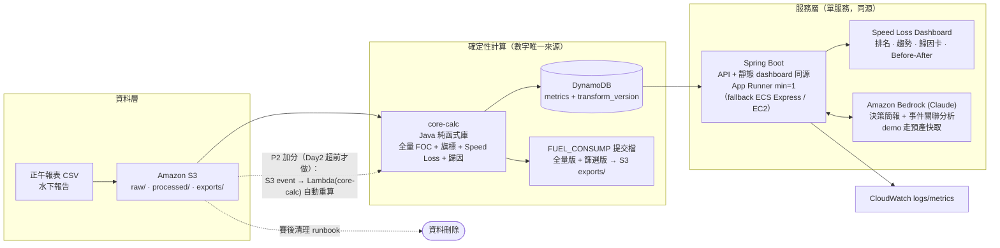

# 題目需求符合度稽核與定稿架構（Requirements Fit & Final Architecture）

> 目的：把 `09`（執行計畫）與 `11`（六路線研究）收斂成一張定稿架構，並逐項稽核「題目到底要什麼 vs 我們的架構給了什麼」，找出缺口並修正。
> 狀態：Draft，待團隊 review。
> **2026-07-14 更新（官方資料到位後）**：①25% 客觀評分確認為**油耗預測任務**（102 個 PREDICT 格），非確定性 Daily FOC——預測管線見 `docs/23`，本文件 R9 的 FUEL_CONSUMP harness 重定位為 dashboard/品質面板用；②提交物確認為**六項經 surveycake**（見 `docs/18` 2026-07-14 更新、`docs/22` §6），本文件 R3/G5「七項/challenge link」為賽前舊資訊，以 `docs/18` 現行管制表為準。

## 1. 題目需求清單（Requirement Register）

從 `01-event-rules.md`、`03-yang-ming-briefing-notes.md`、README、AGENTS.md 逐條抽取。R = 硬性需求、S = 評分驅動需求、C = 約束。

| # | 需求 | 來源 | 類型 |
| --- | --- | --- | --- |
| R1 | 使用 AWS 提供的雲端開發環境 | 01 | C |
| R2 | 只能使用 AWS 提供的模型與服務 | 01 | C |
| R3 | 提交物**七項**：完整提案 deck、**challenge link**、企業資料與資料應用說明、技術架構、GitHub repo 連結、live demo 連結、demo 錄影連結 | 01 | R |
| R4 | 2026-07-16 14:30 前上傳，逾時視同棄權 | 01 | R |
| R5 | 使用 15 艘船 2021–2025 每日正午報表 + 水下報告（檢查／清潔／螺槳拋光；**截圖顯示可能為 before/after 照片型報告，事件日期/類型或需人工抽取**） | 03 | R |
| R6 | 篩選條件 `WIND_SCALE ≤ 4`（好天氣） | 03 | R |
| R7 | 篩選條件 `HOURS_FULL_SPEED ≥ 22` | 03 | R |
| R8 | 多燃料日依熱值換算 VLSFO 當量（LCV：MGO 42.7／ULSFO 41.2／HFO 40.2／VLSFO 40.2） | 03 | R |
| R9 | `Daily FOC = ME_FULLSPEED_CONSUMP_VLSFO ÷ HOURS_FULL_SPEED × 24`（產出比對資料，程式自動評分 25%） | 03 | S |
| R10 | Speed Loss dashboard：Speed Loss 數值顯示（30%，陽明專家評） | 03 | S |
| R11 | 顯示「因船體髒污導致的 Speed Loss 百分比 %」 | 03 | S |
| R12 | 「透過正午報表及水下報告 **AI 判讀**，找出船速油耗與水下報告狀態之**關聯性**」 | 03（簡報原文） | R |
| R13 | 早期偵測船體效率衰退的船，支援安排水下檢查／清潔／拋光的業務行動 | 03 | S |
| R14 | 定位為決策支援，AI 不自主指揮船舶營運 | AGENTS.md | C |
| R15 | 8 分鐘上台 + 4 分鐘 Q&A | README | R |
| R16 | 比賽資料僅供比賽使用；**若官方規則要求**賽後刪除／封存則照辦（條件式，Day1 確認） | 01／README | C |
| R17 | 兩套評分表並存：官方五維（主題 30／完整 25／商用 20／技術 15／創意 10）＋陽明五維（Speed Loss dashboard 30 專家品評／FUEL_CONSUMP 25 程式打分／商務 20／技術 15／**AI 協作創意 10**）——數字同、維度定義與評分人不同；AI 協作創意 10% 由 R12 承接 | 01／03 | S |
| R18 | 回應營運痛點：岸端人力有限，管理與決策支援缺口 | 03 | S |
| R19 | GitHub repo（提交物）**不得含原始企業資料集與任何憑證**；資料一律留在 S3 | README | C |
| R20 | 上傳平台 Day1 09:40–10:00 才公布，欄位／檔案格式限制未知 | 01 | C |
| R21 | 避免自訓 ML／水下影像 CV／影片管線；設計須 3 天內可部署 | AGENTS.md／prebriefing | C |
| R22 | Day3 現場作業時窗僅 11:10 check-in 後的 11:30–14:30；Day1 16:00 抽簡報順序 | 01 | C |

## 2. 需求 ↔ 架構符合度矩陣

對照對象 = `09` P1 單服務架構（`11` 評審 27 分定案）＋既定計畫元素。

| # | 承載元件 | 符合度 | 說明 |
| --- | --- | --- | --- |
| R1 | 全部部署於比賽 AWS 帳號；Day1 權限探測 checklist | ✅ | `09` §2.2 |
| R2 | Bedrock（Claude）為唯一模型來源；無第三方 API | ✅ | `09` §5 |
| R3 | Day3 提交**七項** checklist（**P5 owner**，逐項對官方清單） | ⚠️ G1/G5；G4 已有草稿 | 「企業資料應用說明」已先產 `17`；live demo 連結與 challenge link 仍需 Day1 確認 |
| R4 | Day3 時間軸 12:00–14:00 上傳（不等死線） | ✅ | `09` §7 |
| R5 | S3 raw/ 進料 → core-calc → 事件 join | ✅ | `09` §3 |
| R6–R7 | core-calc 品質旗標（不丟列）＋單元測試邊界案例 | ✅ | `09` §3.1／§8 |
| R8 | core-calc VLSFO 換算純函式 + golden cases + 官方欄位交叉驗證 | ✅ | `09` §3.2 |
| R9 | 全量計算鐵律 + FUEL_CONSUMP 提交 harness（全量／篩選雙版本） | ✅ | `09` §3.2；格式為最高優先待確認 |
| R10 | Dashboard Fleet Overview + Vessel Detail：Speed Loss % KPI、趨勢、排名 | ✅ | `09` §4.5 |
| R11 | 歸因卡三數字（總 Speed Loss ／污損歸因 %／未解釋殘差）＋ Theil-Sen 趨勢歸因 | ✅ | `09` §4.2 |
| R12 | before-after 對比 + 事件標記線 +（強化，見 §3 G2）AI 簡報「事件關聯」段落 | ⚠️ G2 | 措辭上「AI 判讀關聯性」需要顯性回應 |
| R13 | VesselSummary.review_priority 排序 + AI 簡報建議 review 行動 | ✅ | `09` §3.3／§5 |
| R14 | 決策支援框架：AI 排序舉證、人類拍板；「待人工審核」標籤 | ✅ | `09` §1／§4.5 |
| R15 | `10-presentation-plan.md` 7:15 目標 + 2 次彩排 | ✅ | |
| R16 | （強化，見 §3 G3）賽後資料清理 runbook（條件式，Day1 確認官方規定） | ⚠️ G3 | 原計畫只有 README 原則，無執行項 |
| R17 | `09` §1 成功標準 S1–S5 對權重逐項對齊；AI 協作創意 10% ← G2 事件關聯分析 | ✅ | |
| R18 | 「15→97 艘同架構」擴展敘事 + 自動排序取代人工翻報表 | ✅ | `10` slide 2（痛點）＋ slide 8（擴展） |
| R19 | repo 提交前 checklist：無原始資料、無憑證（資料只在 S3；本機快照不進 git） | ✅ | §5 Day3 檢核項 |
| R20 | Day1 09:40–10:00 記錄平台限制 → 當日調整提交流程 | ⚠️ G1 | 與 G1 同時段一併確認 |
| R21 | 架構零自訓 ML／零 CV；`11` 已論證淘汰 SageMaker 主線 | ✅ | `11` §5.1 |
| R22 | `09` §7 Day3 時間軸已按 11:30–14:30 現場窗編排；抽籤結果 Day1 16:00 記入彩排排程 | ✅ | |

## 3. 缺口分析與修正（G1–G5）

### G1【必修】live demo 連結 vs 本機 fallback 的衝突 ＋ 上傳平台未知

`11` §5.2 決策樹的 B''（全本機跑 demo）只能救「上台演示」，**救不了 R3 的「live demo 連結」提交物**——提交的必須是評審能打開的公開 URL。修正：

- 提交物語意分離：**live demo 連結 = 雲端 URL（App Runner／EC2），上台演示 = 可用本機 fallback**。
- 若 Day3 雲端全掛：demo 連結欄位填錄影連結＋說明，並於 Day1 向主辦方確認此退路是否可接受（新增至 `09` §10 待確認清單）。
- 上傳平台（R20）Day1 09:40–10:00 才公布：同一時段一併確認「demo 連結欄位格式、檔案大小限制、challenge link 的定義」。
- App Runner 只在 event account 已開通時使用；若不可建立新服務，改 ECS Express Mode 或 EC2 docker。上傳提交物前跑一輪 warm-up 腳本作健康驗證，確認評審自行點開時服務活著。

### G2【必修】R12「AI 判讀找關聯性」需顯性回應

題目原文要求 AI 判讀「船速油耗與水下報告狀態之關聯性」。現行設計中關聯性由確定性計算產出（before-after、事件分段），Bedrock 只「解釋單船異常」——語意上可被質疑「AI 沒有做判讀」。修正（零新架構、改 prompt 與呈現）：

- ai-brief prompt 增加固定段落「**水下事件關聯分析**」：引用該船每次清潔／拋光事件前後的 k 值變化與回收效率，由 Bedrock 產出跨事件的關聯性敘述（數字仍全部來自輸入 JSON / `citedMetrics`，防幻覺三道防線不變）。賽前已先落 `AiBriefPrompt` / `AiBriefGuardrail` 與 prompt preview endpoint，Day2 接 Bedrock InvokeModel 即可。
- Dashboard Before-After 卡標題直接用題目語言：「水下報告狀態 × 油耗關聯」。
- Q&A 防守（入 `07-judge-qna.md` 素材）：「AI 判讀 = 確定性統計找訊號 + Bedrock 把訊號判讀成營運語言的關聯結論；數字可回溯，這正是可信的 AI 判讀」。

### G3【建議】賽後資料刪除的執行項

R16 目前只有 README 原則（條件式：Day1 先向主辦方確認資料保留規定）。修正：資料只落 S3 與 DynamoDB 兩處（本機開發用的快照納入清單、**不進 git**——R19）；若確認需刪除，Day3 結束後 runbook：`aws s3 rm --recursive` 涵蓋 **raw/、processed/、exports/ 全前綴**（或整個 bucket）、刪 DynamoDB table、清本機快照。寫進 repo README 提交檢查清單尾項。

### G4【必修】「企業資料與資料應用說明」是獨立必交提交物

R3 是硬性需求，此項漏交＝提交不完整，不是「建議」等級。素材直接取自 `09` §3–§4、不依賴 Day3 凍結資料，**沒有理由押到最後一刻**。賽前已先產 `17-enterprise-data-application.md`：涵蓋資料來源、欄位用途、全量 FOC、品質旗標、Speed Loss、AI 邊界與資料安全。Day1/Day2 只需補真 schema、列數、檔名、截圖限制與資料保留規則。

### G5【必修】Challenge link 無人承載

官方七項提交物中的 **challenge link** 在 `09` §7「五件套」與本文件初版均無承載元件——漏交任一必交項在 R4「逾時即棄權」的規則下直接出局。修正：

- `09` §7 Day3 的「五件套」全部改稱「**官方七項提交物**」，P5 的核對清單逐項列出：deck／challenge link／企業資料應用說明／技術架構／GitHub repo／live demo 連結／錄影；完整上傳管制表見 `18-submission-control-sheet.md`。
- challenge link 的確切定義（主辦方發的題目頁連結？平台上的隊伍頁？）Day1 09:40–10:00 向主辦方確認（併入 G1 的同時段問題清單）。

## 4. 定稿架構 v1.0（優化整理後）

整合 `09` P1/P2、`11` 裁決與 §3 修正：

v1.0 相對 `09` §2.1 的優化差異（全部小步、零新風險）：

| 優化 | 內容 | 來源 |
| --- | --- | --- |
| O1 | 部署路線改成既有 App Runner → ECS Express Mode → EC2 docker；提交前 warm-up 腳本作健康驗證 | G1／`16` |
| O2 | ai-brief prompt 固定加「水下事件關聯分析」段（R12 顯性化，同時承接陽明「AI 協作創意 10%」） | G2 |
| O3 | S3 加 exports/ 前綴放提交檔，presigned URL 下載（提交 harness 輸出物有固定家） | `11` A 路線吸收 |
| O4 | 賽後清理 runbook（`scripts/cleanup-event-data.sh`，涵蓋 raw/、processed/、exports/ 與本機快照；條件式，Day1 確認）入提交檢查清單 | G3 |
| O5 | 「企業資料應用說明」已有 `17` 初稿；Day1/Day2 補真 schema 與提交平台格式 | G4 |
| O6 | P2 觸發條件明文化：Day2 18:00 端到端全通且超前才拆 Lambda；否則凍結 | `11` §5.2 |
| O7 | 「五件套」全面改稱**官方七項提交物**，checklist 逐項對官方清單（含 challenge link） | G5 |

不改的事（已被 `11` 三視角驗證，不再動）：單服務同源、core-calc Java、全量計算鐵律、demo 簡報預產快取、DynamoDB、不用 CloudFront/ECS/QuickSight/Agents。

## 5. 開發流程差異（對 `09` §7 的增量）

| 時點 | 增量 | Owner |
| --- | --- | --- |
| Day1 09:40–10:00 | 上傳平台公布：記錄欄位／檔案格式限制、challenge link 定義、demo 連結欄位格式（G1/G5/R20） | **P5**（工程四人專注技術） |
| Day1 10:00–10:40 | 待確認清單追加：live demo 連結雲端全掛時可否以錄影替代（G1）；資料保留／刪除規定（G3）；水下報告是否為照片型、事件欄位如何取得（R5） | **P5** 記錄、工程補技術追問 |
| Day1 16:00 | 抽籤結果記入 Day3 彩排排程（R22） | P5 |
| Day2 | ai-brief prompt 含事件關聯段，與 before-after API 同步交付 | Eddie |
| Day2 晚間 | 以 `17` 為底補真 schema、列數、檔名、demo 船資料來源與提交格式 | Feng |
| Day3 07:30–11:00 | 企業資料應用說明定稿校對 | Feng |
| Day3 12:00–14:00 | 上傳前 warm-up 腳本跑一輪（Sunny）；**官方七項提交物逐項核對＋實際上傳**（含 repo 無原始資料／憑證檢查 R19）；清理 runbook 確認 | **P5** 主責、Sunny 技術驗證 |
| 賽後 | 若 Day1 確認需刪除：執行資料清理 runbook（raw/、processed/、exports/、本機快照） | Sunny |

## 6. 結論

- 題目 22 項需求：18 項 ✅ 原生符合；4 項需求（R3／R12／R16／R20）存在共 5 個缺口（G1–G5，其中 R3 對應 G1+G4+G5），全部以「改流程／改 prompt／加交付物」修正，**零架構變更**。其中 G4 已先以 `17` 補初稿，Day1/Day2 只剩真資料欄位回填。
- 最高風險缺口是 G5（challenge link 漏交＝提交不完整），已入 Day1 確認清單與 Day3 七項核對表。
- 定稿架構 v1.0 = `09` P1 + 七項小優化；`11` 的多路線研究確認沒有更優路線被遺漏。
- 本文件經 2 個對抗稽核 agent 驗證（需求完整性／符合度宣稱），1 critical + 2 major + 12 minor 發現全數整合。
- 後續若真實資料欄位與假設不符（船速／吃水／進塢），依 `09` §4.3 fallback 表執行，不影響本文件結論。
