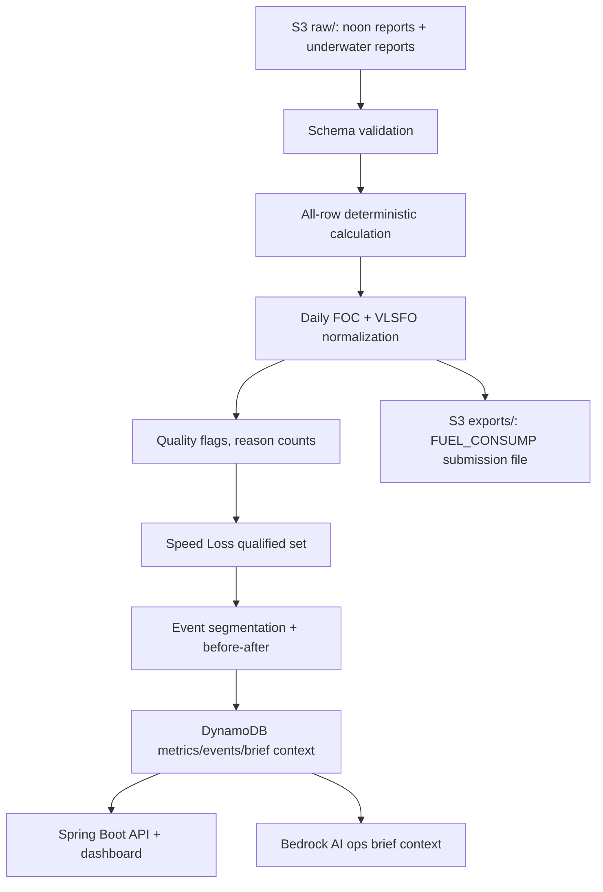

# 企業資料與資料應用說明

> 用途：官方七項提交物之一「Enterprise data and data application description」的提交草稿。  
> 狀態：可直接作為 Day1/Day2 初稿；拿到真實資料後，只需補實際欄位名稱、列數、檔名、資料期間確認與截圖限制。  
> 原則：本文件只描述資料用途與處理方式，不放任何原始企業資料、憑證或可識別營運明細。

## 1. 30 秒版

FleetMind 使用陽明提供的 15 艘船 2021-2025 每日正午報表與水下報告，將船速、滿速時數、天候與主機油耗轉成可追溯的 Daily FOC、Speed Loss、污損歸因、before-after 與清潔 ROI。  

所有數字都由 `core-calc` 確定性計算產生；Bedrock 只負責把已計算的指標改寫成營運可讀的 AI ops brief，不能自行產生新數字。資料留在競賽 AWS 環境的 S3/DynamoDB，GitHub repo 不保存原始企業資料。

## 2. 資料來源

| 資料 | 內容 | FleetMind 用途 | 儲存位置 |
| --- | --- | --- | --- |
| 正午報表 noon reports | vessel_id、date、WIND_SCALE、HOURS_FULL_SPEED、ME_FULLSPEED_CONSUMP_VLSFO、船速/距離/吃水等欄位（以 Day1 schema 為準） | 全量 Daily FOC、品質旗標、Speed Loss、燃油與碳成本估算 | S3 `raw/`；處理後進 S3 `processed/` 與 DynamoDB |
| 水下報告 underwater reports | inspection、hull cleaning、propeller polishing、事件日期、事件類型、備註或照片/PDF 摘要 | 事件切段、before-after、清潔回收效率、AI 事件關聯分析 | S3 `raw/`；事件摘要進 DynamoDB |
| 官方提交格式 | FUEL_CONSUMP 欄位、精度、rounding、列範圍 | 25% 自動評分提交檔 | Day1 09:40-10:00 向主辦方確認後鎖定 |

Day1 待填：

| 項目 | 實際值 |
| --- | --- |
| 正午報表檔名/表名 | TBD |
| 水下報告檔名/格式 | TBD |
| 總列數 | TBD |
| 船舶數 | 15（待資料確認） |
| 資料期間 | 2021-2025（待資料確認） |
| 是否允許截圖進 deck/recording | TBD |
| 賽後資料保留/刪除規則 | TBD |

## 3. 欄位如何被使用

| 欄位/資料 | 使用方式 | 不符合條件時 |
| --- | --- | --- |
| `HOURS_FULL_SPEED` | Daily FOC 公式分母；滿速日品質旗標門檻為 `>= 22` | Daily FOC 仍全量計算；Speed Loss 分析降信心或排除該列 |
| `ME_FULLSPEED_CONSUMP_VLSFO` | Daily FOC 主要輸入 | 缺值或無法解析列進 rejected reason，不影響其他列 |
| 多燃料欄位（若提供） | 依 LCV 換算成 VLSFO 當量，交叉檢查官方 VLSFO 欄位 | 若官方只提供 VLSFO 欄位，換算函式保留為驗證與 Q&A 素材 |
| `WIND_SCALE` | Speed Loss 品質旗標，`<= 4` 視為好天氣 | 不丟列；標記 weather flag |
| 船速/距離欄位 | 計算 k 值 `FOC / V^n`，用於 Speed Loss | 無船速時退化為 fuel penalty / Daily FOC 趨勢，KPI 標示 estimate |
| 吃水/trim（若提供） | 進一步修正載況差異 | 無欄位時只做同船/同速度帶比較並降信心 |
| 水下事件日期與類型 | 切段、reference window、before-after | 若漏 dry-dock，以 k 值 sustained drop 標為 `unknown_breakpoint` |

## 4. 轉換流程



### 全量計算鐵律

`Daily FOC` 對每一列無條件計算，篩選只產生品質旗標，不刪資料列。原因：`FUEL_CONSUMP` 佔 25% 自動評分，官方可能要求全量列輸出；若先 filter 再算，提交檔可能少列。

```text
Daily FOC = ME_FULLSPEED_CONSUMP_VLSFO / HOURS_FULL_SPEED * 24
```

多燃料換算（若原始欄位提供各燃料量）：

```text
VLSFO_equiv = Σ(mass_i * LCV_i / LCV_VLSFO)
LCV: MGO=42.7, ULSFO=41.2, HFO=40.2, VLSFO=40.2
```

## 5. 資料品質與信心等級

FleetMind 不把資料品質問題藏起來，而是把它變成 dashboard 的可解釋元素。

| 品質旗標 | 觸發條件 | 對輸出的影響 |
| --- | --- | --- |
| weather flag | `WIND_SCALE > 4` | 不進 Speed Loss 合格樣本；FUEL_CONSUMP 仍輸出 |
| full-speed flag | `HOURS_FULL_SPEED < 22` | 不進 Speed Loss 合格樣本；FUEL_CONSUMP 仍輸出 |
| missing optional field | 缺船速/吃水/SST 等選用欄位 | 降低信心；不阻塞核心 Daily FOC |
| parse/rejected | 日期、數值或必填欄位無法解析 | 進 rejected reason count；保留原始檔於 S3 raw/ |
| sparse sample | 合格樣本不足 | AI brief 自動降低建議強度，只建議 observation/inspection |

Dashboard 會顯示原因碼統計、樣本數、信心徽章與未解釋殘差，避免把正午報表限制包裝成假精確。

## 6. 資料應用輸出

| 輸出 | 使用者 | 決策價值 |
| --- | --- | --- |
| FUEL_CONSUMP export | 官方自動評分/工程團隊 | 可重現、全量、公式一致的提交檔 |
| Fleet Overview | Fleet operations / dispatch | 15 艘船 Speed Loss、資料品質、review priority 排名 |
| Vessel Detail | Marine technology / maintenance planners | Daily FOC、Speed Loss 趨勢、水下事件標記、信心等級 |
| Before-After | Maintenance / ESG / business stakeholders | 清潔/拋光前後 k 值、回收效率、ROI 回本天數、每日延遲成本 |
| AI Ops Brief | Ops manager / presenter | 用自然語言解釋已計算證據，附 citation 回 dashboard |
| Presentation metrics | P5 / judges | money number、CO2、EU ETS、CII pressure scenario |

## 7. AI 使用邊界

FleetMind 的 AI 不是資料產生者。

- `core-calc` 是唯一數字來源。
- Bedrock prompt 只收到 processed JSON 與 cited metrics。
- Bedrock 不得推算新數字，不得下維修命令。
- API 後驗證會抽取 AI brief 中的金額、百分比、日期、油耗與 CO2 數字，必須能匹配 `citedMetrics`。
- 若 Bedrock 不可用，dashboard 與 FUEL_CONSUMP 不受影響，AI brief 改用 deterministic fallback。

標準回答：

> AI 判讀 = 確定性統計先找訊號，再由 Bedrock 把訊號判讀成營運語言；所有數字可回溯，維修決策仍由人審核。

## 8. 安全、隱私與資料清理

| 風險 | 控制方式 |
| --- | --- |
| 原始企業資料進 GitHub | 禁止。repo 只放程式、文件、假資料、sample output；raw data 留在 S3 `raw/` |
| 憑證或 token 外洩 | `.env*`、credentials 不進 git；Day3 提交前檢查 repo |
| 截圖/錄影含敏感資料 | Day1 確認官方限制；必要時只截聚合 KPI 或遮蔽船名 |
| 賽後資料需刪除 | 使用 `scripts/cleanup-event-data.sh` dry-run/execute 清 S3、DynamoDB、本機 snapshot |
| AI 輸出越權 | prompt 與 UI 標示 human review；AI 不下維修命令 |

清理範圍：

- S3 `raw/`
- S3 `processed/`
- S3 `exports/`
- DynamoDB metrics/events/brief table
- 本機 `work/local-snapshots`

## 9. Day1/Day2 補齊清單

| 時間 | 動作 | Owner |
| --- | --- | --- |
| Day1 09:40-10:00 | 確認提交平台是否有此項模板、字數、檔案格式 | P5 |
| Day1 10:00-10:40 | 記下實際 schema、欄位定義、資料期間與截圖限制 | P5 + Feng |
| Day1 13:00 | 用真 schema 更新欄位表與 `FUEL_CONSUMP` 格式 | Feng |
| Day2 晚 | 加入真列數、實際輸出檔名、demo 船數字來源 | Feng + P5 |
| Day3 12:00 前 | 以此文件輸出官方提交格式，與 deck/repo/demo link 一起上傳 | P5 |

## 10. 可直接放入提交表單的短版

FleetMind 使用陽明提供的 15 艘船 2021-2025 每日正午報表與水下報告。正午報表用於全量計算 Daily FOC、品質旗標、Speed Loss 與燃油/碳成本；水下報告用於清潔/拋光事件切段與 before-after 分析。系統保留所有列計算 FUEL_CONSUMP，天候與滿速條件只作為品質旗標，不會刪除提交資料列。  

所有數字由 Java `core-calc` 確定性產生，處理結果寫入 S3/DynamoDB 並由 Spring Boot API 提供 dashboard、FUEL_CONSUMP export 與 AI brief context。Bedrock 只引用 processed metrics 產生營運說明，不能自行產生新數字；API 會驗證所有數字都可回溯至 `citedMetrics`。原始企業資料只留在競賽 AWS 環境，GitHub repo 不保存 raw data 或憑證；若官方要求賽後刪除，使用清理 runbook 刪除 S3、DynamoDB 與本機 snapshot。
