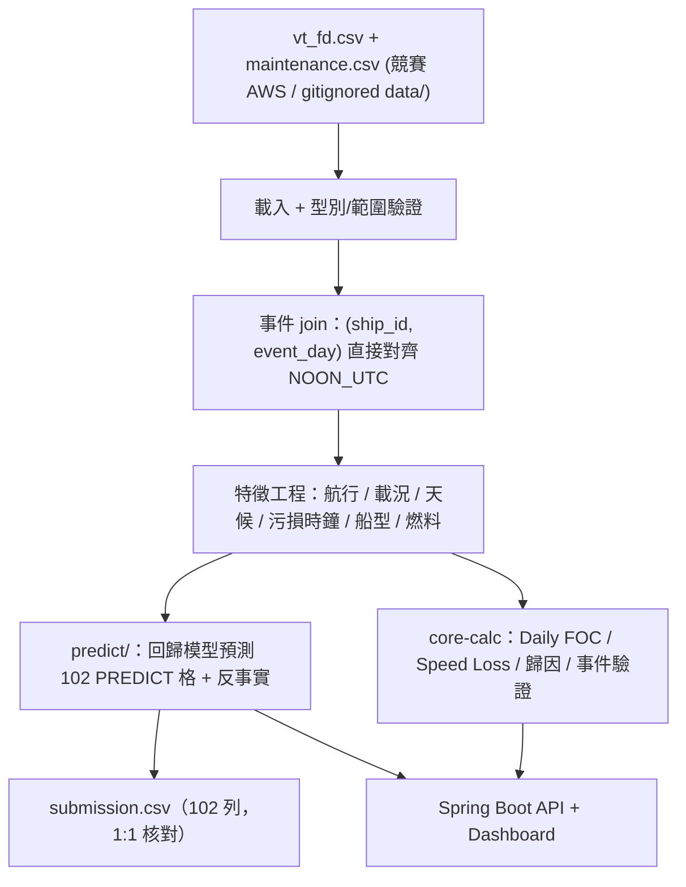

# 企業數據及資料應用說明

> 用途：官方提案簡報內建章節「企業數據及資料應用說明」，屬 7/16 六項繳交物中「完整提案簡報」的一部分。
> 原則：本章只描述資料**結構、欄位語義與應用方式**，不放任何原始資料列、可識別營運明細或憑證。原始競賽資料僅存於競賽 AWS 帳號與本機 gitignored 目錄，不入 GitHub、賽後刪除、不商用。
> 資料版本：陽明官方資料包（`vt_fd.csv` + `maintenance.csv` + 欄位定義 README），2026-07-14 v2。

## 1. 30 秒版

陽明提供 **15 艘匿名船舶約 5 年的正午航行日報（21,282 列）** 與 **77 筆水下養護事件**。部分預測船在養護後一段期間的**主機性能與油耗欄位被遮蔽**，其中 **102 格全速油耗**是官方要 FleetMind 預測的目標（25% 客觀自動評分）。

FleetMind 兩條資料應用主線：（一）`predict/` Python 管線用可見的航行/環境特徵＋污損時鐘，**回歸預測 102 格被遮蔽油耗**並做 UWC／PP 反事實節能推論；（二）`core-calc` Java 以 ISO 19030 框架計算 **Speed Loss、船殼 vs 螺旋槳歸因、養護事件驗證**，由 Spring Boot 服務成 dashboard。兩者共用同一份特徵定義，數字皆可回溯，AI 只把已算好的指標改寫成營運語言。

## 2. 資料來源與結構

| 檔案 | 內容 | 粒度 | 規模 |
| --- | --- | --- | --- |
| `vt_fd.csv` | 匿名航行日報（noon report）：航速、天候、載況、主機性能、油耗 | 每船每日一列（僅排除純靠港／錨泊日以保連續日程） | 15 船 × 約 5 年 ＝ **21,282 列** |
| `maintenance.csv` | 水下／塢修養護事件紀錄 | 每事件一列 | **77 筆事件** |

**船舶分群**

| 群組 | 船舶 | 資料可見性 | 用途 |
| --- | --- | --- | --- |
| 訓練船 | **S1–S12** | 全量可見 | 學習效能衰退＋養護恢復規律 |
| 預測船 | **S21–S23** | 養護後區間**遮蔽** | 預測標的（S21=43、S22=24、S23=35 格） |

**船型（姊妹船，可跨船遷移學習）**

- **W1**：S1–S8、S21 — 同設計、不同航線。
- **W2**：S9–S12、S22、S23 — 同設計、不同航線。

**時間軸（關鍵）**：`vt_fd` 的 `NOON_UTC` 為**每船相對天數**（0 至約 1823），`maintenance.csv` 的 `event_day` 採**同一相對天軸**。因此養護事件可直接以 `(ship_id, event_day)` join 航行日報，**不需日曆對齊、無錨點難題**（v2 資料相對 v1 的關鍵改善）。

## 3. 欄位與遮蔽機制

`vt_fd` 欄位依「是否在遮蔽窗內仍可見」分三類，另有兩個預測日篩選欄位：

| 類別 | 語義 | 代表欄位 | 遮蔽窗內 |
| --- | --- | --- | --- |
| **A · 環境／航行** | 客觀航行與環境條件 | STW（對水船速）、SOG（對地船速）、RPM、各吃水、排水量、載貨、風／浪／湧、水深、距離、滑差 | **可見**（預測特徵來源） |
| **H · 主機性能** | 引擎工況 | `HORSE_POWER`、`LOAD_PCT`、`SFOC`、`THRUST` 等 | **遮蔽（HIDDEN）** |
| **T · 油耗** | 燃油消耗 | `TOTAL_CONSUMP`、`ME_CONSUMPTION`、`ME_FULLSPEED_CONSUMP_{HSHFO, VLSFO, ULSFO, LSMGO, BIO_HSFO}` | **遮蔽（HIDDEN／PREDICT）** |
| 篩選欄位 | 預測日認定 | `WIND_SCALE`、`HOURS_FULL_SPEED` | 可見 |

**遮蔽 vs 預測的區別**

- **HIDDEN**（約 1,550 格油耗）：僅表「此資料不提供」，**非**評分標的。
- **PREDICT**（**102 格**）：官方指定的預測目標，與提交檔 **1:1 對應**。燃料分布 **HSHFO 91 格、VLSFO 11 格**（BIO_HSFO 不在預測窗）。
- **預測日認定條件**（三者皆須滿足）：**全速航行 ≥ 22 小時**、**風速 ≤ 4 級**、**當日單一燃料**（實測 min hours 22.8、max wind 4.0，全數符合）。

**燃料熱值（LCV, MJ/kg，用於跨燃料折算）**

| 燃料 | HSHFO | ULSFO | VLSFO | LSMGO | BIO_HSFO |
| --- | --- | --- | --- | --- | --- |
| LCV | 40.2 | 41.2 | 40.2 | 42.7 | ≈39.4 |

**養護事件類型（6 類，含官方明示提示）**

| 類型 | 意義 | 是否物理介入 |
| --- | --- | --- |
| PP | 螺旋槳拋光 | 是（螺旋槳） |
| UWC | 水下船體清潔 | 是（船殼） |
| UWC+PP | 清潔＋拋光 | 是（船殼＋螺旋槳） |
| UWI+PP | 檢查＋拋光 | 是（螺旋槳） |
| DD | 進塢 dry-dock | 是（全面） |
| **UWI** | **水下檢查，純檢查、無實體介入** | **否 — 不得視為效能改善** |

> 官方兩度明示：`UWI` 這類「純檢查」事件**不應帶來效能恢復**。FleetMind 據此設計污損時鐘：**UWI 不重置任何時鐘**，避免把「養護後」一律誤判為「變好」。

## 4. 資料前處理與特徵工程

`core-calc`（Java，確定性計算）與 `predict/`（Python）共用同一套特徵定義，確保 dashboard 與預測數字一致。

**特徵群組**

| 群組 | 特徵 | 物理／營運意義 |
| --- | --- | --- |
| 航行 | STW、STW³、RPM、滑差（slip） | 阻力與推進；阻力物理用 **STW（對水）**，營運距離用 SOG（對地） |
| 載況 | 各吃水、排水量、載貨量 | 修正載重差異 |
| 天候 | 風／浪／湧、水溫、水深 | 環境阻力；預測日已限風 ≤4 |
| **污損時鐘** | 距上次**船殼**介入天數、距上次**螺旋槳**介入天數、水溫×天數積溫（生物污損 proxy） | 效能衰退驅動；**UWI 不重置** |
| 船別／船型 | ship_id、W1／W2 | 跨姊妹船遷移學習 |
| 燃料 | fuel_type ＋ 對應 LCV | 跨燃料共用單一模型 |

**目標語義（提交鐵律）**：模型內部以「**每全速小時油耗率**」建模（降低 `HOURS_FULL_SPEED` 變異干擾），預測後 **× `HOURS_FULL_SPEED` 還原成當日全速時段總油量（MT/day）**——此即官方 README 定義的 `predicted_value` 原語義，提交時務必還原。

## 5. 資料應用（預測＋Speed Loss）

### 5.1 油耗預測（25% 客觀評分）— `predict/` Python

- **管線**：`load → anchor（event_day 直接 join）→ features → models → validate → submit`，僅用 pandas／numpy／sklearn。
- **模型階梯**：①物理 baseline（k·STW³，滾動中位數 k 含時間漂移）②sklearn HistGradientBoosting（目標＝每全速小時油耗率）③驗證擇優／混合。HSHFO 佔 91/102 為重心，VLSFO 11 格靠 LCV 折算＋fuel_type 特徵共用模型。
- **防漏答驗證**：在 S1–S12 上**模擬真實遮蔽模式**（真養護事件後 5–10 合格日窗遮蔽再評分，逐窗 RMSE／MAPE）＋ GroupKFold(by ship)；不以隨機 K-fold 為唯一指標。
- **反事實推論（商務價值彈藥）**：同日特徵、把船殼／螺旋槳污損時鐘歸零重預測 →「現在做 UWC／PP 每天省 X MT ≈ Y%」→ 接 dashboard ROI 卡。
- **提交檔**：`predict/output/submission.csv`，欄位 `ship_id, day, fuel_type, predicted_value`，**恰 102 列**與 PREDICT 格 1:1，程式強制核對後才寫檔。

### 5.2 Speed Loss Dashboard（30% 專家品評）— `core-calc` Java + Spring Boot

- **ISO 19030 框架**計算 Speed Loss：以 `k = Daily FOC / STW³` 為推進效能 proxy，呈現隨航程的效能衰退趨勢（`SpeedLoss.java`）。
- **船殼 vs 螺旋槳歸因**：`Attribution.java` 依污損時鐘與事件類型，將 Speed Loss 拆分為船殼污損與螺旋槳污損兩來源；樣本不足時退回**標記為 heuristic 的 50/50**，誠實呈現不確定性。
- **養護事件驗證**：`EventValidation` 比對效能恢復／惡化時點是否對應養護事件。誠實限制：即使事件精確對齊，真實 noon-report 稀疏＋同速帶樣本少，多數 UWI 事件仍測到超噪音門檻的變化——dashboard 呈現**實測變化量＋信心旗標**，不宣稱「UWI＝零變化」；UWI「不帶恢復」的洞見正確落在**預測模型的污損時鐘不因 UWI 重置**。
- **服務層**：`apps/api` Spring Boot 提供 Fleet Overview、Vessel Detail、Before-After／ROI、預測值與反事實數字。
- **品質旗標**：`WIND_SCALE > 4`、`HOURS_FULL_SPEED < 22`、缺選用欄位等只**標記信心等級**，不刪列；dashboard 顯示樣本數、原因碼與未解釋殘差，避免假精確。

### 5.3 AI 使用邊界

AI（Bedrock）不是資料產生者：只收 `core-calc`／`predict` 已算好的 processed metrics 與 cited numbers，把訊號改寫成營運可讀的決策簡報；不得推算新數字、不得下維修命令。API 後驗證會抽取 AI brief 中的金額／百分比／油耗／CO2，須匹配 `citedMetrics`；Bedrock 不可用時 dashboard 與提交檔不受影響。

## 6. 資料治理與安全（遵 AWS Workshop 責任使用守則）

| 面向 | 控制方式 |
| --- | --- |
| 原始資料落地 | 只存於競賽 AWS 帳號與本機 **gitignored `data/`**；**永不 commit 進 GitHub** |
| 存取範圍 | S3 一律關閉公開存取；region 限 `us-east-1`／`us-west-2`；Bedrock 節流、只申請所需模型 |
| 個資／受規範資料 | **不引入**任何個資／財務／健康／生物特徵／支付／惡意程式；命題資料本身已匿名化（船名為 S1–S23 代號、時間為相對天數） |
| 憑證外洩 | `.env*`、credentials 不進 git；繳交前檢查 repo |
| 賽後處置 | 命題資料**限競賽期間使用，賽後刪除、不得商用**；帳號由主辦自動回收，需保留者賽前自行備份 |
| 截圖／錄影 | 只呈現聚合 KPI 與 S-代號，不外露原始資料列 |
