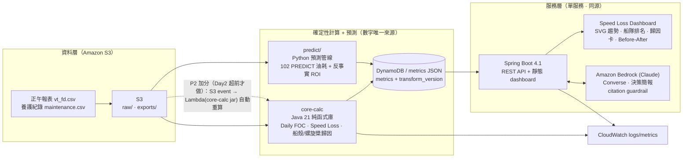

# 技術架構（FleetMind）

> 用途：本章為提案簡報（deck）內的「**技術架構**」章節。依官方規則（`docs/22` §6），航運物流組經 **surveycake 六項提交**，企業資料應用與技術架構**併入 deck**，故本文件為 deck 章節而非獨立提交檔。
> 撰寫依據：`docs/12`（定稿架構）、`docs/16`（Day1 運維）、`docs/22`（官方命題與規則）、`docs/23`（油耗預測計畫），並對照 `core-calc/`、`apps/api/`、`predict/` 實作。
> 誠實狀態：`core-calc`、`apps/api`（含 Bedrock client）、`predict/` 皆已實作並經測試；**Bedrock 上線只差 Day1 兩個環境變數**（`AWS_REGION`、`FLEETMIND_BEDROCK_MODEL_ID`），未設時走 deterministic fallback。實際部署 URL／region／model id／表名於 Day3 回填。

## 1. 設計原則

> **數字來自計算，語言來自 AI，決策留給人。**

- **數字唯一來源＝確定性引擎**：Speed Loss、歸因、油耗預測全部由 `core-calc`（Java 純函式）與 `predict/`（Python 模型）產出，可回溯、可重現、golden-test 鎖定。
- **AI 只做「翻譯」不做「發明」**：Amazon Bedrock 只把已算好的 metric JSON 轉成營運語言；任何未引用來源的數字會被 guardrail 攔下（見 §6）。
- **AI 不自主指揮營運**：簡報只給「建議人工檢查／清潔／拋光」的排序舉證，最終由陽明岸端專家拍板（對應命題 R14 決策支援定位）。
- **三天可交付**：零自訓深度模型、零水下影像 CV、單服務同源部署，把風險收斂在 55%（Speed Loss 30% + 油耗預測 25%）硬分數上。

## 2. 架構圖



## 3. 三大程式資產

| 元件 | 技術 | 角色 |
| --- | --- | --- |
| **`core-calc`** | 零相依 Java（JDK 21）純函式庫，golden test 鎖定 | 確定性計算核心；Speed Loss 30% 與 dashboard 的數字唯一來源 |
| **`apps/api`** | 單一 Spring Boot 4.1 服務（Java 21）+ 同源 vanilla-JS 靜態前端 | REST API + Speed Loss dashboard 同源服務；串接 Bedrock 決策簡報 |
| **`predict/`** | Python 3.12（uv + pandas/numpy/scikit-learn） | 油耗預測管線；產出 25% 客觀評分的 102 個 `PREDICT` 值與反事實 ROI |

### 3.1 `core-calc` 模組

| 模組 | 職責 |
| --- | --- |
| `CoreCalc` | 全量 Daily FOC（`ME_FULLSPEED_CONSUMP_VLSFO ÷ HOURS_FULL_SPEED × 24`）、阻力係數 `k = FOC / V³`、多燃料 VLSFO 熱值換算、品質旗標（`WIND_SCALE > 4`、`HOURS_FULL_SPEED < 22`、缺欄；**只標記不刪列**） |
| `SpeedLoss` | ISO 19030 風格：參考窗（10–15 日、行事曆上限 60 日）、±1 kn 同速帶、滾動中位數（窗長 5）、Theil-Sen 穩健趨勢、Before-After 對比（最少 5 合格日）、燃料罰則（fuel penalty） |
| `Attribution` | Speed Loss 的**船殼 vs 螺旋槳**歸因拆分；逐事件驗證，**UWI（純檢查）不重置任何污損時鐘**（官方兩度明示：純檢查不得視為效能改善） |
| `MetricsExportCli` | 讀取 gitignored 的私有資料集、以 `event_day` join 養護事件、輸出**每船 metrics JSON**（dashboard 的真資料來源） |
| `FuelConsumpExportCli` | 產出 FUEL_CONSUMP 匯出（全量／篩選雙版本），**重定位為 dashboard／品質面板用**——25% 客觀分改由 `predict/` 承載 |

### 3.2 `apps/api`（單服務同源）

- **前端**：同源 vanilla-JS Speed Loss dashboard——SVG 趨勢圖、船隻切換、metric 引用點擊回跳（citation click-back）；無獨立前端伺服器、無 CORS/HTTPS 拆分風險。
- **資料抽象**：`FleetDataProvider` 介面 + 兩實作——`DemoDataService`（合成 demo 資料）、`RealDataService`（設定 `FLEETMIND_METRICS_FILE` 後載入 `core-calc` 產的真 metrics JSON）。
- **AI**：`AiBriefService` = Bedrock client（**Converse API**，call/attempt timeout 12s/10s、retry 1 次、`temperature 0.2`、`maxTokens 600`），採 guardrail 把關的 fallback 階梯 **bedrock → cached（該船上次通過的簡報）→ deterministic template**；citation guardrail 見 §6。
- **API surface**（實作已對照 `FleetMindController`）：

```http
GET  /api/health
GET  /api/fleet/summary
GET  /api/vessels/{id}/performance
GET  /api/vessels/{id}/underwater-events
GET  /api/vessels/{id}/before-after?eventId=...
POST /api/vessels/{id}/ai-brief?forceFallback=false
GET  /api/vessels/{id}/ai-brief/prompt
GET  /api/data-quality/summary
GET  /api/fuel-consump/export
```

### 3.3 `predict/`（25% 客觀評分）

- **目標**：在只給部分可見特徵下，推估被遮蔽的 102 個 `PREDICT` 油耗格（提交值＝全速時段油料總量 MT，非 24h 正規化）。
- **管線**：`load → anchor（event_day 直接 join）→ features → models → validate → submit`。
- **模型階梯**：①物理 baseline（`k·STW³` + 時間漂移滾動中位數）②sklearn HistGradientBoosting（目標＝每全速小時油耗率，預測後 ×hours 還原）③擇優混合（blend）。**誠實**：最佳成績來自樸素 GBM baseline（約 RMSE 3–4 MT／MAPE 5–6%），更複雜的堆疊在防漏驗證上未勝出，故不上。
- **防漏答案驗證**：在可見船 S1–S12 上**模擬真實遮蔽模式**（事件後 5–10 合格日窗遮蔽再評分）+ GroupKFold(by ship)，不用隨機 K-fold 當唯一指標。
- **商務彈藥**：反事實推論——把船殼／螺旋槳時鐘歸零重預測，得「現在做 UWC/PP 每天省 X MT」→ 接 dashboard ROI 卡（承接商務決策價值 20%）。
- **輸出**：`output/submission.csv` 恰 102 列與 PREDICT 格 1:1，寫檔前程式強制核對。

## 4. AWS 服務與部署路線

| 服務 | 角色 | 選型理由 |
| --- | --- | --- |
| **Amazon S3** | 存 `raw/`（進料）與 `exports/`（FUEL_CONSUMP／快照） | 生命週期簡單、原始企業資料不進 GitHub、Block Public Access |
| **Amazon DynamoDB** | 存處理後 metrics + `transform_version` | 固定查詢樣式、免 schema migration、demo 讀取快 |
| **Amazon Bedrock（Claude）** | 由 metric JSON 產出「決策簡報」 | AWS-only 模型服務；AI 解釋證據、不創造數字 |
| **Amazon CloudWatch** | 收計算／API／Bedrock 失敗 logs/metrics | 黑客松等級可觀測性足夠 |
| Spring Boot 單容器 | 同源服務 API + dashboard | 移除 CORS/HTTPS 拆分風險，backend-heavy 團隊最快 Day1 路徑 |

**Region**：一律 `us-east-1`（白名單 `us-east-1` / `us-west-2`；遇 access denied 先查 region）。

**刻意不用**：RDS、CloudFront、QuickSight、Bedrock Agents——避免三天內拉高部署與權限風險。

**部署路線（優先序，`docs/16` 裁決）**：

| 優先序 | 路線 | 觸發條件 |
| --- | --- | --- |
| 1 | 既有 App Runner | 只在 event account 已開通 App Runner 時用（最快拿 HTTPS URL） |
| 2 | ECS Express Mode | 預設雲端 fallback |
| 3 | EC2 + Docker | 最小 fallback：`docker build -f apps/api/Dockerfile` |
| 4 | 本機錄影 | 只救上台演示，不替代 official live demo 連結（Day1 需向主辦確認） |

**P2 選配（Day2 端到端全通且超前才做）**：把 `core-calc` jar 包成 **S3-event Lambda**，上傳新資料自動重算，否則凍結不做。

## 5. 資料流

1. 正午報表 `vt_fd.csv` 與養護 `maintenance.csv` 上傳 S3 `raw/`（原始企業資料只在 S3，不進 git）。
2. `core-calc` 驗證 schema、全量計算 Daily FOC / `k`、標品質旗標（不刪列），以 `event_day` join 養護事件產出**每船 metrics JSON**；`predict/` 對 102 `PREDICT` 格建模產出預測值與反事實 ROI。
3. 處理後 metrics 寫入 DynamoDB／JSON（`transform_version` 標記版本）；FUEL_CONSUMP 匯出落 S3 `exports/`。
4. Spring Boot API 只讀「處理後 metrics」，供 dashboard 與 Bedrock 簡報。
5. Bedrock 只吃結構化 metric JSON，產出引用式簡報；dashboard 與簡報**都不接觸原始資料**。

## 6. AI 安全邊界（Bedrock guardrail）

| 防線 | 實作 |
| --- | --- |
| 不生成數字 | Bedrock prompt 只收結構化的處理後 JSON（`AiBriefPrompt`） |
| 數值後驗證 | `AiBriefGuardrail` 抽出簡報中每個數值宣稱，比對就近的 `[metricId]` 引用與 `citedMetrics` 實值；未引用或引錯來源即判 violation |
| 失敗降級 | Bedrock model/quota 失敗 → 該船 cached 簡報 → deterministic template，dashboard 與 55% 硬分數不受影響 |
| 人在迴路 | 簡報明示「檢查／清潔／拋光建議需人類航運專家覆核」 |
| Demo 穩定 | Day3 資料凍結後以 `scripts/freeze-demo-snapshot.sh` 快取、`scripts/warmup-live-demo.sh` 暖機 |

## 7. Day3 回填欄位

| 欄位 | 值 |
| --- | --- |
| AWS region | TBD（`us-east-1`） |
| 部署路線 | App Runner / ECS Express / EC2 |
| Live demo URL | TBD |
| S3 bucket / DynamoDB table | TBD |
| Bedrock model id / inference profile | TBD（`FLEETMIND_BEDROCK_MODEL_ID`） |
| `transform_version` / GitHub commit SHA | TBD |
