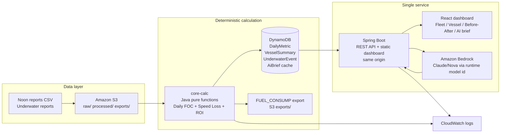

# Technical Architecture Submission

> 用途：官方七項提交物之一「Technical architecture」的短版提交稿。  
> 詳細依據：`09-architecture-and-execution-plan.md`、`12-requirements-fit-and-final-architecture.md`、`16-day1-ops-runbook.md`。  
> 狀態：可用於 Day1/Day2 技術架構初稿；Day3 只需把實際部署 URL、AWS region、Bedrock model id、資料表/bucket 名稱補上。

## 1. Architecture in one sentence

FleetMind is a single-service AWS application: S3 stores raw and processed competition data, a Java `core-calc` library produces deterministic fuel and Speed Loss metrics, DynamoDB stores processed metrics/events/AI brief cache, Spring Boot serves both API and dashboard from one origin, and Amazon Bedrock generates cited operations briefs from processed metrics only.

## 2. Diagram



## 3. AWS services

| Service | Role | Why |
| --- | --- | --- |
| Amazon S3 | Stores `raw/`, `processed/`, and `exports/` competition files | Simple lifecycle, easy cleanup, no raw data in GitHub |
| Amazon DynamoDB | Stores processed metrics, vessel summaries, events, and cached AI briefs | Fixed query patterns, no schema migration, fast demo reads |
| Spring Boot on one container | Serves API and static dashboard from same origin | Removes CORS/HTTPS split risk, fastest Day1 path for backend-heavy team |
| Amazon Bedrock | Produces AI ops brief from processed metric JSON | AWS-only model service; AI explains evidence but does not create numbers |
| Amazon CloudWatch | Logs calculation/API/Bedrock failures | Enough observability for hackathon demo |

Deployment path:

| Priority | Route | Trigger |
| --- | --- | --- |
| 1 | Existing AWS App Runner | Use only if event account already has App Runner access |
| 2 | ECS Express Mode | Default cloud fallback for managed HTTPS/container deployment |
| 3 | EC2 + Docker | Minimal fallback when managed deployment is blocked |
| 4 | Local recording | Presentation fallback only; does not replace official live demo link unless organizer allows |

## 4. Component responsibilities

| Component | Responsibility | Failure mode |
| --- | --- | --- |
| `core-calc` | VLSFO normalization, all-row Daily FOC, quality flags, Speed Loss, before-after, ROI | If API fails, calculations remain testable and reproducible |
| Spring Boot API | Reads processed metrics, serves dashboard, exports FUEL_CONSUMP, calls Bedrock | If Bedrock fails, API returns deterministic fallback brief |
| Dashboard | Fleet ranking, vessel detail, before-after card, AI brief with cited metrics | If AI unavailable, deterministic dashboard still covers 55% hard score |
| Bedrock guardrail | Converts metric JSON into operations language; post-validates numeric claims | Any uncited number is rejected/flagged |

## 5. Data flow

1. Upload noon reports and underwater reports to S3 `raw/`.
2. Validate schema. Unparseable rows are counted with reason codes.
3. Calculate Daily FOC for every row, unconditionally:

```text
Daily FOC = ME_FULLSPEED_CONSUMP_VLSFO / HOURS_FULL_SPEED * 24
```

4. Apply quality flags (`WIND_SCALE > 4`, `HOURS_FULL_SPEED < 22`, missing optional fields). Flags do not delete rows from the FUEL_CONSUMP output.
5. Use qualified rows for Speed Loss and fouling attribution:

```text
k = Daily FOC / V^n
Speed Loss % = 1 - (k_ref / k_t)^(1/n)
```

6. Segment each vessel timeline by underwater cleaning/polishing events and unknown breakpoints.
7. Write processed metrics to DynamoDB and FUEL_CONSUMP files to S3 `exports/`.
8. Dashboard and AI brief read only processed metrics.

## 6. API surface

Implemented/demo contract:

```http
GET  /api/health
GET  /api/fleet/summary
GET  /api/vessels/{id}/performance
GET  /api/vessels/{id}/underwater-events
GET  /api/vessels/{id}/before-after?eventId=...
POST /api/vessels/{id}/ai-brief
GET  /api/vessels/{id}/ai-brief/prompt
GET  /api/data-quality/summary
GET  /api/fuel-consump/export
```

Day1 real-data additions:

```http
GET  /api/fuel-consump/export?variant=full|filtered
POST /admin/reprocess
```

## 7. AI safety boundary

| Guardrail | Implementation |
| --- | --- |
| No generated numbers | Bedrock prompt receives structured processed JSON only |
| Numeric post-validation | API extracts numeric claims and matches them to `citedMetrics` |
| Human-in-the-loop | Brief says review/inspect/cleaning recommendation requires human maritime expert |
| Fallback | If Bedrock model or quota fails, deterministic brief template still renders |
| Demo stability | Demo vessel brief can be cached after Day3 data freeze and shown with `generated_at` |

Standard framing:

> Numbers come from deterministic calculation. Language comes from AI. Decisions stay with humans.

## 8. Data security and cleanup

- GitHub repo contains code, docs, synthetic samples, and generated deck only.
- Raw enterprise datasets stay in S3 `raw/`; processed outputs stay in S3 `processed/`/`exports/` and DynamoDB.
- `.env`, AWS credentials, tokens, raw enterprise CSV/PDF, and sensitive screenshots are not committed.
- If competition rules require deletion, run `scripts/cleanup-event-data.sh` for S3, DynamoDB, and local snapshots.

## 9. Verification

Local and CI checks:

| Check | Command / owner |
| --- | --- |
| core-calc golden checks | `./scripts/test-core-calc.sh` |
| local demo smoke | `./scripts/demo-local.sh` |
| Maven package | GitHub Actions with Java 21 |
| API smoke | GitHub Actions starts Spring Boot and runs `./scripts/api-smoke.sh` |
| Markdown links | GitHub Actions local link checker |
| diff hygiene | `git diff --check` |
| AWS/Bedrock Day1 probe | `./scripts/probe.sh` + `./scripts/bedrock-models.sh` |

## 10. Day3 fields to fill

| Field | Value |
| --- | --- |
| AWS region | TBD |
| Deployment route | App Runner / ECS Express Mode / EC2 |
| Live demo URL | TBD |
| S3 bucket | TBD |
| DynamoDB table(s) | TBD |
| Bedrock model id / inference profile | TBD |
| Final `transform_version` | TBD |
| GitHub commit SHA | TBD |

## 11. Short upload text

FleetMind uses a minimal AWS architecture optimized for a three-day hackathon: S3 stores raw/processed/export files, a Java `core-calc` library deterministically calculates Daily FOC and Speed Loss, DynamoDB stores processed vessel metrics and event summaries, and a single Spring Boot service serves both API and dashboard from the same origin. Amazon Bedrock generates cited operations briefs from processed metric JSON only; all numeric claims are post-validated against `citedMetrics`, and deterministic dashboard/export functions continue working if Bedrock fails. Deployment prioritizes an existing App Runner account, then ECS Express Mode, then EC2 Docker fallback. Raw enterprise data never enters GitHub and can be deleted from S3/DynamoDB with the provided cleanup runbook.
